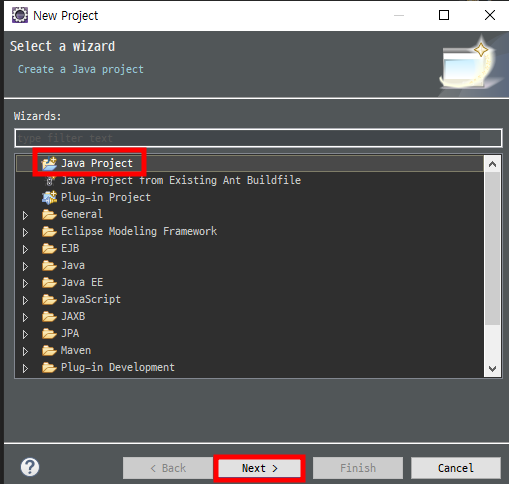

# `ExcelReadWrite`

본 학습으로 확장자별(xls, xlsx) 엑셀파일을 자바로 읽고 쓰기를 할 수 있습니다.

진행순서 : 엑셀파일 읽기 -> 엑셀파일 쓰기

준비물: 이클립스, poi라이브러리, 엑셀 읽기를 위한 테스트용 Excel파일

---

## `Create Java Project`

  
  


---

## `라이브러리 다운로드`

  
  
poi 라이브러리를 담을 수 있도록 폴더 하나를 생성 합니다.

[MavenRepository](https://mvnrepository.com/) 해당 경로에서 jar 또는 다른 형태의 파일의 lib을 받을 수 있습니다.

  
poi로 검색하여 필요한 poi라이브 러리를 받습니다.

  
표시된 세개의 라이브러리를 jar형태로 다운로드 합니다.

  
해당 라이브러리의 이름을 클릭하면 위와 같은 화면으로 넘어가게 되는데  
이 강의에서는 사용자 수가 가장많은 3.17 버전으로 다루도록 하겠습니다.

  
버전을 클릭하면 위 해당 화면으로 넘어오게 되는데 이때, 자바프로젝트로 진행하기때문에 jar형태의 라이브러리가 필요하므로 jar를 눌러 다운로드 합니다.

위 세개를 같은 방법으로 다운 로드 받아  
라이브러리를 담기위해 미리 만들어 논 폴더 lib에 넣어 줄수 있도록합니다.

  
저는 다음 단계에서 진행 할 라이브러리를 미리 받아 두었으므로 현재 다운로드 받은 세개의 라이브러리가 있는지 확인합니다.

---

## `라이브러리 import`

윗 챕터에서 모든 라이브러리를 다운 받았다면 자바프로젝트가 이 라이브러리를 사용 할 수 있도록 ADD 시켜주어야 합니다.

  
프로젝트를 우클릭하여 해당 그림과 같이 build path에 접근 할 수 있습니다.

  
jar파일이므로, Add JARs... 버튼을 눌러 라이브러리를 등록합니다.

  
  
Apply와 OK버튼을 이용하여 마무리 합니다.

  
위의 해당 코드는 엑셀파일의 시트 갯수를 가져오는 로직입니다.  
test를 위하여 메인 메소드 안에서 위 코드를 작성뒤 실행(이클립스 기준: ctrl + F11)을 해보도록 하겠습니다.

```
try {
    File file = new File("D:\\park\\SCMINNO_PARK\\ExcelReadWrite\\테스트문서\\테스트문서.xlsx");
    InputStream is = new FileInputStream(file);
    Workbook workBook = new XSSFWorkbook(is);

    int sheetCnt = workBook.getNumberOfSheets();
    System.out.println("엑셀파일의 시트 갯수 : " + sheetCnt);
} catch(Exception e) {
    e.printStackTrace();
}
```

ClassNotFoundException: org.apache.xmlbeans.XmlObject 에러가 발생했습니다.  
해당 에러는 클래스가 없어서 발생하는 에러 인데, poi는 아파치의 xmlbeans라는 패키지를 참조 XmlObject 클래스를 사용 하고 있는것으로 보입니다.

위 에러를 해결하기 위하여 메이븐 리포지토리를 이용하여 해당 라이브러리 패키지를 다운 받습니다.

  
해당 에러 내용으로 검색하여 찾은 뒤 다운 받을 수 있습니다.  
다운 받은뒤에는 위 해왔던 과정을 통해서 라이브러리 추가를 합니다.

> 혹시나 버튼이 Apply버튼이 비활성화 인경우 모두 remove를 하신뒤, 다시 모두 등록 하시면 되겠습니다.  
> Apply가 비활성화 인경우는 xmlbean이 먼저 등록되어야 하는데 다른 poi라이브러리가 먼저 등록 되어서 그렇습니다.

  
그 후 해당 코드를 다시 실행한다면 다른 클래스가 없다고 에러메시지가 나옵니다.  
위의 xmlbeans에서 했던 과정을 통해 다시 검색하여 해당 라이브러리를 다운 받습니다.

  
이름이 틀려서 헷갈리실 수 있는데 poi는 아파치 패키지에 있으므로, org.apache.commons 패키지에있는 Apache Commons Collections 를 다운 받을 수 있도록 합니다.  
그 후 ADD JARs... 를 통해 다시 한번 라이브러리 등록을 합니다.

  
해당 라이브러리까지 모두 적용뒤 다시 실행하면 실행결과가 잘 출력되시는걸 볼 수 있습니다.

---

## `Excel Read (.xlsx)`

Read를 하기전 test엑셀문서를 확인해 주시기 바랍니다.  
엑셀은 확장자에 따라서 크게 두 분류로 나눌 수 있습니다.  
통합문서인 .xlsx 와  
Excel 97 ~ 2003 버전의 통합문서인 .xls로 나눌 수 있습니다.

두 종류를 구분 짓는 이유는  
엑셀 Read를 위한 WorkBook의 class가 다르기 때문입니다.  
.xlsx: XSSFWorkbook, .xls: HSSFWorkbook

먼저, .xlsx 확장 자를 가진 엑셀 파일을 Read해보도록 하겠습니다.

코드로 설명을 대체 합니다.  
코드의 주석을 확인해 주세요

```
package test;

import java.io.File;
import java.io.FileInputStream;
import java.io.IOException;
import java.io.InputStream;
import java.text.NumberFormat;
import java.text.SimpleDateFormat;
import java.util.ArrayList;
import java.util.List;

import org.apache.poi.hssf.usermodel.HSSFDateUtil;
import org.apache.poi.ss.usermodel.Cell;
import org.apache.poi.ss.usermodel.Row;
import org.apache.poi.ss.usermodel.Sheet;
import org.apache.poi.ss.usermodel.Workbook;
import org.apache.poi.xssf.usermodel.XSSFCell;
import org.apache.poi.xssf.usermodel.XSSFWorkbook;

public class ExcelXlsxRead {

	public static void main(String[] args) {
		File file = new File("D:\\park\\SCMINNO_PARK\\ExcelReadWrite\\테스트문서\\테스트문서.xlsx");
		InputStream is = null;
		try {
			is = new FileInputStream(file);
			Workbook workBook = new XSSFWorkbook(is);
			NumberFormat numberFormat = NumberFormat.getInstance();
			// DecimalFormat decimalFormat = new DecimalFormat("###,###.##");
			SimpleDateFormat sf = new SimpleDateFormat("yyyy-MM-dd");

			List<String> colNames = new ArrayList<String>();

			int sheetCnt = workBook.getNumberOfSheets(); // 시트의 갯수를 가져옵니다.
			System.out.println("엑셀파일의 시트 갯수 : " + sheetCnt);

			if(sheetCnt > 0) {
				for(int i = 0; i < sheetCnt; i++) { // 시트의 갯수만큼 반복 시켜줍니다.
					Sheet sheet = workBook.getSheetAt(i); // i번째에 해당하는 시트를 가져옵니다.
					System.out.println(i + " 번째 시트");

					if(sheet != null) {
						int rowCnt = sheet.getPhysicalNumberOfRows(); // 현재 시트의 줄의 수를 가져옵니다.

						if(rowCnt > 0) {
							for(int j = 0; j < rowCnt; j++) {
								Row row = sheet.getRow(j); // j번째에 해당하는 row를 가져옵니다.
								System.out.println(j + " 번째 줄");

								if(row != null) {
									int cellCnt = row.getPhysicalNumberOfCells(); // 현재 시트 현재 줄의 셀 갯수를 가져옵니다.

									if(cellCnt > 0) {
										for(int k = 0; k < cellCnt; k++) { // 셀의 갯수 만큼 반복합니다.
											Cell cell = row.getCell(k); // k번째에 해당하는 cell을 가져옵니다.
											// System.out.println(k + " 번째 셀");

											if(cell != null) {
												int cellType = cell.getCellType(); // Enum class로 된 셀의 Type 즉, 서식을 가져옵니다.

												String value = "";

												switch(cellType) {
													case XSSFCell.CELL_TYPE_STRING: // 문자 서식 이 있는 cell
														value = cell.getStringCellValue();
														break;
													case XSSFCell.CELL_TYPE_NUMERIC: // 숫자 서식 이 있는 cell
														// 날짜 형식의 셀도 숫자 형식의 type으로 들어옵니다.
														// 날짜 형식을 판단하여 날짜 형식으로 value를 바꿔 줍니다.
														if(HSSFDateUtil.isCellDateFormatted(cell)) value = sf.format(cell.getDateCellValue());
														else value = numberFormat.format(cell.getNumericCellValue());
														break;
													case XSSFCell.CELL_TYPE_FORMULA: // 수식이 있는 cell
														// sum 이라는 필드는 나이 + 재산을 더하는 수식이 있는 셀로 숫자 형태로 바꾸어 줄 수 있도록 합니다.
														if(colNames.get(k).equals("SUM")) value = numberFormat.format(cell.getNumericCellValue());
														else value = cell.getCellFormula(); // ex) A1 + B1 의 수식이 나옴
														break;
													case XSSFCell.CELL_TYPE_BOOLEAN: // boolean
														value = cell.getBooleanCellValue() + "";
														break;
													case XSSFCell.CELL_TYPE_BLANK: // 공백
														value = cell.getStringCellValue();
														break;
													case XSSFCell.CELL_TYPE_ERROR: // 에러
														value = cell.getStringCellValue();
														break;
												}
												if(j == 0) colNames.add(value); // colName을 담고 있는 row

												System.out.print(value);
												System.out.print(" ");
											}
										}
										System.out.println("");
									}
								}
								// if(j == 0) System.out.println("컬럼명 : " + colNames);
							}
							System.out.println(" ");
						}
					}
				}
			}
		} catch(Exception e) {
			e.printStackTrace();
		} finally {
			if(is != null)
				try {
					is.close(); // 인풋 스트림을 닫아 줄수 있도록 합니다.
				} catch (IOException e) {
					e.printStackTrace();
				}
		}
	}
}

```

---

## `Excel Read (.xls)`

Read를 하기전 test엑셀문서를 확인해 주시기 바랍니다.  
엑셀은 확장자에 따라서 크게 두 분류로 나눌 수 있습니다.  
통합문서인 .xlsx 와  
Excel 97 ~ 2003 버전의 통합문서인 .xls로 나눌 수 있습니다.

두 종류를 구분 짓는 이유는  
엑셀 Read를 위한 WorkBook의 class가 다르기 때문입니다.  
.xlsx: XSSFWorkbook, .xls: HSSFWorkbook

다음으로, .xls 확장 자를 가진 엑셀 파일을 Read해보도록 하겠습니다.

코드로 설명을 대체 합니다.  
코드의 주석을 확인해 주세요

```
package test;

import java.io.File;
import java.io.FileInputStream;
import java.io.IOException;
import java.io.InputStream;
import java.text.NumberFormat;
import java.text.SimpleDateFormat;
import java.util.ArrayList;
import java.util.List;

import org.apache.poi.hssf.usermodel.HSSFDateUtil;
import org.apache.poi.hssf.usermodel.HSSFWorkbook;
import org.apache.poi.ss.usermodel.Cell;
import org.apache.poi.ss.usermodel.Row;
import org.apache.poi.ss.usermodel.Sheet;
import org.apache.poi.ss.usermodel.Workbook;
import org.apache.poi.xssf.usermodel.XSSFCell;

public class ExcelXlsRead {

	public static void main(String[] args) {
		File file = new File("D:\\park\\SCMINNO_PARK\\ExcelReadWrite\\테스트문서\\테스트문서.xls");
		InputStream is = null;
		try {
			is = new FileInputStream(file);
			Workbook workBook = new HSSFWorkbook(is);
			NumberFormat numberFormat = NumberFormat.getInstance();
			// DecimalFormat decimalFormat = new DecimalFormat("###,###.##");
			SimpleDateFormat sf = new SimpleDateFormat("yyyy-MM-dd");

			List<String> colNames = new ArrayList<String>();

			int sheetCnt = workBook.getNumberOfSheets(); // 시트의 갯수를 가져옵니다.
			System.out.println("엑셀파일의 시트 갯수 : " + sheetCnt);

			if(sheetCnt > 0) {
				for(int i = 0; i < sheetCnt; i++) { // 시트의 갯수만큼 반복 시켜줍니다.
					Sheet sheet = workBook.getSheetAt(i); // i번째에 해당하는 시트를 가져옵니다.
					System.out.println(i + " 번째 시트");

					if(sheet != null) {
						int rowCnt = sheet.getPhysicalNumberOfRows(); // 현재 시트의 줄의 수를 가져옵니다.

						if(rowCnt > 0) {
							for(int j = 0; j < rowCnt; j++) {
								Row row = sheet.getRow(j); // j번째에 해당하는 row를 가져옵니다.
								System.out.println(j + " 번째 줄");

								if(row != null) {
									int cellCnt = row.getPhysicalNumberOfCells(); // 현재 시트 현재 줄의 셀 갯수를 가져옵니다.

									if(cellCnt > 0) {
										for(int k = 0; k < cellCnt; k++) { // 셀의 갯수 만큼 반복합니다.
											Cell cell = row.getCell(k); // k번째에 해당하는 cell을 가져옵니다.
											// System.out.println(k + " 번째 셀");

											if(cell != null) {
												int cellType = cell.getCellType(); // Enum class로 된 셀의 Type 즉, 서식을 가져옵니다.

												String value = "";

												switch(cellType) {
													case XSSFCell.CELL_TYPE_STRING: // 문자 서식 이 있는 cell
														value = cell.getStringCellValue();
														break;
													case XSSFCell.CELL_TYPE_NUMERIC: // 숫자 서식 이 있는 cell
														// 날짜 형식의 셀도 숫자 형식의 type으로 들어옵니다.
														// 날짜 형식을 판단하여 날짜 형식으로 value를 바꿔 줍니다.
														if(HSSFDateUtil.isCellDateFormatted(cell)) value = sf.format(cell.getDateCellValue());
														else value = numberFormat.format(cell.getNumericCellValue());
														break;
													case XSSFCell.CELL_TYPE_FORMULA: // 수식이 있는 cell
														// sum 이라는 필드는 나이 + 재산을 더하는 수식이 있는 셀로 숫자 형태로 바꾸어 줄 수 있도록 합니다.
														if(colNames.get(k).equals("SUM")) value = numberFormat.format(cell.getNumericCellValue());
														else value = cell.getCellFormula(); // ex) A1 + B1 의 수식이 나옴
														break;
													case XSSFCell.CELL_TYPE_BOOLEAN: // boolean
														value = cell.getBooleanCellValue() + "";
														break;
													case XSSFCell.CELL_TYPE_BLANK: // 공백
														value = cell.getStringCellValue();
														break;
													case XSSFCell.CELL_TYPE_ERROR: // 에러
														value = cell.getStringCellValue();
														break;
												}
												if(j == 0) colNames.add(value); // colName을 담고 있는 row

												System.out.print(value);
												System.out.print(" ");
											}
										}
										System.out.println("");
									}
								}
								// if(j == 0) System.out.println("컬럼명 : " + colNames);
							}
							System.out.println(" ");
						}
					}
				}
			}
		} catch(Exception e) {
			e.printStackTrace();
		} finally {
			if(is != null)
				try {
					is.close(); // 인풋 스트림을 닫아 줄수 있도록 합니다.
				} catch (IOException e) {
					e.printStackTrace();
				}
		}
	}
}
```

---

## `Refactoring`

```
package test;

import java.io.File;
import java.io.FileInputStream;
import java.io.IOException;
import java.io.InputStream;
import java.text.NumberFormat;
import java.text.SimpleDateFormat;
import java.util.ArrayList;
import java.util.List;

import org.apache.poi.hssf.usermodel.HSSFDateUtil;
import org.apache.poi.hssf.usermodel.HSSFWorkbook;
import org.apache.poi.ss.usermodel.Cell;
import org.apache.poi.ss.usermodel.Row;
import org.apache.poi.ss.usermodel.Sheet;
import org.apache.poi.ss.usermodel.Workbook;
import org.apache.poi.xssf.usermodel.XSSFCell;
import org.apache.poi.xssf.usermodel.XSSFWorkbook;

public class ExcelRead {

	// 메인메소드
	public static void main(String[] args) {
		String[] filePaths = {"D:\\park\\SCMINNO_PARK\\ExcelReadWrite\\테스트문서\\테스트문서.xlsx", "D:\\park\\SCMINNO_PARK\\ExcelReadWrite\\테스트문서\\테스트문서.xls"};

		int random = (int) (Math.random() * 2);

		String filePath = filePaths[random]; // 랜덤으로 확장자를 선택하여 해당 확장자에 맞는 Read class가 제대로 작동 하는지 확인 합니다.

		String extention = filePath.substring(filePath.lastIndexOf("."));

		if(extention.equals(".xlsx")) {
			xlsxRead(filePath);
		} else if(extention.equals(".xls")) {
			xlsRead(filePath);
		}
	}

	// .xlsx Read
	static public void xlsxRead(String path) {
		File file = new File(path);
		InputStream is = null;
		try {
			is = new FileInputStream(file);
			Workbook workBook = new XSSFWorkbook(is);
			NumberFormat numberFormat = NumberFormat.getInstance();
			// DecimalFormat decimalFormat = new DecimalFormat("###,###.##");
			SimpleDateFormat sf = new SimpleDateFormat("yyyy-MM-dd");

			List<String> colNames = new ArrayList<String>();

			int sheetCnt = workBook.getNumberOfSheets(); // 시트의 갯수를 가져옵니다.
			System.out.println("엑셀파일의 시트 갯수 : " + sheetCnt);

			if(sheetCnt > 0) {
				for(int i = 0; i < sheetCnt; i++) { // 시트의 갯수만큼 반복 시켜줍니다.
					Sheet sheet = workBook.getSheetAt(i); // i번째에 해당하는 시트를 가져옵니다.
					System.out.println(i + " 번째 시트");

					if(sheet != null) {
						int rowCnt = sheet.getPhysicalNumberOfRows(); // 현재 시트의 줄의 수를 가져옵니다.

						if(rowCnt > 0) {
							for(int j = 0; j < rowCnt; j++) {
								Row row = sheet.getRow(j); // j번째에 해당하는 row를 가져옵니다.
								System.out.println(j + " 번째 줄");

								if(row != null) {
									int cellCnt = row.getPhysicalNumberOfCells(); // 현재 시트 현재 줄의 셀 갯수를 가져옵니다.

									if(cellCnt > 0) {
										for(int k = 0; k < cellCnt; k++) { // 셀의 갯수 만큼 반복합니다.
											Cell cell = row.getCell(k); // k번째에 해당하는 cell을 가져옵니다.
											// System.out.println(k + " 번째 셀");

											if(cell != null) {
												int cellType = cell.getCellType(); // Enum class로 된 셀의 Type 즉, 서식을 가져옵니다.

												String value = "";

												switch(cellType) {
													case XSSFCell.CELL_TYPE_STRING: // 문자 서식 이 있는 cell
														value = cell.getStringCellValue();
														break;
													case XSSFCell.CELL_TYPE_NUMERIC: // 숫자 서식 이 있는 cell
														// 날짜 형식의 셀도 숫자 형식의 type으로 들어옵니다.
														// 날짜 형식을 판단하여 날짜 형식으로 value를 바꿔 줍니다.
														if(HSSFDateUtil.isCellDateFormatted(cell)) value = sf.format(cell.getDateCellValue());
														else value = numberFormat.format(cell.getNumericCellValue());
														break;
													case XSSFCell.CELL_TYPE_FORMULA: // 수식이 있는 cell
														// sum 이라는 필드는 나이 + 재산을 더하는 수식이 있는 셀로 숫자 형태로 바꾸어 줄 수 있도록 합니다.
														if(colNames.get(k).equals("SUM")) value = numberFormat.format(cell.getNumericCellValue());
														else value = cell.getCellFormula(); // ex) A1 + B1 의 수식이 나옴
														break;
													case XSSFCell.CELL_TYPE_BOOLEAN: // boolean
														value = cell.getBooleanCellValue() + "";
														break;
													case XSSFCell.CELL_TYPE_BLANK: // 공백
														value = cell.getStringCellValue();
														break;
													case XSSFCell.CELL_TYPE_ERROR: // 에러
														value = cell.getStringCellValue();
														break;
												}
												if(j == 0) colNames.add(value); // colName을 담고 있는 row

												System.out.print(value);
												System.out.print(" ");
											}
										}
										System.out.println("");
									}
								}
								// if(j == 0) System.out.println("컬럼명 : " + colNames);
							}
							System.out.println(" ");
						}
					}
				}
			}
		} catch(Exception e) {
			e.printStackTrace();
		} finally {
			if(is != null)
				try {
					is.close(); // 인풋 스트림을 닫아 줄수 있도록 합니다.
				} catch (IOException e) {
					e.printStackTrace();
				}
		}
	} // end xlsxRead()

	// .xls Read
	static public void xlsRead(String path) {
		File file = new File(path);
		InputStream is = null;
		try {
			is = new FileInputStream(file);
			Workbook workBook = new HSSFWorkbook(is);
			NumberFormat numberFormat = NumberFormat.getInstance();
			// DecimalFormat decimalFormat = new DecimalFormat("###,###.##");
			SimpleDateFormat sf = new SimpleDateFormat("yyyy-MM-dd");

			List<String> colNames = new ArrayList<String>();

			int sheetCnt = workBook.getNumberOfSheets(); // 시트의 갯수를 가져옵니다.
			System.out.println("엑셀파일의 시트 갯수 : " + sheetCnt);

			if(sheetCnt > 0) {
				for(int i = 0; i < sheetCnt; i++) { // 시트의 갯수만큼 반복 시켜줍니다.
					Sheet sheet = workBook.getSheetAt(i); // i번째에 해당하는 시트를 가져옵니다.
					System.out.println(i + " 번째 시트");

					if(sheet != null) {
						int rowCnt = sheet.getPhysicalNumberOfRows(); // 현재 시트의 줄의 수를 가져옵니다.

						if(rowCnt > 0) {
							for(int j = 0; j < rowCnt; j++) {
								Row row = sheet.getRow(j); // j번째에 해당하는 row를 가져옵니다.
								System.out.println(j + " 번째 줄");

								if(row != null) {
									int cellCnt = row.getPhysicalNumberOfCells(); // 현재 시트 현재 줄의 셀 갯수를 가져옵니다.

									if(cellCnt > 0) {
										for(int k = 0; k < cellCnt; k++) { // 셀의 갯수 만큼 반복합니다.
											Cell cell = row.getCell(k); // k번째에 해당하는 cell을 가져옵니다.
											// System.out.println(k + " 번째 셀");

											if(cell != null) {
												int cellType = cell.getCellType(); // Enum class로 된 셀의 Type 즉, 서식을 가져옵니다.

												String value = "";

												switch(cellType) {
													case XSSFCell.CELL_TYPE_STRING: // 문자 서식 이 있는 cell
														value = cell.getStringCellValue();
														break;
													case XSSFCell.CELL_TYPE_NUMERIC: // 숫자 서식 이 있는 cell
														// 날짜 형식의 셀도 숫자 형식의 type으로 들어옵니다.
														// 날짜 형식을 판단하여 날짜 형식으로 value를 바꿔 줍니다.
														if(HSSFDateUtil.isCellDateFormatted(cell)) value = sf.format(cell.getDateCellValue());
														else value = numberFormat.format(cell.getNumericCellValue());
														break;
													case XSSFCell.CELL_TYPE_FORMULA: // 수식이 있는 cell
														// sum 이라는 필드는 나이 + 재산을 더하는 수식이 있는 셀로 숫자 형태로 바꾸어 줄 수 있도록 합니다.
														if(colNames.get(k).equals("SUM")) value = numberFormat.format(cell.getNumericCellValue());
														else value = cell.getCellFormula(); // ex) A1 + B1 의 수식이 나옴
														break;
													case XSSFCell.CELL_TYPE_BOOLEAN: // boolean
														value = cell.getBooleanCellValue() + "";
														break;
													case XSSFCell.CELL_TYPE_BLANK: // 공백
														value = cell.getStringCellValue();
														break;
													case XSSFCell.CELL_TYPE_ERROR: // 에러
														value = cell.getStringCellValue();
														break;
												}
												if(j == 0) colNames.add(value); // colName을 담고 있는 row

												System.out.print(value);
												System.out.print(" ");
											}
										}
										System.out.println("");
									}
								}
								// if(j == 0) System.out.println("컬럼명 : " + colNames);
							}
							System.out.println(" ");
						}
					}
				}
			}
		} catch(Exception e) {
			e.printStackTrace();
		} finally {
			if(is != null)
				try {
					is.close(); // 인풋 스트림을 닫아 줄수 있도록 합니다.
				} catch (IOException e) {
					e.printStackTrace();
				}
		}
	} // end xlsRead()
}
```
