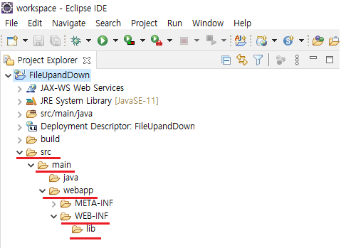

# Dynamic Web Project(Feat. SERVER & Servlet & Single)

본 학습은 servlet을 이해하고 COS 라이브러리를 통해 서버에 파일 업로드를 구현하고 다운로드 기능을 구현을 목적으로 합니다.

---

## 1. DB Setting

```
DROP TABLE FILETEST;

CREATE TABLE FILETEST (
	FILENAME VARCHAR(500), -- 중복되어 변경된 파일명
	FILEREALNAME VARCHAR(500), -- 사용자가 실제로 업로드한 파일명
	EXTENTION VARCHAR(50), -- 확장자
	FILESIZE BIGINT, -- 파일 크기
	DOWNCOUNT INT -- 다운로드 횟수
);

-- table comment
EXEC   SP_ADDEXTENDEDPROPERTY 'MS_DESCRIPTION', 'SERVER 파일업로드 TEST TABLE', 'USER', DBO, 'TABLE', FILETEST;

-- column comment
EXEC   SP_ADDEXTENDEDPROPERTY 'MS_DESCRIPTION', '중복되어 변경된 파일명', 'USER', DBO, 'TABLE', FILETEST, 'COLUMN', FILENAME;
EXEC   SP_ADDEXTENDEDPROPERTY 'MS_DESCRIPTION', '사용자가 실제로 업로드한 파일명', 'USER', DBO, 'TABLE', FILETEST, 'COLUMN', FILEREALNAME;
EXEC   SP_ADDEXTENDEDPROPERTY 'MS_DESCRIPTION', '확장자', 'USER', DBO, 'TABLE', FILETEST, 'COLUMN', EXTENTION;
EXEC   SP_ADDEXTENDEDPROPERTY 'MS_DESCRIPTION', '파일 크기', 'USER', DBO, 'TABLE', FILETEST, 'COLUMN', FILESIZE;
EXEC   SP_ADDEXTENDEDPROPERTY 'MS_DESCRIPTION', '다운로드 횟수', 'USER', DBO, 'TABLE', FILETEST, 'COLUMN', DOWNCOUNT;
```

---

## 2. Java와 MSSQL 연동을 위한 Connection 다운로드

MavenReposiroty를 통한 라이브러리 다운로드  
[MavenReposiroty](https://mvnrepository.com/)  
  
  


---

## 3. COS 라이브러리 다운로드

1. 라이브러리 공식 사이트를 동한 라이브러리 다운로드  
   [공식사이트 URL](http://www.servlets.com/)  
      
    
2. MavenReposiroty를 통한 라이브러리 다운로드  
   [MavenReposiroty](https://mvnrepository.com/)  
      
      
      
    jar 파일을 다운로드 받습니다.

위 두가지중 한가지 방법을 택 1하여 jar 파일을 다운로드 합니다.

---

## 4. Tomcat

WAS(Web Application Server) 다운로드  
[Apache Tomcat](https://tomcat.apache.org/)


해당 운영체제에 맞는 Tomcat을 다운로드 합니다.

---

## 5. Project 생성


또는


또는

  


위 방법 중 택1하여 Dynaminc Web Project를 생성합니다.


---

## 6. 라이브러리 추가

  


위 2번 과 3번에서 다운받은 라이브러리를 lib폴더에 넣어 줍니다.

---

## 7. WAS Setting

  
  
  
  


4번 에서 받았던 톰캣 압축을 풀고 압축푼 폴더를 EClipse에 등록 합니다.

  
  
  
  
  
  
  


  
  
  
해당 WAS에 배포하기 위하여, Web Module을 등록합니다.

  
  


서버를 올리고 localhost:8080, localhost:8080/index.jsp 로 접속해봤지만  
404Error 즉, 페이지를 찾지 못하고 있습니다.

그 이유는 ContextPath 라는 건데
  
  
  
위와 같이 ContextPath를 Web Module에 있는 path와 일치시켜주시면  
해당 페이지가 나오게 됩니다.

다른 방법으로는 아래와 같이 ContextPath를 수정 하는 방법이 있습니다.  
  
  
  
  
ContextPath를 수정하여 기본 경로를 변경하여 index.jsp를가 rott path가 되었습니다.  
이로서 tomcat 설정까지 완료 되었으므로, 기능 구현 part로 넘어가도록 하겠습니다.
