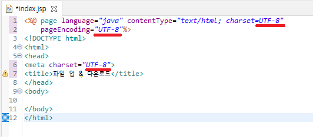
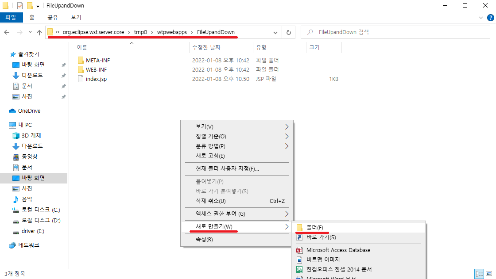
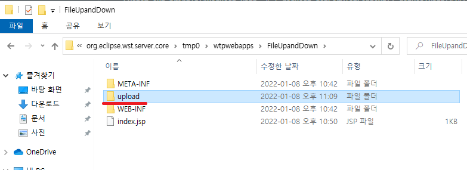
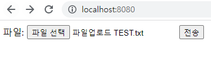
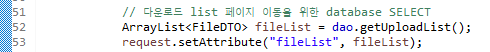
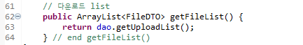
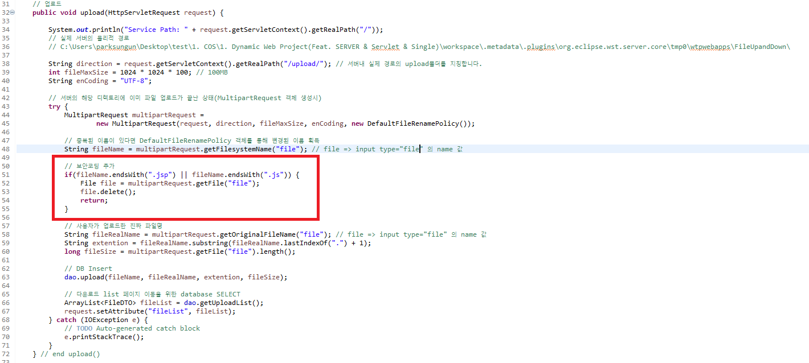

# 업로드 & 다운로드 기능 구현

## 업로드 기능 구현

> 업로드프로세스: 업로드form -> 업로드 -> 다운로드List 페이지 이동 -> 다운로드

jsp 파일을 생성합니다.  


아래 생성시 중요한 점은 파일의 이름은 index로 하셔야 합니다.  
그 이유는 서버를 올려 접속시 서버는 index페이지를 제일 첫번째로 찾기 때문에 파일의 이름은 무조건 index여야 합니다.  


EUC-KR로 되어있는 charset을 UTF-8 로 변경합니다.  
  


파일을 업로드 할 수 있는 form을 생성합니다.

```
	<form action="fileUpload" method="post" enctype="multipart/form-data">
		<label>
			파일:&nbsp;<input type="file" name="file" />
		</label>
		<button type="submit">전송</button>
	</form>
```

이때, 파일은 보안을위하여 post method로 전송하며  
enctype은 multipart/form-data로 하여 서버에서 파일을 전송 받을 수 있도록 합니다.  
오랫동안 비동기통신(ajax)에 익숙해져 form태그를 기억 못하시는 분을 위하여 action은 서버로 보내는 주소를 의미합니다.  


자바소스를 추가하기 위한 package를 생성합니다.  


먼저 데이터베이스에 접근하기 위해 Access 객체 DAO  
그리고 Transfer 객체 DTO를 생성합니다.  
또, Query를 관리하기위한 Query 객체를 생성합니다.

file.Query.java

```
package file;

public class Query {

	// 업로드 될때 DataBase에 file정보를 insert 하기 위한 쿼리
	final static String FILE_UPLOAD = "INSERT INTO FILETEST(FILENAME, FILEREALNAME, FILESTREAM, EXTENTION, FILESIZE, DOWNCOUNT)"
			+ "VALUES(?, ?, ?, ?, ?, 0)";

	// 다운로드 될때 DataBase에 횟수를 Update 하기 위한 쿼리
	final static String FILE_DOWN_COUNT_UP = "UPDATE FILETEST SET DOWNCOUNT = DOWNCOUNT + 1"
			+ "WHERE FILENAME = ? AND SEQ = ?";

	// 업로드 된 파일의 전체 리스트
	final static String FILE_ALL_LIST = "SELECT FILENAME, FILEREALNAME, EXTENTION, FILESIZE, DOWNCOUNT, SEQ FROM FILETEST";

	// 파일의 실제명, Stream SELECT
	final static String FILE_FILE = "SELECT FILEREALNAME, FILESTREAM FROM FILETEST WHERE FILENAME = ? AND SEQ = ?";
}
```

DTO란 ? Data Transfer Object  
file.FileDTO.java

```
package file;

public class FileDTO {

	private String fileName;
	private String fileRealName;
	private String extention;
	private long fileSize;
	private int downCount;
	private int seq;

	public FileDTO() {
		super();
	}

	public FileDTO(String fileName, String fileRealName, String extention, long fileSize, int downCount, int seq) {
		super();
		this.fileName = fileName;
		this.fileRealName = fileRealName;
		this.extention = extention;
		this.fileSize = fileSize;
		this.downCount = downCount;
		this.seq = seq;
	}

	public String getFileName() {
		return fileName;
	}

	public void setFileName(String fileName) {
		this.fileName = fileName;
	}

	public String getFileRealName() {
		return fileRealName;
	}

	public void setFileRealName(String fileRealName) {
		this.fileRealName = fileRealName;
	}

	public String getExtention() {
		return extention;
	}

	public void setExtention(String extention) {
		this.extention = extention;
	}

	public long getFileSize() {
		return fileSize;
	}

	public void setFileSize(long fileSize) {
		this.fileSize = fileSize;
	}

	public int getDownCount() {
		return downCount;
	}

	public void setDownCount(int downCount) {
		this.downCount = downCount;
	}

	public int getSeq() {
		return seq;
	}

	public void setSeq(int seq) {
		this.seq = seq;
	}

}
```

DAO란 ? Data Access Object  
file.FileDAO.java

DAO에서 사용된 PreapredStatement 객체란 Mybatis에서 #{VALUE} 로 변수를 넣는 방식과 비슷하게  
String 형태로 된 Query의 '?' 에 변수를 꽃아 Query를 완성시킵니다.

✨ 이전 학습과 차이점은 MSSQL의 VARBINART type의 field에 byte[]을 insert 하는 점 입니다.

```
package file;

import java.io.FileInputStream;
import java.sql.Connection;
import java.sql.DriverManager;
import java.sql.PreparedStatement;
import java.sql.ResultSet;
import java.sql.SQLException;
import java.util.ArrayList;
import java.util.HashMap;
import java.util.Map;

public class FileDAO {

	private Connection con;
	private String dbURL;
	private String dbID;
	private String dbPassword;

	public FileDAO() {
		super();
		this.dbURL = "jdbc:sqlserver://127.0.0.1:1433;databasename=STUDY";
		this.dbID = "sa";
		this.dbPassword = "mssql";

		try {
			// 해당 SQL Conncetion 라이브러리의 클래스를 찾을 수 있도록 로드
			Class.forName("com.microsoft.sqlserver.jdbc.SQLServerDriver");

			// DataBase에 접근 할 수 있도록 Connection 생성
			this.con = DriverManager.getConnection(this.dbURL, this.dbID, this.dbPassword);
		} catch (ClassNotFoundException | SQLException e) {
			e.printStackTrace();
		}
	}

	public FileDAO(String dbURL, String dbID, String dbPassword) {
		super();
		this.dbURL = dbURL;
		this.dbID = dbID;
		this.dbPassword = dbPassword;

		try {
			// 해당 SQL Conncetion 라이브러리의 클래스를 찾을 수 있도록 로드
			Class.forName("com.microsoft.sqlserver.jdbc.SQLServerDriver");

			// DataBase에 접근 할 수 있도록 Connection 생성
			this.con = DriverManager.getConnection(this.dbURL, this.dbID, this.dbPassword);
		} catch (ClassNotFoundException | SQLException e) {
			e.printStackTrace();
		}
	}

	// file insert
	public int upload(String fileName, String fileRealName, byte[] fileByteArray, String extention, long fileSize) {
		try {
			// INSERT INTO FILETEST(FILENAME, FILEREALNAME, FILESTREAM, EXTENTION, FILESIZE, DOWNCOUNT) VALUES(?, ?, ?, ?, ?, 0)
			PreparedStatement psmt = con.prepareStatement(Query.FILE_UPLOAD);
			psmt.setString(1, fileName);
			psmt.setString(2, fileRealName);
			// psmt.setBytes(3, fileInputStream.readAllBytes()); // Stream을 byte[]로 DB에 insert
			psmt.setBytes(3, fileByteArray); // Stream을 byte[]로 DB에 insert
			psmt.setString(4, extention);
			psmt.setLong(5, fileSize);
			return psmt.executeUpdate(); // insert 된 row의 수를 반환
		} catch(Exception e) {
			e.printStackTrace();
		}
		return -1; // 오류 발생시 -1을 return 함으로서 오류임을 증명
	} // end upload()

	// 다운로드 전 file의 진짜 이름 SELECT
	public Map getFile(String fileName, int seq) {
		Map<String, Object> result = new HashMap<String, Object>();
		try {
			// SELECT FILEREALNAME, FILESTREAM FROM FILETEST WHERE FILENAME = ? AND SEQ = ?
			PreparedStatement psmt = con.prepareStatement(Query.FILE_FILE);
			psmt.setString(1, fileName);
			psmt.setInt(2, seq);
			ResultSet rs = psmt.executeQuery();
			while(rs.next()) {
				result.put("FILEREALNAME", rs.getString("FILEREALNAME"));
				// DB의 VARBINARY TYPE에 byte[]을 꺼낼 수 있는 getBytes 메소드 사용
				result.put("FILESTREAM", rs.getBytes("FILESTREAM"));
			}
		} catch(Exception e) {
			e.printStackTrace();
		}
		return result;
	} // end getFile()

	// 다운로드시 다운로드 횟수 증가
	public int downIncrease(String fileName, int seq) {
		try {
			// UPDATE FILETEST SET DOWNCOUNT = DOWNCOUNT + 1 WHERE FILENAME = ? AND SEQ = ?
			PreparedStatement psmt = con.prepareStatement(Query.FILE_DOWN_COUNT_UP);
			psmt.setString(1, fileName);
			psmt.setInt(2, seq);
			return psmt.executeUpdate(); // update 된 row의 수를 반환
		} catch(Exception e) {
			e.printStackTrace();
		}
		return -1; // 오류 발생시 -1을 return 함으로서 오류임을 증명
	} // end downIncrease()

	// 업로드 된 파일의 list를 반환
	public ArrayList<FileDTO> getUploadList() {
		try {
			// SELECT FILENAME, FILEREALNAME, EXTENTION, FILESIZE, DOWNCOUNT FROM FILETEST
			ArrayList<FileDTO> fileList = new ArrayList<FileDTO>();
			PreparedStatement psmt = con.prepareStatement(Query.FILE_ALL_LIST);
			ResultSet rs = psmt.executeQuery(); // 실행된 쿼리의 반환 결과물을 담아 줍니다.
			while(rs.next()) {
				FileDTO file = new FileDTO();
				file.setFileName(rs.getString("FILENAME")); // field명으로 직접 입력 가능
				file.setFileRealName(rs.getString(2)); // SELECT 쿼리의 index로 입력 가능
				file.setExtention(rs.getString("EXTENTION"));
				file.setFileSize(rs.getLong("FILESIZE"));
				file.setDownCount(rs.getInt("DOWNCOUNT"));
				file.setSeq(rs.getInt("SEQ"));

				fileList.add(file);
			}
			return fileList;
		} catch(Exception e) {
			e.printStackTrace();
		}
		return null; // 오류 발생시 null을 return 함으로서 오류임을 증명
	}
}
```

업로드를 위한 Service 작성

이제부터 Servlet을 생성할건데,  
Spring만 사용하고 Setvlet Programing을 한번도 접하지 않으셧다면,  
Setvlet을 너무 어렵게 생각하지 않았으면 합니다.  
지금부터 생성하는 Setvlet은 단지 자바 Class이며, HttpServlet객체를 상속받은 클래스를 자동으로 만들어 줄 뿐입니다.  
반대로 말씀드리면 Class를 생성해서 상속밑 오버라이드 메소드를 그대로 작성해주면 똑같이 동작합니다.  
  
  


form태그에서 post메소드를 사용한다고 작성했으므로,  
우리는 우리의 모든 로직을 Servlet의 doPost메소드에 작성하시면 됩니다.  
  
보기 불편한 주석들은 제거를 하고 진행하도록 하겠습니다.

실제 서버에 물리적 경로에 업로드폴더 생성

```
System.out.println("Servlet Path: " + this.getServletContext().getRealPath("/")); // this => HttpServlet 객체를 의미
// 실제 서버의 물리적 경로
// C:\Users\parksungun\Desktop\test\1. COS\1. Dynamic Web Project(Feat. SERVER & Servlet & Single)\workspace\.metadata\.plugins\org.eclipse.wst.server.core\tmp0\wtpwebapps\FileUpandDown\

System.out.println("Request Path: " + request.getServletContext().getRealPath("/"));
// 실제 서버의 물리적 경로
// C:\Users\parksungun\Desktop\test\1. COS\1. Dynamic Web Project(Feat. SERVER & Servlet & Single)\workspace\.metadata\.plugins\org.eclipse.wst.server.core\tmp0\wtpwebapps\FileUpandDown\
new FileService().upload(request);
```

  
  
여기서 path로 직접 찾아가 파일을 업로드 된 파일을 관리하기 위하여,  
새로운 폴더를 생성하여 업로드된 파일을 관리 할 수 있도록 합니다.

  
  


✨ 이전 학습과 달라진 점은 Service에서 upload폴더에 있는 모든 file Date를 지우는 것입니다.  
✨ 그 이유느 FileInputStream을 byte[]로 readAllreadAllBytes() 메소드를 사용하여 DB에 insert하기 때문에 물리적인 파일이 쓸때 없이 필요 없기 때문 입니다.

file.Upload.java

```
package file;

import java.io.IOException;

import javax.servlet.RequestDispatcher;
import javax.servlet.ServletException;
import javax.servlet.annotation.WebServlet;
import javax.servlet.http.HttpServlet;
import javax.servlet.http.HttpServletRequest;
import javax.servlet.http.HttpServletResponse;

import service.FileService;

@WebServlet("/Upload") // 서버에서 받는 주소 Spring의 @RequestMapping 즉 Controller의 역할을 수행합니다.
public class Upload extends HttpServlet {
	private static final long serialVersionUID = 1L;

    public Upload() {
        super();
        // TODO Auto-generated constructor stub
    }

    // get방식
	protected void doGet(HttpServletRequest request, HttpServletResponse response) throws ServletException, IOException {
		// TODO Auto-generated method stub
		response.getWriter().append("Served at: ").append(request.getContextPath());
	}

	// post방식
	protected void doPost(HttpServletRequest request, HttpServletResponse response) throws ServletException, IOException {
		System.out.println("Servlet Path: " + this.getServletContext().getRealPath("/")); // this => HttpServlet 객체를 의미
		// 실제 서버의 물리적 경로
		// C:\Users\parksungun\Desktop\test\1. COS\1. Dynamic Web Project(Feat. SERVER & Servlet & Single)\workspace\.metadata\.plugins\org.eclipse.wst.server.core\tmp0\wtpwebapps\FileUpandDown\

		System.out.println("Request Path: " + request.getServletContext().getRealPath("/"));
		// 실제 서버의 물리적 경로
		// C:\Users\parksungun\Desktop\test\1. COS\1. Dynamic Web Project(Feat. SERVER & Servlet & Single)\workspace\.metadata\.plugins\org.eclipse.wst.server.core\tmp0\wtpwebapps\FileUpandDown\
		new FileService().upload(request);

		// 업로드 후 다운로드 페이지로 이동하여 다운로드 List를 뿌려줍니다.
		RequestDispatcher requestDispatcher = request.getRequestDispatcher("/downloadList.jsp");
		requestDispatcher.forward(request, response);
	}

}
```

업로드의 핵심인 Service로직을 살펴보도록 하겠습니다.  
service.FileService.java

```
package service;

import java.io.ByteArrayInputStream;
import java.io.File;
import java.io.FileInputStream;
import java.io.IOException;
import java.io.InputStream;
import java.io.OutputStream;
import java.net.URLDecoder;
import java.util.ArrayList;
import java.util.Map;

import javax.servlet.http.HttpServletRequest;
import javax.servlet.http.HttpServletResponse;

import com.oreilly.servlet.MultipartRequest;
import com.oreilly.servlet.multipart.DefaultFileRenamePolicy;

import file.FileDAO;
import file.FileDTO;

public class FileService {

	FileDAO dao;
	FileDTO dto;

	public FileService() {
		super();
		dao = new FileDAO();
		dto = new FileDTO();
	}

	// 업로드
	public void upload(HttpServletRequest request) {

		System.out.println("Service Path: " + request.getServletContext().getRealPath("/"));
		// 실제 서버의 물리적 경로
		// C:\Users\parksungun\Desktop\test\1. COS\1. Dynamic Web Project(Feat. SERVER & Servlet & Single)\workspace\.metadata\.plugins\org.eclipse.wst.server.core\tmp0\wtpwebapps\FileUpandDown\

		String direction = request.getServletContext().getRealPath("/upload/"); // 서버내 실제 경로의 upload폴더를 지칭합니다.
		// String direction = "서버컴퓨터의 local의 사용자 임의 업로드 폴더 경로 설정 하여 보안을 적용 할 수 있습니다.";
		int fileMaxSize = 1024 * 1024 * 100; // 100MB
		String enCoding = "UTF-8";

		try {
			// 서버의 local 환경에 있는 upload 파일 전체 삭제
			// upload후 삭제하려 했지만, 파일이 사용 중엔 삭제가 되지 않아 upload 시작시 이전 upload 파일 삭제
			File[] files = new File(direction).listFiles();
			for(File f : files) {
				if(f.exists()) {
					if(f.isFile()) {
						f.delete();
					}
				}
			}

			// 서버의 해당 디렉토리에 이미 파일 업로드가 끝난 상태(MultipartRequest 객체 생성시)
			MultipartRequest multipartRequest =
					new MultipartRequest(request, direction, fileMaxSize, enCoding, new DefaultFileRenamePolicy());

			// 중복된 이름이 있다면 DefaultFileRenamePolicy 객체를 통해 변경된 이름 획득
			String fileName = multipartRequest.getFilesystemName("file"); // file => input type="file" 의 name 값

			// 보안코딩 추가
			if(fileName.endsWith(".jsp") || fileName.endsWith(".js")) {
				File file = multipartRequest.getFile("file");
				file.delete();
				return;
			}

			// 사용자가 업로드한 진짜 파일명
			String fileRealName = multipartRequest.getOriginalFileName("file"); // file => input type="file" 의 name 값
			String extention = fileRealName.substring(fileRealName.lastIndexOf(".") + 1);
			long fileSize = multipartRequest.getFile("file").length();

			// DB Insert를 위한 file 의 byte[]
			File file = multipartRequest.getFile("file");
			FileInputStream fileInputStream = new FileInputStream(file);
			byte[] fileByteArray = fileInputStream.readAllBytes(); // Stream을 byte[]로 DB에 insert

			// DB Insert
			dao.upload(fileName, fileRealName, fileByteArray, extention, fileSize);

			// 다운로드 list 페이지 이동을 위한 database SELECT
			ArrayList<FileDTO> fileList = dao.getUploadList();
			request.setAttribute("fileList", fileList);
		} catch (IOException e) {
			// TODO Auto-generated catch block
			e.printStackTrace();
		}
	} // end upload()

	// 다운로드 list
	public ArrayList<FileDTO> getFileList() {
		return dao.getUploadList();
	} // end getFileList()

	// 다운로드 서비스
	public void download(HttpServletRequest request, HttpServletResponse response) {
		try {
			// downloadList.jsp에서 a태그의 주소를 살펴보면
			// <a href="/download?file=%ED%8C%8C%EC%9D%BC%EC%97%85%EB%A1%9C%EB%93%9C+TEST.txt"><span>파일업로드 TEST.txt</span><span>&nbsp;다운로드 횟수: 0 회</span><span>&nbsp;파일크기: 37byte</span></a>
			// 인코딩 된 파일명으로 file이란 이름으로 보내주고 있습니다. 보내주는 파라미터를 받아 보도록 하겠습니다.
			String fileName = request.getParameter("file"); // 서버 업로드 폴더에 업로드 DefaultFileRenamePolicy 로 변경된 이름을 받아 옵니다.
			String seqStr = request.getParameter("seq");
			int seq = !seqStr.equals("") && seqStr != null ? Integer.parseInt(seqStr) : 0;

			// 인코딩 된 파일명을 받았으니 디코딩을 시켜 파일명을 복호화 합니다.
			fileName = URLDecoder.decode(fileName, "UTF-8");

			// 파일명은 사용자가 실제 올린 파일명으로 다운로드가 진행되어야 하기 때문에
			// DB를 조회해서 실제 파일명과 FileInputStream 을 SELECT 합니다.
			Map<String, Object> fileMap = dao.getFile(fileName, seq);
			String fileRealName = (String) fileMap.get("FILEREALNAME");
			byte[] fileInputStreamByteArr = (byte[]) fileMap.get("FILESTREAM");

			// 어떤한 정보를 주고 받는지에 대한 response(응답)에 대한 contentType setting
			String mimeType = response.getContentType();
			if(mimeType == null || !mimeType.equalsIgnoreCase("application/octet-stream")) {
				response.setContentType("application/octet-stream");
			}

			// 사용자에게 파일을 다운로드 받을시 다시 파일명을 해당 플랫폼에 따라 인코딩 시켜줄수 있도록 encoding을 설정합니다.
			// 여기서 플랫폼이란 IE, 엣지, 크롬 등을 의미 합니다.
			String downloadName = null;
			// 요청온 해더의 유저정보에서 확일 할 수 있습니다.
			if(request.getHeader("user-agent").indexOf("MISE") != -1) { // MSIE = IE
				// -1 이 아니라면... 즉, 익스플로러가 아니라면
				downloadName = new String(fileRealName.getBytes("UTF-8"), "8859_1"); // 8859_1 : encoding 방식의 한 종류
			} else { // 익스플로러 라면....
				downloadName = new String(fileRealName.getBytes("EUC-KR"), "8859_1"); // 8859_1 : encoding 방식의 한 종류
			}

			// response(응답)에 대한 header setting
			StringBuffer sb = new StringBuffer();
			sb.append("attachment;filename=\"");
			sb.append(downloadName);
			sb.append("\"");
			String contentDisposition = sb.toString();
			response.setHeader("Content-Disposition", contentDisposition);

			InputStream is = new ByteArrayInputStream(fileInputStreamByteArr);
			OutputStream os = response.getOutputStream();
			// Stream은 byte단위로 1024byte로 쪼개서 보낼 수 있도록 합니다.
			byte[] tempFile = new byte[1024];
			int data = 0;
			while((data = is.read(tempFile, 0, tempFile.length)) != -1) {
				os.write(tempFile, 0, data);
			}

			// Stream 종료
			os.flush();
			os.close();
			is.close();

			// 다운로드가 끝난뒤 다운로드 횟수 증가
			dao.downIncrease(fileName, seq);
		} catch(Exception e) {
			e.printStackTrace();
		}
	} // download()
}
```

실제 업로드 확인전 현재 downLoadList.jsp 가 없으므로 먼저 downLoadList.jsp를 생성해 줍니다.

  
  
  
업로드 후 정상적으로 다운로드 페이지로 이동한 모습을 볼 수 있습니다.  
  
데이터베이스 에도 정상적으로 데이터가 들어온 모습을 볼 수 있고,
위 사진과 같이 크기(fileSize)도 정상적으로 들어오는 모습을 볼 수 있습니다.

✨ 실제 물리적 경로로 업데이트 된 파일을 다른 파일이 업로드 될때마다 모두 지울 것이기때문에 따로 확인해 보진 않겠습니다.

그렇다면 중복된 이름의 파일을 업로드 하면 어떻게 될까요? TEST해보겠습니다.  
  
  


✨ 업로드시 파일을 지우기때문에 DB에 같은 이름으로 insert 되는 모습을 확인 할 수 있습니다.  
그래서 DB설계시 SEQ 필드를 PRIMARY KEY로 잡아 file을 구분 할 수 있도록 하였습니다.

database와 실제 물리적 경로에 sequnce가 증가되어 파일명으로 저장되었습니다.  
이로서 중복파일 TEST도 통과 되었습니다.

---

## 다운로드 기능 구현

먼저 upload와 동시에 다운로드 페이지로 forwording 되면서 다운로드 List를 뿌릴 수 있도록 Service의 upload 메소드를 튜닝 해 보도록 하겠습니다.  
또한, downloadList.jsp로 바로 접근시 List를 받아 오도록 getList service 로직을 작성하고  
downloadList Servlet 또한 작성해 보도록 하겠습니다.

service.FileService.java

```
package service;

import java.io.ByteArrayInputStream;
import java.io.File;
import java.io.FileInputStream;
import java.io.IOException;
import java.io.InputStream;
import java.io.OutputStream;
import java.net.URLDecoder;
import java.util.ArrayList;
import java.util.Map;

import javax.servlet.http.HttpServletRequest;
import javax.servlet.http.HttpServletResponse;

import com.oreilly.servlet.MultipartRequest;
import com.oreilly.servlet.multipart.DefaultFileRenamePolicy;

import file.FileDAO;
import file.FileDTO;

public class FileService {

	FileDAO dao;
	FileDTO dto;

	public FileService() {
		super();
		dao = new FileDAO();
		dto = new FileDTO();
	}

	// 업로드
	public void upload(HttpServletRequest request) {

		System.out.println("Service Path: " + request.getServletContext().getRealPath("/"));
		// 실제 서버의 물리적 경로
		// C:\Users\parksungun\Desktop\test\1. COS\1. Dynamic Web Project(Feat. SERVER & Servlet & Single)\workspace\.metadata\.plugins\org.eclipse.wst.server.core\tmp0\wtpwebapps\FileUpandDown\

		String direction = request.getServletContext().getRealPath("/upload/"); // 서버내 실제 경로의 upload폴더를 지칭합니다.
		// String direction = "서버컴퓨터의 local의 사용자 임의 업로드 폴더 경로 설정 하여 보안을 적용 할 수 있습니다.";
		int fileMaxSize = 1024 * 1024 * 100; // 100MB
		String enCoding = "UTF-8";

		try {
			// 서버의 local 환경에 있는 upload 파일 전체 삭제
			// upload후 삭제하려 했지만, 파일이 사용 중엔 삭제가 되지 않아 upload 시작시 이전 upload 파일 삭제
			File[] files = new File(direction).listFiles();
			for(File f : files) {
				if(f.exists()) {
					if(f.isFile()) {
						f.delete();
					}
				}
			}

			// 서버의 해당 디렉토리에 이미 파일 업로드가 끝난 상태(MultipartRequest 객체 생성시)
			MultipartRequest multipartRequest =
					new MultipartRequest(request, direction, fileMaxSize, enCoding, new DefaultFileRenamePolicy());

			// 중복된 이름이 있다면 DefaultFileRenamePolicy 객체를 통해 변경된 이름 획득
			String fileName = multipartRequest.getFilesystemName("file"); // file => input type="file" 의 name 값

			// 보안코딩 추가
			if(fileName.endsWith(".jsp") || fileName.endsWith(".js")) {
				File file = multipartRequest.getFile("file");
				file.delete();
				return;
			}

			// 사용자가 업로드한 진짜 파일명
			String fileRealName = multipartRequest.getOriginalFileName("file"); // file => input type="file" 의 name 값
			String extention = fileRealName.substring(fileRealName.lastIndexOf(".") + 1);
			long fileSize = multipartRequest.getFile("file").length();

			// DB Insert를 위한 file 의 byte[]
			File file = multipartRequest.getFile("file");
			FileInputStream fileInputStream = new FileInputStream(file);
			byte[] fileByteArray = fileInputStream.readAllBytes(); // Stream을 byte[]로 DB에 insert

			// DB Insert
			dao.upload(fileName, fileRealName, fileByteArray, extention, fileSize);

			// 다운로드 list 페이지 이동을 위한 database SELECT
			ArrayList<FileDTO> fileList = dao.getUploadList();
			request.setAttribute("fileList", fileList);
		} catch (IOException e) {
			// TODO Auto-generated catch block
			e.printStackTrace();
		}
	} // end upload()

	// 다운로드 list
	public ArrayList<FileDTO> getFileList() {
		return dao.getUploadList();
	} // end getFileList()

	// 다운로드 서비스
	public void download(HttpServletRequest request, HttpServletResponse response) {
		try {
			// downloadList.jsp에서 a태그의 주소를 살펴보면
			// <a href="/download?file=%ED%8C%8C%EC%9D%BC%EC%97%85%EB%A1%9C%EB%93%9C+TEST.txt"><span>파일업로드 TEST.txt</span><span>&nbsp;다운로드 횟수: 0 회</span><span>&nbsp;파일크기: 37byte</span></a>
			// 인코딩 된 파일명으로 file이란 이름으로 보내주고 있습니다. 보내주는 파라미터를 받아 보도록 하겠습니다.
			String fileName = request.getParameter("file"); // 서버 업로드 폴더에 업로드 DefaultFileRenamePolicy 로 변경된 이름을 받아 옵니다.
			String seqStr = request.getParameter("seq");
			int seq = !seqStr.equals("") && seqStr != null ? Integer.parseInt(seqStr) : 0;

			// 인코딩 된 파일명을 받았으니 디코딩을 시켜 파일명을 복호화 합니다.
			fileName = URLDecoder.decode(fileName, "UTF-8");

			// 파일명은 사용자가 실제 올린 파일명으로 다운로드가 진행되어야 하기 때문에
			// DB를 조회해서 실제 파일명과 FileInputStream 을 SELECT 합니다.
			Map<String, Object> fileMap = dao.getFile(fileName, seq);
			String fileRealName = (String) fileMap.get("FILEREALNAME");
			byte[] fileInputStreamByteArr = (byte[]) fileMap.get("FILESTREAM");

			// 어떤한 정보를 주고 받는지에 대한 response(응답)에 대한 contentType setting
			String mimeType = response.getContentType();
			if(mimeType == null || !mimeType.equalsIgnoreCase("application/octet-stream")) {
				response.setContentType("application/octet-stream");
			}

			// 사용자에게 파일을 다운로드 받을시 다시 파일명을 해당 플랫폼에 따라 인코딩 시켜줄수 있도록 encoding을 설정합니다.
			// 여기서 플랫폼이란 IE, 엣지, 크롬 등을 의미 합니다.
			String downloadName = null;
			// 요청온 해더의 유저정보에서 확일 할 수 있습니다.
			if(request.getHeader("user-agent").indexOf("MISE") != -1) { // MSIE = IE
				// -1 이 아니라면... 즉, 익스플로러가 아니라면
				downloadName = new String(fileRealName.getBytes("UTF-8"), "8859_1"); // 8859_1 : encoding 방식의 한 종류
			} else { // 익스플로러 라면....
				downloadName = new String(fileRealName.getBytes("EUC-KR"), "8859_1"); // 8859_1 : encoding 방식의 한 종류
			}

			// response(응답)에 대한 header setting
			StringBuffer sb = new StringBuffer();
			sb.append("attachment;filename=\"");
			sb.append(downloadName);
			sb.append("\"");
			String contentDisposition = sb.toString();
			response.setHeader("Content-Disposition", contentDisposition);

			InputStream is = new ByteArrayInputStream(fileInputStreamByteArr);
			OutputStream os = response.getOutputStream();
			// Stream은 byte단위로 1024byte로 쪼개서 보낼 수 있도록 합니다.
			byte[] tempFile = new byte[1024];
			int data = 0;
			while((data = is.read(tempFile, 0, tempFile.length)) != -1) {
				os.write(tempFile, 0, data);
			}

			// Stream 종료
			os.flush();
			os.close();
			is.close();

			// 다운로드가 끝난뒤 다운로드 횟수 증가
			dao.downIncrease(fileName, seq);
		} catch(Exception e) {
			e.printStackTrace();
		}
	} // download()
}
```

  
Insert 이후 SELECT 를하여 request에 해당 데이터를 셋팅 할 수 있도록 합니다.  
  
이후 list를 받아오는 getFileList 메소드를 작성합니다.

다음으로 DownloadList Servlet을 생성하여 구현해 보도록 하겠습니다.  
먼저, downloadList.jsp 에서 get방식으로 접근 할 것이기 때문에 doGet 메소드를 이용해 봅니다.

  


file.DownloadList.java

```
package file;

import java.io.IOException;
import java.util.ArrayList;

import javax.servlet.RequestDispatcher;
import javax.servlet.ServletException;
import javax.servlet.annotation.WebServlet;
import javax.servlet.http.HttpServlet;
import javax.servlet.http.HttpServletRequest;
import javax.servlet.http.HttpServletResponse;

import service.FileService;

@WebServlet("/downloadList")
public class DownloadList extends HttpServlet {
	private static final long serialVersionUID = 1L;

    public DownloadList() {
        super();
        // TODO Auto-generated constructor stub
    }

	protected void doGet(HttpServletRequest request, HttpServletResponse response) throws ServletException, IOException {
		System.out.println("get");

		ArrayList<FileDTO> fileList = new FileService().getFileList();
		RequestDispatcher requestDispatcher = null;

		if(fileList != null && fileList.size() >0) {
			request.setAttribute("fileList", fileList);

			requestDispatcher = request.getRequestDispatcher("/downloadList.jsp");
		} else {
			// 목록이 없을 경우 index.jsp 로 forwording 시켜 업로드를 할 수 있도록 진행 합니다.
			requestDispatcher = request.getRequestDispatcher("/index.jsp");
		}

		if(requestDispatcher != null) requestDispatcher.forward(request, response);
	}

	protected void doPost(HttpServletRequest request, HttpServletResponse response) throws ServletException, IOException {
		System.out.println("post");
	}
}
```

다음으로 list를 뿌려주는 downloadList.jsp를 작성해 보도록 하겠습니다.

downloadList.jsp

✨ 이전 학습과 다른점은 파일을 구분할수 없기때문에 추가한 SEQ 필드를 parameter로 보내준다는 점입니다.

```
<%@page import="file.FileDTO"%>
<%@page import="java.net.URLEncoder"%>
<%@page import="java.util.ArrayList"%>
<%@ page language="java" contentType="text/html; charset=UTF-8"
    pageEncoding="UTF-8"%>
<!DOCTYPE html>
<html>
<head>
<meta charset="UTF-8">
<title>파일 업 & 다운로드</title>
</head>
<body>
	<h1>다운로드 페이지</h1>
	<%
		ArrayList<FileDTO> fileList = (ArrayList) request.getAttribute("fileList");

		if(fileList != null && fileList.size() > 0) { // 업로드 하고 페이지가 자동으로 넘어온 경우
			for(FileDTO file : fileList) {
				out.write("<a href=\"/download?file="
							// 파일명이 한글이라면 QueryString 즉 get방식으로 보낼때
							// encoding 되지 않아 에러를 발생시킵니다.
							// 이를 방지하기 위해 java.net 패키지에 있는 URLEncoder 클래스를 사용해서
							// URL로 인코딩 하여 서버에 보낼 수 있도록 합니다.
							+ URLEncoder.encode(file.getFileName(), "UTF-8")
							+ "&seq="
							+ file.getSeq()
							+ "\">"
							+ "<span>"
							+ file.getFileRealName()
							+ "</span>"
							+ "<span>&nbsp;"
							+ "다운로드 횟수: "
							+ file.getDownCount()
							+ " 회"
							+ "</span>"
							+ "<span>&nbsp;"
							+ "파일크기: "
							+ file.getFileSize()
							+ "byte"
							+ "</span>"
							+ "</a><br />");
			}
		} else { // downloadList.jsp 로 페이지에 접근한 경우
			response.sendRedirect("downloadList"); // list를 반환하는 servlet에 접근 후 redirection
		}
	%>
</body>
</html>
```

a 태그 안에 Servlet으로 가는 URL을 설정하고 필요한 정보를 Setting 합니다.

이제 업로드 후 파일 다운로드 List가 제대로 나오는지 확인해 보겠습니다.
  
정상적으로 list가 잘 나오는 모습을 볼 수 있습니다.  
이전 학습에서 보듯이 파일명은 같지만 물리적 서버의 경로에 있는 파일명은 다르기 때문에  
보이는 이름은 같지만, 서버에 get방식으로 보내는 파일명은 모두 다르게 나오기 때문에  
다운로드 횟수를 증가 시킬수 있습니다.

이제 본격적으로 다운로드 Servlet을 구현해 보도록 하겠습니다.

downloadList.jsp 에서 a태그의 url을 살펴보면 download라는 곳으로 Request를 보낼 것이기 때문에 download라는 주소를 받는 servlet을 작성합니다.

  
  
  
위 사진을 보고 의문을 가지실 분이 계실수도 있을거라고 생각합니다.  
download라는 곳으로 Request를 보낼껀데 Servlet의 Class명은 왜 DowloadServlet 로 하였을까요...?

답은 단지 클래스명이고 우리는 방금 만든 Servlet Class 내부의 @WebServlet 어노테이션에 주목해야 합니다.  
  
  
우리가 요청보내는 주소로 변경해줍니다.  
여기서 알 수 있듯이 클래스명과는 아무런 상관이 없습니다.

file.DownloadServlet.java

```
package file;

import java.io.IOException;

import javax.servlet.ServletException;
import javax.servlet.annotation.WebServlet;
import javax.servlet.http.HttpServlet;
import javax.servlet.http.HttpServletRequest;
import javax.servlet.http.HttpServletResponse;

import service.FileService;

@WebServlet("/download")
public class DownloadServlet extends HttpServlet {
	private static final long serialVersionUID = 1L;

    public DownloadServlet() {
        super();
        // TODO Auto-generated constructor stub
    }

	protected void doGet(HttpServletRequest request, HttpServletResponse response) throws ServletException, IOException {
		System.out.println("get");
		new FileService().download(request, response);
	}

	protected void doPost(HttpServletRequest request, HttpServletResponse response) throws ServletException, IOException {
		System.out.println("post");
	}

}
```

file.FileService.download() 구현

```
	// 다운로드 서비스
	public void download(HttpServletRequest request, HttpServletResponse response) {
		try {
			// downloadList.jsp에서 a태그의 주소를 살펴보면
			// <a href="/download?file=%ED%8C%8C%EC%9D%BC%EC%97%85%EB%A1%9C%EB%93%9C+TEST.txt"><span>파일업로드 TEST.txt</span><span>&nbsp;다운로드 횟수: 0 회</span><span>&nbsp;파일크기: 37byte</span></a>
			// 인코딩 된 파일명으로 file이란 이름으로 보내주고 있습니다. 보내주는 파라미터를 받아 보도록 하겠습니다.
			String fileName = request.getParameter("file"); // 서버 업로드 폴더에 업로드 DefaultFileRenamePolicy 로 변경된 이름을 받아 옵니다.
			String seqStr = request.getParameter("seq");
			int seq = !seqStr.equals("") && seqStr != null ? Integer.parseInt(seqStr) : 0;

			// 인코딩 된 파일명을 받았으니 디코딩을 시켜 파일명을 복호화 합니다.
			fileName = URLDecoder.decode(fileName, "UTF-8");

			// 파일명은 사용자가 실제 올린 파일명으로 다운로드가 진행되어야 하기 때문에
			// DB를 조회해서 실제 파일명과 FileInputStream 을 SELECT 합니다.
			Map<String, Object> fileMap = dao.getFile(fileName, seq);
			String fileRealName = (String) fileMap.get("FILEREALNAME");
			byte[] fileInputStreamByteArr = (byte[]) fileMap.get("FILESTREAM");

			// 어떤한 정보를 주고 받는지에 대한 response(응답)에 대한 contentType setting
			String mimeType = response.getContentType();
			if(mimeType == null || !mimeType.equalsIgnoreCase("application/octet-stream")) {
				response.setContentType("application/octet-stream");
			}

			// 사용자에게 파일을 다운로드 받을시 다시 파일명을 해당 플랫폼에 따라 인코딩 시켜줄수 있도록 encoding을 설정합니다.
			// 여기서 플랫폼이란 IE, 엣지, 크롬 등을 의미 합니다.
			String downloadName = null;
			// 요청온 해더의 유저정보에서 확일 할 수 있습니다.
			if(request.getHeader("user-agent").indexOf("MISE") != -1) { // MSIE = IE
				// -1 이 아니라면... 즉, 익스플로러가 아니라면
				downloadName = new String(fileRealName.getBytes("UTF-8"), "8859_1"); // 8859_1 : encoding 방식의 한 종류
			} else { // 익스플로러 라면....
				downloadName = new String(fileRealName.getBytes("EUC-KR"), "8859_1"); // 8859_1 : encoding 방식의 한 종류
			}

			// response(응답)에 대한 header setting
			StringBuffer sb = new StringBuffer();
			sb.append("attachment;filename=\"");
			sb.append(downloadName);
			sb.append("\"");
			String contentDisposition = sb.toString();
			response.setHeader("Content-Disposition", contentDisposition);

			InputStream is = new ByteArrayInputStream(fileInputStreamByteArr);
			OutputStream os = response.getOutputStream();
			// Stream은 byte단위로 1024byte로 쪼개서 보낼 수 있도록 합니다.
			byte[] tempFile = new byte[1024];
			int data = 0;
			while((data = is.read(tempFile, 0, tempFile.length)) != -1) {
				os.write(tempFile, 0, data);
			}

			// Stream 종료
			os.flush();
			os.close();
			is.close();

			// 다운로드가 끝난뒤 다운로드 횟수 증가
			dao.downIncrease(fileName, seq);
		} catch(Exception e) {
			e.printStackTrace();
		}
	} // download()
```

  


실제로 DataBase에 다운로드 횟수가 잘 증가하였고, 화면에서도 새로고침 후에 다운로드 횟수가 증가된 모습을 볼 수 있습니다.


실제로 다운로드 폴더에 업로드 했던 파일과 일치한 파일이 정확하게 들어 왔음을 알 수 있습니다.

같은 파일만 업로드한 학습이라 혼동이 될 수 있으니, 다른 파일로 시도 해보시고  
그래도 혼동이 되신다면 FileService의 download 메소드에서 downloadName을 fileRealName이 아닌 fileName으로 변경해 보신다면 좀더 명확하게 확인해 보실 수 있습니다.

---

## 보안코딩

악의적인 의도로 .jsp, .js에 악의적 코드를 작성하여 서버에 업로드 하게 된다면 ... ?  
그 악의적인 코드가 작동 할 수 있습니다.  
이를 방지하기위해 2가지 방법을 살펴보겠습니다.

1. 확장자를 구분하여 upload 제한(file.FileService.upload())

```
			// 보안코딩 추가
			if(fileName.endsWith(".jsp") || fileName.endsWith(".js")) {
				File file = multipartRequest.getFile("file");
				file.delete();
				return;
			}
```

  
허나 이발법은 좋은 방법이 아닙니다.  
원천적으로 upload를 막는다면 좋은 방법이지만, MultipartRequest 객체의 특성상  
이미 폴더에 upload시킨 상태 입니다.  
후속조치로 해당 확장자면 파일을 다시지우는 방법 입니다.

이때 문제점이 한명은 지속적으로 악의적코드가 들어간 파일을 업로드하고,  
또 한명은 그 파일이 지워지기전에 계속 실행하려 한다면  
일명 경쟁상태에 빠지게 됩니다.

이때, 모든 경쟁상태를 막을 수 없어 결국 한번쯤은 실행 될 수 도 있습니다.  
이런 경쟁상태를 방지하기 위해

2. upload 및 download 경로를 하드코딩 작성합니다.

```
String direction = "서버컴퓨터의 local의 사용자 임의 업로드 폴더 경로 설정 하여 보안을 적용 할 수 있습니다.";
```

  


위와 같이 업로드, 다운로드 경로를 하드코딩으로 작성한다면...  
관계자 외에 이 경로를 알 수 있는 방법이 매우 어렵고 희박합니다.

---

## 마침

이렇게 보안코딩까지 적용하여 파일 업, 다운 로드를 학습해 보았습니다.
