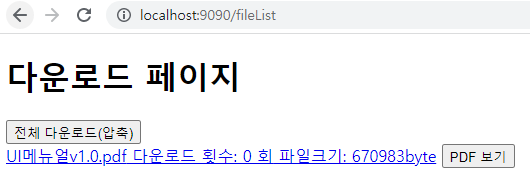
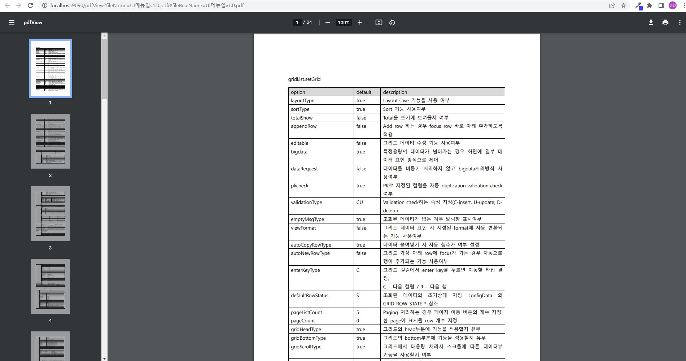

# 다운로드 기능 구현

확장자가 PDF인 파일을 다운로드없이 브라우저의 Viewer로 열어 열람 할 수 있습니다.

---

## Servlet

controller.PdfViewer.java

```
package controller;

import java.io.IOException;
import javax.servlet.ServletException;
import javax.servlet.annotation.WebServlet;
import javax.servlet.http.HttpServlet;
import javax.servlet.http.HttpServletRequest;
import javax.servlet.http.HttpServletResponse;

import service.FileService;

/**
 * Servlet implementation class PdfViewer
 */
@WebServlet("/pdfView")
public class PdfViewer extends HttpServlet {
	private static final long serialVersionUID = 1L;

    /**
     * @see HttpServlet#HttpServlet()
     */
    public PdfViewer() {
        super();
        // TODO Auto-generated constructor stub
    }

	/**
	 * @see HttpServlet#doGet(HttpServletRequest request, HttpServletResponse response)
	 */
	protected void doGet(HttpServletRequest request, HttpServletResponse response) throws ServletException, IOException {
		// TODO Auto-generated method stub
		new FileService().pdfViewer(request, response);
	}

	/**
	 * @see HttpServlet#doPost(HttpServletRequest request, HttpServletResponse response)
	 */
	protected void doPost(HttpServletRequest request, HttpServletResponse response) throws ServletException, IOException {
		// TODO Auto-generated method stub
		doGet(request, response);
	}

}

```

---

## Service

service.FileService.java / pdfViewer()

```
// pdf file view
	public void pdfViewer(HttpServletRequest request, HttpServletResponse response) {
		FileInputStream fileInputStream = null;
		OutputStream outputStream = null;
		try {
			String fileName = request.getParameter("fileRealName"); // 서버 업로드 폴더에 업로드 DefaultFileRenamePolicy 로 변경된 이름을 받아 옵니다.

			// 인코딩 된 파일명을 받았으니 디코딩을 시켜 파일명을 복호화 합니다.
			fileName = URLDecoder.decode(fileName, "UTF-8");

			// file명은 위를 통해 취득했으니 이제 업로드된 서버의 실제 경로를 설정합니다.
			String direction = request.getServletContext().getRealPath("/");
			// String direction = "서버컴퓨터의 local의 사용자 임의 업로드 폴더 경로 설정 하여 보안을 적용 할 수 있습니다.";

			// 서버에 업로드된 실제 경로와 파일명을 + 하여 조합합니다.
			StringBuffer sb = new StringBuffer();
			sb.append(direction);
			sb.append("upload");
			sb.append(File.separator);
			sb.append(fileName);
			String filePath = sb.toString();

			File file = new File(filePath);

			// pdf 파일을 보여 주기위한 response setting
			response.setContentType("application/pdf");
			response.setHeader("Content-Description", "JSP Generated Data");

			response.flushBuffer();

			fileInputStream = new FileInputStream(file);
			outputStream = response.getOutputStream();

			int read = -1;
			byte[] buffer = new byte[1024];
			while((read = fileInputStream.read(buffer, 0, buffer.length)) >= 0) {
				outputStream.write(buffer, 0, buffer.length);
			}
			outputStream.flush();
		} catch(Exception e) {
			e.printStackTrace();
		}
	} // end pdfViewer()
```

기본적으로 다운로드와 매우 유사(?) 똑같습니다.

한가지 다른 점은 response.setContentType("application/pdf");

response에 ContentType을 application/pdf로 설정 한다는 점 입니다.

---

## TEST

  
a태그의 링크로 걸려있는 이름 부분을 누르면 다운로드,  
그 옆에 PDF보기 버튼을 누르면 PDF Viewer로 다운로드 없이 바로보기가 가능합니다.

  
위의 해당화면은 PDF보기 버튼을 눌렀을시 업로드 되어 있던 PDF파일이 다운로드 없이 브라우저에서 직접 나타날 수 있습니다.
