# 다운로드 기능 구현

다운로드 파일을 DB에 INSERT하기 전 Servlet과 통신을 위해 JACKSON 라이브러리를 사용하여,  
JSON을 간편하게 다룰 수 있습니다.

---

## Setting

JackSon lib는 JSON => JavaObject,  
JavaObject => JSON 으로 손 쉽게 변경해주는 라이브러리 입니다.

MavenReposiroty를 통한 라이브러리 다운로드  
[MavenReposiroty](https://mvnrepository.com/)  
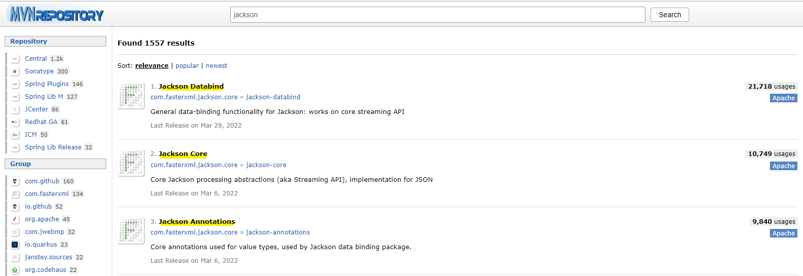  
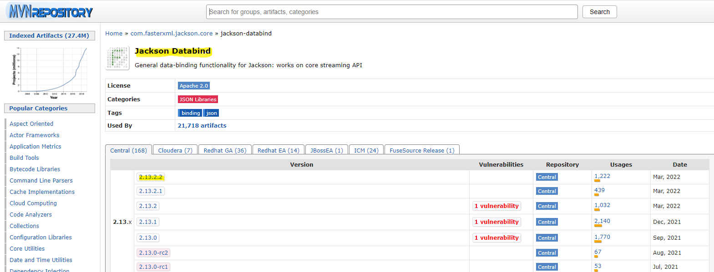  
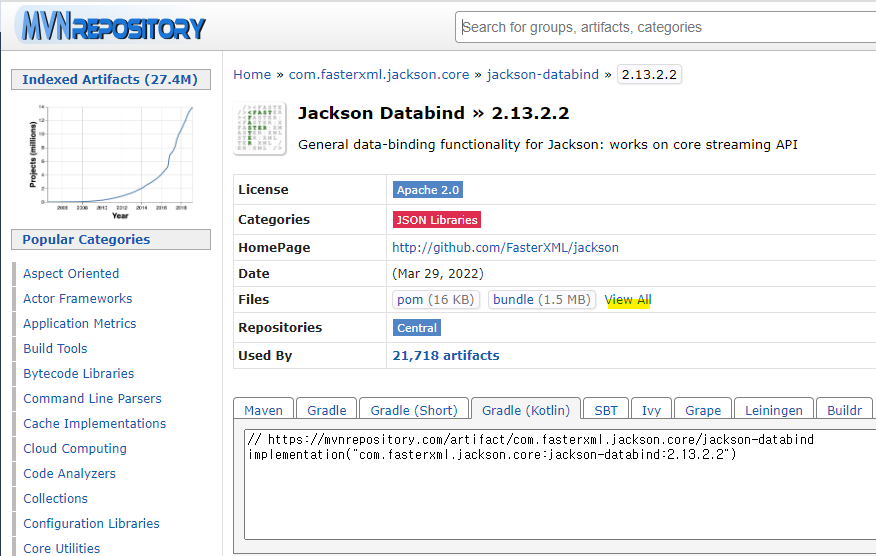  
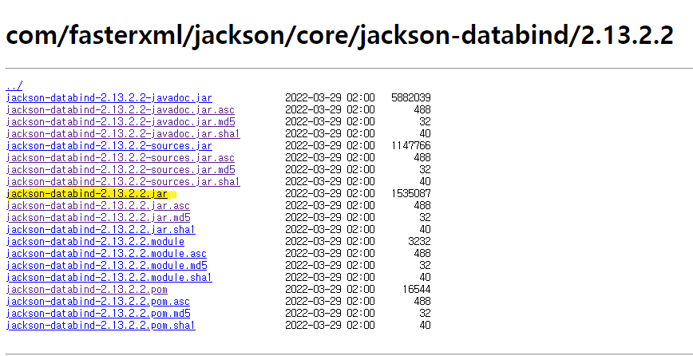  
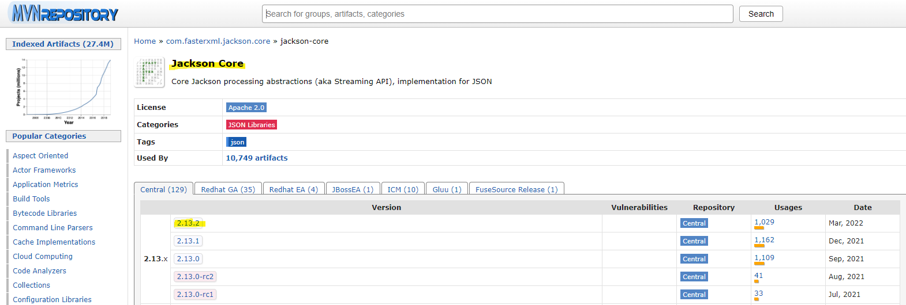  
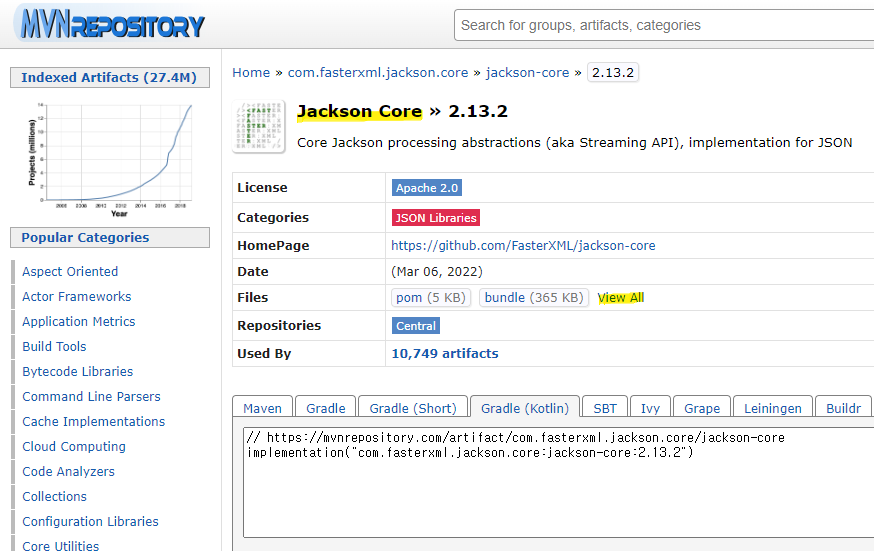  
  
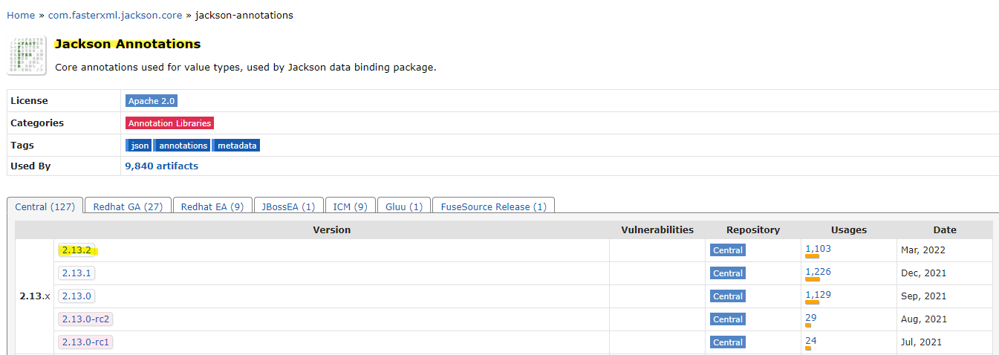  
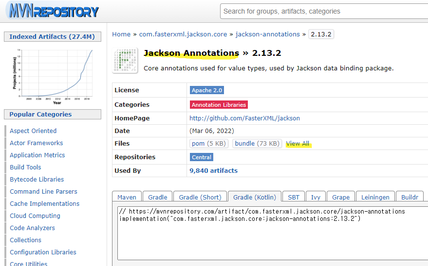  
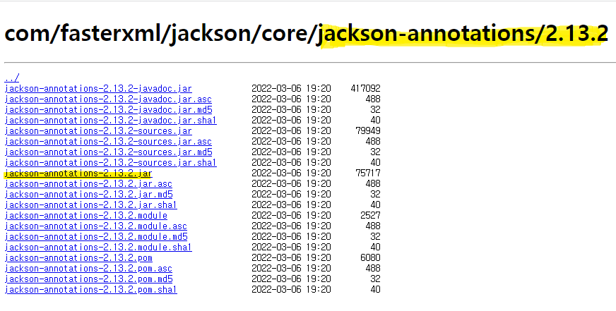  
 jar 파일을 다운로드 받습니다.

---

## 7. 라이브러리 추가

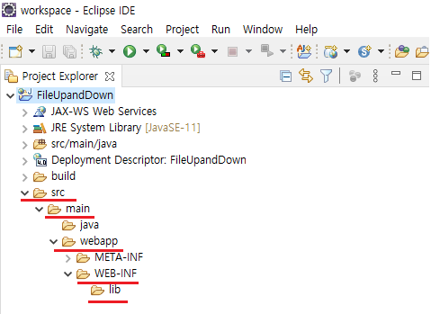  
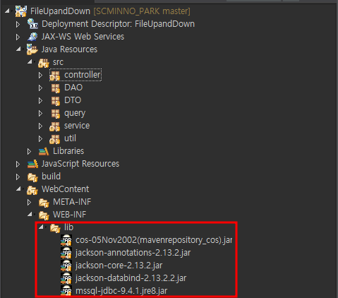

다운받은 라이브러리를 lib폴더에 넣어 줍니다.

---

## JSON -> JAVA OBJECT

```
BufferedReader bufferedReader =  request.getReader();
			String readLine = null;
			StringBuilder json = new StringBuilder();
			while((readLine = bufferedReader.readLine()) != null) {
				json.append(URLDecoder.decode(readLine, "UTF-8"));
			}
```

HttpServletRequest 객체를 사용하여 getReader 메소드를 이용하여, BufferedReader 객체를 가져 올 수 있습니다.

사용자가 요청한 객체를 한줄씩 읽어 String의 형태로 합칩니다.

```
Map<String, Object> params = new ObjectMapper().readValue(json.toString(), HashMap.class);
```

String으로 변경된 데이터를 ObjectMapper 객체를 통하여, readValue메소드를 이용하여,  
필요한 객체로 변경할 수 있습니다.

---

## JAVA OBJECT -> JSON

```
Map<String, String> result = new HashMap<String, String>();
```

```
resultJson = new ObjectMapper().writeValueAsString(result);
```

ObjectMapper 객체를 이용하여 writeValueAsString메소드를 사용하여, 자바의 Object를  
JSON즉 String형태로 변환이 가능합니다.
