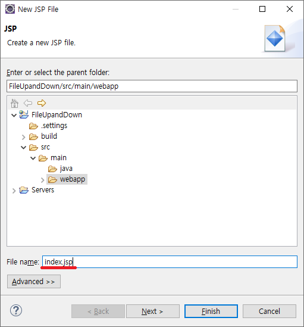

# Index.jsp

## Create index.jsp

jsp 파일을 생성합니다.  


아래 생성시 중요한 점은 파일의 이름은 index로 하셔야 합니다.  
그 이유는 서버를 올려 접속시 서버는 index페이지를 제일 첫번째로 찾기 때문에 파일의 이름은 무조건 index여야 합니다.  


EUC-KR로 되어있는 charset을 UTF-8 로 변경합니다.  
  


파일을 업로드 할 수 있는 form을 생성합니다.

```
	<form action="Upload" id="form" method="post" enctype="multipart/form-data">
		<label>
			파일:&nbsp;<input type="file" name="file0" />
		</label>
		<br />
		<label>
			파일:&nbsp;<input type="file" name="file1" />
		</label>
		<br />
		<label>
			파일:&nbsp;<input type="file" name="file2" />
		</label>
		<br />
		<label>
			파일:&nbsp;<input type="file" name="file3" />
		</label>
		<br />
		<label>
			파일:&nbsp;<input type="file" name="file4" />
		</label>
		<br />
		<button type="submit">submit 전송</button>
	</form>
	<button type="button" onclick="handelFetch();">ajax 전송</button>
```

이때, 파일은 보안을위하여 post method로 전송하며  
enctype은 multipart/form-data로 하여 서버에서 파일을 전송 받을 수 있도록 합니다.  
오랫동안 비동기통신(ajax)에 익숙해져 form태그를 기억 못하시는 분을 위하여 action은 서버로 보내는 주소를 의미합니다.  


---

## AJAX통신을 위한 fetch함수를 통한 fetch로직 작성

```
	<script>
		function handelFetch() {
			let url = '/postUpload';
			let fetchOption = {
					headers: {},
					method: 'post'
			}

			var data = new FormData(document.getElementById('form'));

			// 파일 사이즈 유효성 검사
			for (var value of data.values()) {
				if(value instanceof File) {
					if(value.name) {
						let byteSiz = value.size;
						let kiloByteSize = byteSiz / 1024;
						let megaByteSize = kiloByteSize / 1024;

						// 정확한 30.1MB는 30MB를 초과 즉 소수점 이하에서 올림을 하여 계산
						let resultSize = Math.ceil(megaByteSize);

						let maxSize = 30;
						if(resultSize > maxSize) {
							alert(value.name + ' 이 최대크기인 30MB를 초과하였습니다.\n현재파일크기: ' + resultSize + 'MB');
							return;
						}
					}
				}
			}

			fetchOption.body = data;

			fetch(url, fetchOption) //
			.then((response) => {
				if(response.status == 200) {
					return response.json();
				}
			}) //
			.then((json) => {
				if(json.STATUS === 'SUCCESS') {
					location.href = json.FORWARD;
				}
			}) //
			.catch((e) => {
				console.error(e.message);
			})
		} // end handelFetch()
	</script>
```
