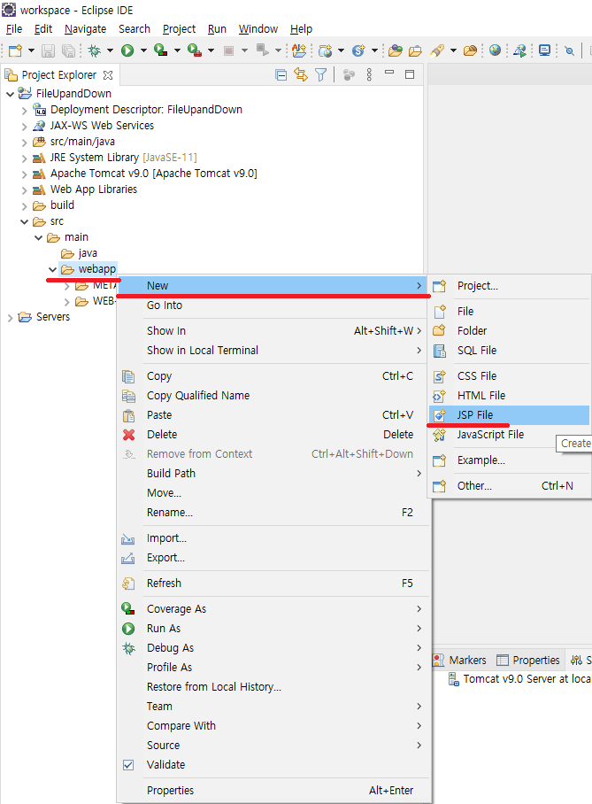

# downloadList.jsp

1. PDF파일일시 다운로드 및 다운로드없이 바로보기 기능 구현
2. 업로드된 파일 전체 다운로드 진행

---

## Create downloadList.jsp

jsp 파일을 생성합니다.  


```
<%@page import="java.net.URLEncoder"%>
<%@page import="DTO.FileDTO"%>
<%@page import="java.util.ArrayList"%>
<%@ page language="java" contentType="text/html; charset=UTF-8"
    pageEncoding="UTF-8"%>
<!DOCTYPE html>
<html>
<head>
<meta charset="UTF-8">
<title>파일 업 & 다운로드</title>
</head>
<body>
	<h1>다운로드 페이지</h1>
	<button onclick="allDownload();">전체 다운로드(압축)</button>
	<div id="box">
	<%
		ArrayList<FileDTO> fileList = (ArrayList) request.getAttribute("fileList");

		if(fileList != null && fileList.size() > 0) { // 업로드 하고 페이지가 자동으로 넘어온 경우
			for(FileDTO file : fileList) {
				String outputStr = "";
				if(file.getFileName().toLowerCase().endsWith("pdf")) {
					outputStr =  "<a href=\"/download?file="
							// 파일명이 한글이라면 QueryString 즉 get방식으로 보낼때
							// encoding 되지 않아 에러를 발생시킵니다.
							// 이를 방지하기 위해 java.net 패키지에 있는 URLEncoder 클래스를 사용해서
							// URL로 인코딩 하여 서버에 보낼 수 있도록 합니다.
							+ URLEncoder.encode(file.getFileName(), "UTF-8") + "\">"
							+ "<span>"
							+ file.getFileRealName()
							+ "</span>"
							+ "<span>&nbsp;"
							+ "다운로드 횟수: "
							+ file.getDownCount()
							+ " 회"
							+ "</span>"
							+ "<span>&nbsp;"
							+ "파일크기: "
							+ file.getFileSize()
							+ "byte"
							+ "</span>"
							+ "</a>"
							+ "&nbsp;"
							// + "<button onclick=\"location.href='/pdfView?fileNam="
							// + URLEncoder.encode(file.getFileName(), "UTF-8")
							// + "&fileRealName="
							// + URLEncoder.encode(file.getFileRealName(), "UTF-8")
							// + "'\">PDF 보기</button>"
							+ "<button onclick=\"handlePdf('"
							+ file.getFileRealName()
							+ "', '"
							+ file.getFileRealName()
							+ "'"
							+");\">PDF 보기</button>"
							+ "<br />";
				} else {
					outputStr =  "<a href=\"/download?file="
							// 파일명이 한글이라면 QueryString 즉 get방식으로 보낼때
							// encoding 되지 않아 에러를 발생시킵니다.
							// 이를 방지하기 위해 java.net 패키지에 있는 URLEncoder 클래스를 사용해서
							// URL로 인코딩 하여 서버에 보낼 수 있도록 합니다.
							+ URLEncoder.encode(file.getFileName(), "UTF-8") + "\">"
							+ "<span>"
							+ file.getFileRealName()
							+ "</span>"
							+ "<span>&nbsp;"
							+ "다운로드 횟수: "
							+ file.getDownCount()
							+ " 회"
							+ "</span>"
							+ "<span>&nbsp;"
							+ "파일크기: "
							+ file.getFileSize()
							+ "byte"
							+ "</span>"
							+ "</a>"
							+ "<br />";
				}
				out.write(outputStr);
			}
		} else { // downloadList.jsp 로 페이지에 접근한 경우
			response.sendRedirect("/fileList"); // list를 반환하는 servlet에 접근 후 redirection
		}
	%>
	</div>
	<script>
		// PDF파일 일시 다운로드 없이 바로보기 기능
		function handlePdf(fileName, fileRealName) {
			window.fileName = fileName;
			window.fileRealName = fileRealName;
			window.open('/pdfViewer.jsp', '_BLANK');
		} // end handlePdf()

		// 압축하여 전체 다운로드
		function allDownload() {
			let boxAList = Array.from(document.querySelectorAll('#box a'));

			let fileNamesStr = '';
			let fileNamesArr = [];
			for(var i = 0; i < boxAList.length; i++) {
				// let fileRealName = boxAList[i].firstChild.innerText;

				let href = boxAList[i].href; // 파일 개별 다운로드 링크
				let fileRealName = href.substring(href.lastIndexOf('=') + 1); // 파일명만 필요하므로 서버에 올라간
				// 실제 파일명만 가져옵니다.

				fileNamesArr.push(fileRealName);
				fileNamesStr += fileRealName;

				if(i < boxAList.length - 1) fileNamesStr += ',';
			}

			let data = {
					fileNamesStr: fileNamesStr,
					fileNamesArr: fileNamesArr
			};

			//test
			/*
			fileNamesArr = ['aa', 'bb', 'cc', 'dd', 'ee']
			// fileNamesArr = 'aa,bb,cc,dd,ee';
			let fileNamesMap = {
					'첫번째 파일': 'aa',
					'두번째 파일': 'bb',
					'세번째 파일': 'cc',
					'네번째 파일': 'dd',
					'다섯번째 파일': 'ee',
					'여섯번째 파일': ['aa', 'bb', 'cc', 'dd', 'ee'],
					'일곱번째 파일': {
						'첫번째 파일': 'aa',
						'두번째 파일': 'bb',
						'세번째 파일': 'cc',
						'네번째 파일': 'dd',
						'다섯번째 파일': 'ee',
						'여섯번째 파일': ['aa', 'bb', 'cc', 'dd', 'ee'],
					}
			};

			data =  {
					  FILENAMESSTR: "",
					  FILEREALNAMESARR: ["aa", "bb", "cc", "dd", "ee"],
					  FILENAMESMAP: {
					    "첫번째 파일": "aa",
					    "두번째 파일": "bb",
					    "세번째 파일": "cc",
					    "네번째 파일": "dd",
					    "다섯번째 파일": "ee",
					    "여섯번째 파일": [
					      "aa",
					      "bb",
					      "cc",
					      "dd",
					      ["aa", "bb", "cc", ["aa", "bb", "cc"]]
					    ],
					    "일곱번째 파일": {
					      "첫번째 파일": "aa",
					      "두번째 파일": "bb",
					      "세번째 파일": "cc",
					      "네번째 파일": "dd",
					      "다섯번째 파일": "ee",
					      "여섯번째 파일": [
					        "aa",
					        "bb",
					        "cc",
					        ["aa", "bb", "cc"],
					        {
					          "첫번째 파일": "aa",
					          "두번째 파일": "bb",
					          "세번째 파일": "cc",
					          "네번째 파일": "dd",
					          "다섯번째 파일": "ee",
					          "여섯번째 파일": ["aa", "bb", "cc", "dd", "ee"]
					        }
					      ]
					    }
					  },
					  TEST: [
					    "aa",
					    "bb",
					    "cc",
					    ["aa", "bb", "cc"],
					    {
					      "첫번째 파일": "aa",
					      "두번째 파일": "bb",
					      "세번째 파일": "cc",
					      "네번째 파일": "dd",
					      "다섯번째 파일": "ee",
					      "여섯번째 파일": ["aa", "bb", "cc", "dd", "ee"]
					    }
					  ]
					};
			*/

			// 브라우저의 최대 URL 길이가 있으므로, 먼저 다운로드 하고자 하는 파일들의 이름을 DOWNLOAD table에 INSERT 합니다.
			let url = '/createMultiDownInsert';
			let fetchOption = {method: 'post'};
			fetchOption.body = JSON.stringify(data);

			fetch(url, fetchOption) //
			.then((response) => {
				return response.json();
			}) //
			.then((json) => {
				console.log(json);
				// INSERT가 완료된 뒤,
				// DB저장된 파일명들에 대한 SEQ를 가지고 다운로드 진행
				location.href = '/createMultiDownList?SEQ=' + json.SEQ;
			}) //
			.catch((e) => {
				console.error(e);
			})
		} // end allDownload()
	</script>
</body>
</html>
```
