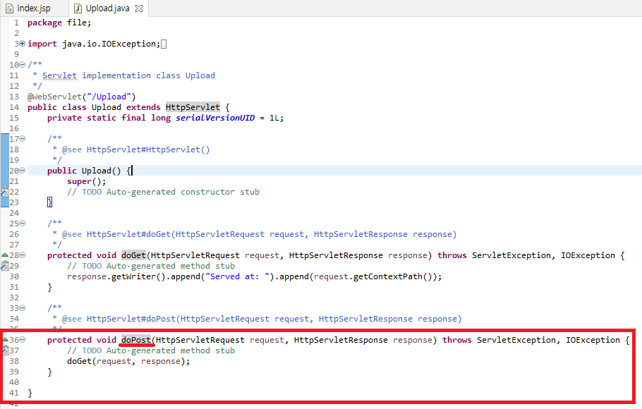
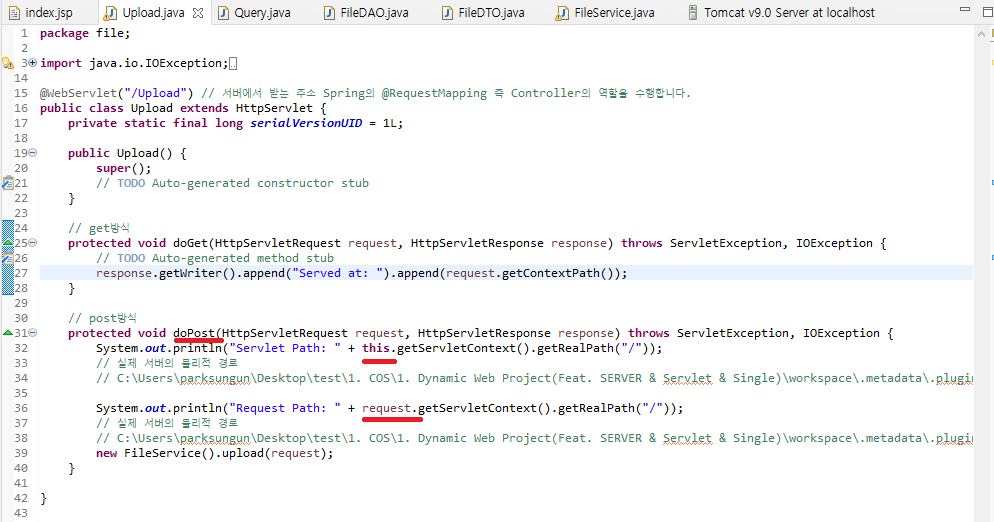

# 업로드 기능 구현

## 업로드 기능 구현

> 업로드프로세스: 업로드form -> 업로드 -> 다운로드List 페이지 이동 -> 다운로드

---

## Servlet 및 Service

업로드를 위한 Service 작성

이제부터 Servlet을 생성할건데,  
Spring만 사용하고 Setvlet Programing을 한번도 접하지 않으셧다면,  
Setvlet을 너무 어렵게 생각하지 않았으면 합니다.  
지금부터 생성하는 Setvlet은 단지 자바 Class이며, HttpServlet객체를 상속받은 클래스를 자동으로 만들어 줄 뿐입니다.  
반대로 말씀드리면 Class를 생성해서 상속밑 오버라이드 메소드를 그대로 작성해주면 똑같이 동작합니다.  
  
  


form태그에서 post메소드를 사용한다고 작성했으므로,  
우리는 우리의 모든 로직을 Servlet의 doPost메소드에 작성하시면 됩니다.  
  
보기 불편한 주석들은 제거를 하고 진행하도록 하겠습니다.

실제 서버에 물리적 경로에 업로드폴더 생성

```
System.out.println("Servlet Path: " + this.getServletContext().getRealPath("/")); // this => HttpServlet 객체를 의미
// 실제 서버의 물리적 경로
// C:\Users\parksungun\Desktop\test\1. COS\1. Dynamic Web Project(Feat. SERVER & Servlet & Single)\workspace\.metadata\.plugins\org.eclipse.wst.server.core\tmp0\wtpwebapps\FileUpandDown\

System.out.println("Request Path: " + request.getServletContext().getRealPath("/"));
// 실제 서버의 물리적 경로
// C:\Users\parksungun\Desktop\test\1. COS\1. Dynamic Web Project(Feat. SERVER & Servlet & Single)\workspace\.metadata\.plugins\org.eclipse.wst.server.core\tmp0\wtpwebapps\FileUpandDown\
new FileService().upload(request);
```

  
  
여기서 path로 직접 찾아가 파일을 업로드 된 파일을 관리하기 위하여,  
새로운 폴더를 생성하여 업로드된 파일을 관리 할 수 있도록 합니다.

  
  


controller.Upload.java

```
package controller;

import java.io.IOException;

import javax.servlet.RequestDispatcher;
import javax.servlet.ServletException;
import javax.servlet.annotation.WebServlet;
import javax.servlet.http.HttpServlet;
import javax.servlet.http.HttpServletRequest;
import javax.servlet.http.HttpServletResponse;

import service.FileService;

@WebServlet("/Upload")
public class Upload extends HttpServlet {
	private static final long serialVersionUID = 1L;

    public Upload() {
        super();
        // TODO Auto-generated constructor stub
    }

    // get방식
	protected void doGet(HttpServletRequest request, HttpServletResponse response) throws ServletException, IOException {
		// TODO Auto-generated method stub
		response.getWriter().append("Served at: ").append(request.getContextPath());
	}

	// post방식
	protected void doPost(HttpServletRequest request, HttpServletResponse response) throws ServletException, IOException {
		System.out.println("Servlet Path: " + this.getServletContext().getRealPath("/")); // this => HttpServlet 객체를 의미
		// 실제 서버의 물리적 경로
		// D:\park\SCMINNO_PARK\FileUpandDown\1. COS\3. DWP(Feat. DB & Servlet & Multi(ZIP) & AJAX)\workspace\.metadata\.plugins\org.eclipse.wst.server.core\tmp0\wtpwebapps\FileUpandDown\

		System.out.println("Request Path: " + request.getServletContext().getRealPath("/"));
		// 실제 서버의 물리적 경로
		// D:\park\SCMINNO_PARK\FileUpandDown\1. COS\3. DWP(Feat. DB & Servlet & Multi(ZIP) & AJAX)\workspace\.metadata\.plugins\org.eclipse.wst.server.core\tmp0\wtpwebapps\FileUpandDown\
		new FileService().upload(request);

		// 업로드 후 다운로드 페이지로 이동하여 다운로드 List를 뿌려줍니다.
		RequestDispatcher requestDispatcher = request.getRequestDispatcher("/downloadList.jsp");
		requestDispatcher.forward(request, response);
	}
}

```

업로드의 핵심인 Service로직을 살펴보도록 하겠습니다.  
service.FileService.java / upload()

```
	// 업로드
	public void upload(HttpServletRequest request) {

		System.out.println("Service Path: " + request.getServletContext().getRealPath("/"));
		// 실제 서버의 물리적 경로
		// D:\park\SCMINNO_PARK\FileUpandDown\1. COS\3. DWP(Feat. DB & Servlet & Multi(ZIP) & AJAX)\workspace\.metadata\.plugins\org.eclipse.wst.server.core\tmp0\wtpwebapps\FileUpandDown\

		String direction = request.getServletContext().getRealPath("upload"); // 서버내 실제 경로의 upload폴더를 지칭합니다.
		// String direction = "서버컴퓨터의 local의 사용자 임의 업로드 폴더 경로 설정 하여 보안을 적용 할 수 있습니다.";
		int fileMaxSize = 1024 * 1024 * 100; // 100MB
		String enCoding = "UTF-8";

		// 서버의 해당 디렉토리에 이미 파일 업로드가 끝난 상태(MultipartRequest 객체 생성시)
		try {
			MultipartRequest multipartRequest =
					new MultipartRequest(request, direction, fileMaxSize, enCoding, new DefaultFileRenamePolicy());

			// 반복문을 통하여 db insert
			Enumeration<String> enumerration = multipartRequest.getFileNames();

			while(enumerration.hasMoreElements()) {
				String parameterName = (String) enumerration.nextElement();

				// 중복된 이름이 있다면 DefaultFileRenamePolicy 객체를 통해 변경된 이름 획득
				String fileName = multipartRequest.getFilesystemName(parameterName); // file => input type="file" 의 name 값

				if(fileName != null) {
					// 보안코딩 추가
					if(fileName.endsWith(".jsp") || fileName.endsWith(".js")) {
						File file = multipartRequest.getFile(parameterName);
						file.delete();
						continue;
					}

					// 사용자가 업로드한 진짜 파일명
					String fileRealName = multipartRequest.getOriginalFileName(parameterName); // file => input type="file" 의 name 값
					String extention = fileRealName.substring(fileRealName.lastIndexOf(".") + 1);
					long fileSize = multipartRequest.getFile(parameterName).length();

					// DB Insert
					dao.upload(fileName, fileRealName, extention, fileSize);
				}
			}
			/*
			// 다운로드 list 페이지 이동을 위한 database SELECT
			ArrayList<FileDTO> fileList = dao.getUploadList();
			request.setAttribute("fileList", fileList);
			*/
		} catch (IOException e) {
			// TODO Auto-generated catch block
			e.printStackTrace();
		}
	} // end upload()
```

---

## test

  
  
  
업로드 후 정상적으로 다운로드 페이지로 이동한 모습을 볼 수 있습니다.  
  
데이터베이스 에도 정상적으로 데이터가 들어온 모습을 볼 수 있고,
위 사진과 같이 크기(fileSize)도 정상적으로 들어오는 모습을 볼 수 있습니다.  
  
서버의 실제 물리적 경로에도 파일이 잘 들어와 있는 모습을 볼 수 있습니다.

그렇다면 중복된 이름의 파일을 업로드 하면 어떻게 될까요? TEST해보겠습니다.  
  
  
  


database와 실제 물리적 경로에 sequnce가 증가되어 파일명으로 저장되었습니다.  
이로서 중복파일 TEST도 통과 되었습니다.

---

## 업로드 와 동시에 downloadList.jsp로 이동 할 수 있도록 upload 메소드 튜닝

먼저 upload와 동시에 다운로드 페이지로 forwording 되면서 다운로드 List를 뿌릴 수 있도록 Service의 upload 메소드를 튜닝 해 보도록 하겠습니다.

```
	// 업로드
	public void upload(HttpServletRequest request) {

		System.out.println("Service Path: " + request.getServletContext().getRealPath("/"));
		// 실제 서버의 물리적 경로
		// D:\park\SCMINNO_PARK\FileUpandDown\1. COS\3. DWP(Feat. DB & Servlet & Multi(ZIP) & AJAX)\workspace\.metadata\.plugins\org.eclipse.wst.server.core\tmp0\wtpwebapps\FileUpandDown\

		String direction = request.getServletContext().getRealPath("upload"); // 서버내 실제 경로의 upload폴더를 지칭합니다.
		// String direction = "서버컴퓨터의 local의 사용자 임의 업로드 폴더 경로 설정 하여 보안을 적용 할 수 있습니다.";
		int fileMaxSize = 1024 * 1024 * 100; // 100MB
		String enCoding = "UTF-8";

		// 서버의 해당 디렉토리에 이미 파일 업로드가 끝난 상태(MultipartRequest 객체 생성시)
		try {
			MultipartRequest multipartRequest =
					new MultipartRequest(request, direction, fileMaxSize, enCoding, new DefaultFileRenamePolicy());

			// 반복문을 통하여 db insert
			Enumeration<String> enumerration = multipartRequest.getFileNames();

			while(enumerration.hasMoreElements()) {
				String parameterName = (String) enumerration.nextElement();

				// 중복된 이름이 있다면 DefaultFileRenamePolicy 객체를 통해 변경된 이름 획득
				String fileName = multipartRequest.getFilesystemName(parameterName); // file => input type="file" 의 name 값

				if(fileName != null) {
					// 보안코딩 추가
					if(fileName.endsWith(".jsp") || fileName.endsWith(".js")) {
						File file = multipartRequest.getFile(parameterName);
						file.delete();
						continue;
					}

					// 사용자가 업로드한 진짜 파일명
					String fileRealName = multipartRequest.getOriginalFileName(parameterName); // file => input type="file" 의 name 값
					String extention = fileRealName.substring(fileRealName.lastIndexOf(".") + 1);
					long fileSize = multipartRequest.getFile(parameterName).length();

					// DB Insert
					dao.upload(fileName, fileRealName, extention, fileSize);
				}
			}
			// 변경부분
			// 다운로드 list 페이지 이동을 위한 database SELECT
			ArrayList<FileDTO> fileList = dao.getUploadList();
			request.setAttribute("fileList", fileList);
		} catch (IOException e) {
			// TODO Auto-generated catch block
			e.printStackTrace();
		}
	} // end upload()
```

  
Insert 이후 SELECT 를하여 request에 해당 데이터를 셋팅 할 수 있도록 합니다.
