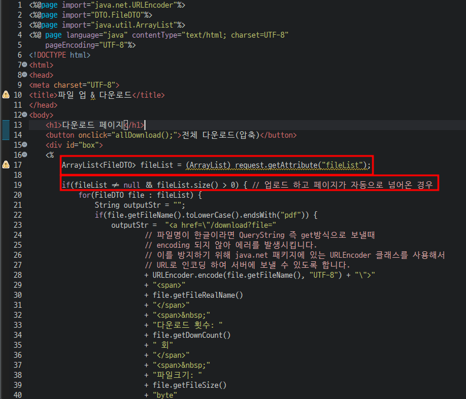

# 업로드 기능 구현

downloadList.jsp에 업로드된 파일의 정보 출력을 구현

downloadList.jsp로 바로 접근시 List를 받아 오도록 getList service 로직을 작성하고  
downloadList Servlet 또한 작성해 보도록 하겠습니다.

---

## downloadList.jsp



/fileList 를 통하여 downloadList.jsp에 업로드된 정보들을 가지고 접근 할 수 있도록 합니다.

---

## Servlet

controller.FileList.java

```
package controller;

import java.io.IOException;
import java.util.ArrayList;

import javax.servlet.RequestDispatcher;
import javax.servlet.ServletException;
import javax.servlet.annotation.WebServlet;
import javax.servlet.http.HttpServlet;
import javax.servlet.http.HttpServletRequest;
import javax.servlet.http.HttpServletResponse;

import DTO.FileDTO;
import service.FileService;

/**
 * Servlet implementation class FileList
 */
@WebServlet("/fileList")
public class FileList extends HttpServlet {
	private static final long serialVersionUID = 1L;

    /**
     * @see HttpServlet#HttpServlet()
     */
    public FileList() {
        super();
        // TODO Auto-generated constructor stub
    }

	/**
	 * @see HttpServlet#doGet(HttpServletRequest request, HttpServletResponse response)
	 */
	protected void doGet(HttpServletRequest request, HttpServletResponse response) throws ServletException, IOException {
		// TODO Auto-generated method stub
		ArrayList<FileDTO> fileList = new FileService().getFileList();
		RequestDispatcher requestDispatcher = null;

		// 조회된 업로드 파일이 있는경우 downloadList.jsp에서 볼 수 있도록 하며, 다운로드 할 수 있도록 구현합니다.
		if(fileList.size() > 0) {
			request.setAttribute("fileList", fileList);

			requestDispatcher = request.getRequestDispatcher("/downloadList.jsp");
		} else { // 조회된 업로드 파일이 없는경우 index.jsp에서 파일을 업로드 할 수 있도록 업로드폼으로 이동합니다.
			requestDispatcher = request.getRequestDispatcher("/index.jsp");
		}

		if(requestDispatcher != null) requestDispatcher.forward(request, response);
	}

	/**
	 * @see HttpServlet#doPost(HttpServletRequest request, HttpServletResponse response)
	 */
	protected void doPost(HttpServletRequest request, HttpServletResponse response) throws ServletException, IOException {
		// TODO Auto-generated method stub
		doGet(request, response);
	}

}
```

---

## Service


service.FileService.java / getFileList()

```
	// 다운로드 list
	public ArrayList<FileDTO> getFileList() {
		return dao.getUploadList();
	} // end getFileList()
```

DataBase에 입력된 정보를 List형태로 return 합니다.
