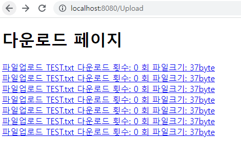

# 다운로드 기능 구현

개별 다운로드를 진행합니다.

---

## Servlet

downloadList.jsp 에서 a태그의 url을 살펴보면 download라는 곳으로 Request를 보낼 것이기 때문에 download라는 주소를 받는 servlet을 작성합니다.

  
  
  
위 사진을 보고 의문을 가지실 분이 계실수도 있을거라고 생각합니다.  
download라는 곳으로 Request를 보낼껀데 Servlet의 Class명은 왜 DowloadServlet 로 하였을까요...?

답은 단지 클래스명이고 우리는 방금 만든 Servlet Class 내부의 @WebServlet 어노테이션에 주목해야 합니다.  
  
  
우리가 요청보내는 주소로 변경해줍니다.  
여기서 알 수 있듯이 클래스명과는 아무런 상관이 없습니다.

```
package controller;

import java.io.IOException;

import javax.servlet.ServletException;
import javax.servlet.annotation.WebServlet;
import javax.servlet.http.HttpServlet;
import javax.servlet.http.HttpServletRequest;
import javax.servlet.http.HttpServletResponse;

import service.FileService;

/**
 * Servlet implementation class Download
 */
@WebServlet("/download")
public class Download extends HttpServlet {
	private static final long serialVersionUID = 1L;

    /**
     * @see HttpServlet#HttpServlet()
     */
    public Download() {
        super();
        // TODO Auto-generated constructor stub
    }

	/**
	 * @see HttpServlet#doGet(HttpServletRequest request, HttpServletResponse response)
	 */
	protected void doGet(HttpServletRequest request, HttpServletResponse response) throws ServletException, IOException {
		// TODO Auto-generated method stub
		new FileService().download(request, response);
	}

	/**
	 * @see HttpServlet#doPost(HttpServletRequest request, HttpServletResponse response)
	 */
	protected void doPost(HttpServletRequest request, HttpServletResponse response) throws ServletException, IOException {
		// TODO Auto-generated method stub
		doGet(request, response);
	}

}
```

---

## Service

service.FileService.java / download()

```
	// 다운로드 서비스
	public void download(HttpServletRequest request, HttpServletResponse response) {
		try {
			// downloadList.jsp에서 a태그의 주소를 살펴보면
			// <a href="/download?file=%ED%8C%8C%EC%9D%BC%EC%97%85%EB%A1%9C%EB%93%9C+TEST.txt"><span>파일업로드 TEST.txt</span><span>&nbsp;다운로드 횟수: 0 회</span><span>&nbsp;파일크기: 37byte</span></a>
			// 인코딩 된 파일명으로 file이란 이름으로 보내주고 있습니다. 보내주는 파라미터를 받아 보도록 하겠습니다.
			String fileName = request.getParameter("file"); // 서버 업로드 폴더에 업로드 DefaultFileRenamePolicy 로 변경된 이름을 받아 옵니다.

			// 인코딩 된 파일명을 받았으니 디코딩을 시켜 파일명을 복호화 합니다.
			fileName = URLDecoder.decode(fileName, "UTF-8");

			// file명은 위를 통해 취득했으니 이제 업로드된 서버의 실제 경로를 설정합니다.
			String direction = request.getServletContext().getRealPath("/");
			// String direction = "서버컴퓨터의 local의 사용자 임의 업로드 폴더 경로 설정 하여 보안을 적용 할 수 있습니다.";

			// 서버에 업로드된 실제 경로와 파일명을 + 하여 조합합니다.
			StringBuffer sb = new StringBuffer();
			sb.append(direction);
			sb.append("upload");
			sb.append(File.separator);
			sb.append(fileName);
			String filePath = sb.toString();

			File file = new File(filePath);

			// 어떤한 정보를 주고 받는지에 대한 response(응답)에 대한 contentType setting
			String mimeType = request.getServletContext().getMimeType(file.toString());
			if(mimeType == null) {
				// application/octet-seream => 파일관련 정보를 주고 받는 ContentType
				response.setContentType("application/octet-seream");
			}

			// 파일은 실제 서버의 물리적 경로에 업로드된 파일을 사용하되,
			// 파일명은 사용자가 실제 올린 파일명으로 다운로드가 진행되어야 하기 때문에
			// DB를 조회해서 실제 파일명을 SELECT 합니다.
			String fileRealName = dao.getFileRealName(fileName);

			// 사용자에게 파일을 다운로드 받을시 다시 파일명을 해당 플랫폼에 따라 인코딩 시켜줄수 있도록 encoding을 설정합니다.
			// 여기서 플랫폼이란 IE, 엣지, 크롬 등을 의미 합니다.
			String downloadName = null;
			// 요청온 해더의 유저정보에서 확일 할 수 있습니다.
			if(request.getHeader("user-agent").indexOf("MISE") != -1) { // MSIE = IE
				// -1 이 아니라면... 즉, 익스플로러가 아니라면
				downloadName = new String(fileRealName.getBytes("UTF-8"), "8859_1"); // 8859_1 : encoding 방식의 한 종류
			} else { // 익스플로러 라면....
				downloadName = new String(fileRealName.getBytes("EUC-KR"), "8859_1"); // 8859_1 : encoding 방식의 한 종류
			}

			// response(응답)에 대한 header setting
			sb = new StringBuffer();
			sb.append("attachment;filename=\"");
			sb.append(downloadName);
			sb.append("\"");
			String contentDisposition = sb.toString();
			response.setHeader("Content-Disposition", contentDisposition);

			// 실제로 Stream을 사용하며 사용자 컴퓨터에 다운로드
			FileInputStream fis = new FileInputStream(file);
			OutputStream os = response.getOutputStream();

			// Stream은 byte단위로 1024byte로 쪼개서 보낼 수 있도록 합니다.
			byte[] tempFile = new byte[1024];
			int data = 0;
			while((data = fis.read(tempFile, 0, tempFile.length)) != -1) {
				os.write(tempFile, 0, data);
			}

			// Stream 종료
			os.flush();
			os.close();
			fis.close();

			// 다운로드가 끝난뒤 다운로드 횟수 증가
			dao.downIncrease(fileName);
		} catch(Exception e) {
			e.printStackTrace();
		}
	} // download()
```

---

## TEST

다음으로 list를 뿌려주는 downloadList.jsp에서 업로드 된 파일을 확인 해보도록 하겠습니다.

a 태그 안에 다운로드 Servlet으로 가는 URL을 설정하고 필요한 정보를 Setting 합니다.

이제 업로드 후 파일 다운로드 List가 제대로 나오는지 확인해 보겠습니다.
  
정상적으로 list가 잘 나오는 모습을 볼 수 있습니다.  
이전 학습에서 보듯이 파일명은 같지만 물리적 서버의 경로에 있는 파일명은 다르기 때문에  
보이는 이름은 같지만, 서버에 get방식으로 보내는 파일명은 모두 다르게 나오기 때문에  
다운로드 횟수를 증가 시킬수 있습니다.

  


실제로 DataBase에 다운로드 횟수가 잘 증가하였고, 화면에서도 새로고침 후에 다운로드 횟수가 증가된 모습을 볼 수 있습니다.


실제로 다운로드 폴더에 업로드 했던 파일과 일치한 파일이 정확하게 들어 왔음을 알 수 있습니다.

같은 파일만 업로드한 학습이라 혼동이 될 수 있으니, 다른 파일로 시도 해보시고  
그래도 혼동이 되신다면 FileService의 download 메소드에서 downloadName을 fileRealName이 아닌 fileName으로 변경해 보신다면 좀더 명확하게 확인해 보실 수 있습니다.

---

## 보안코딩

악의적인 의도로 .jsp, .js에 악의적 코드를 작성하여 서버에 업로드 하게 된다면 ... ?  
그 악의적인 코드가 작동 할 수 있습니다.  
이를 방지하기위해 2가지 방법을 살펴보겠습니다.

1. 확장자를 구분하여 upload 제한(file.FileService.upload())

```
			// 보안코딩 추가
			if(fileName.endsWith(".jsp") || fileName.endsWith(".js")) {
				File file = multipartRequest.getFile("file");
				file.delete();
				return;
			}
```

  
허나 이발법은 좋은 방법이 아닙니다.  
원천적으로 upload를 막는다면 좋은 방법이지만, MultipartRequest 객체의 특성상  
이미 폴더에 upload시킨 상태 입니다.  
후속조치로 해당 확장자면 파일을 다시지우는 방법 입니다.

이때 문제점이 한명은 지속적으로 악의적코드가 들어간 파일을 업로드하고,  
또 한명은 그 파일이 지워지기전에 계속 실행하려 한다면  
일명 경쟁상태에 빠지게 됩니다.

이때, 모든 경쟁상태를 막을 수 없어 결국 한번쯤은 실행 될 수 도 있습니다.  
이런 경쟁상태를 방지하기 위해

2. upload 및 download 경로를 하드코딩 작성합니다.

```
String direction = "서버컴퓨터의 local의 사용자 임의 업로드 폴더 경로 설정 하여 보안을 적용 할 수 있습니다.";
```

  


위와 같이 업로드, 다운로드 경로를 하드코딩으로 작성한다면...  
관계자 외에 이 경로를 알 수 있는 방법이 매우 어렵고 희박합니다.

---

## 마침

이렇게 보안코딩까지 적용하여 파일 업, 다운 로드를 학습해 보았습니다.
