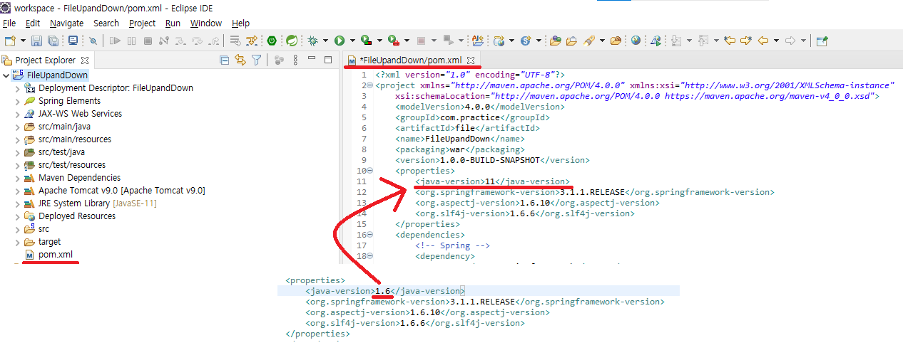
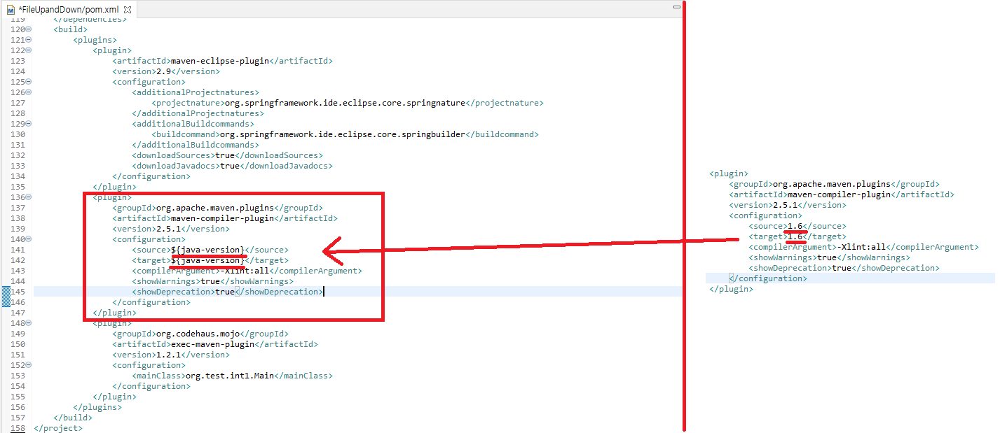
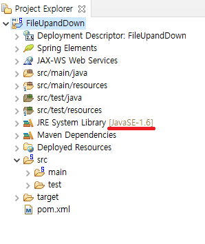
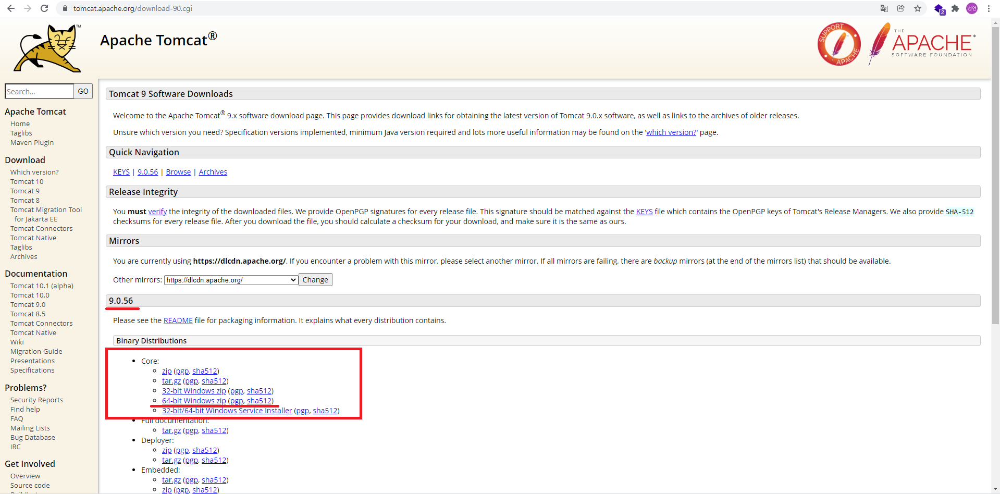
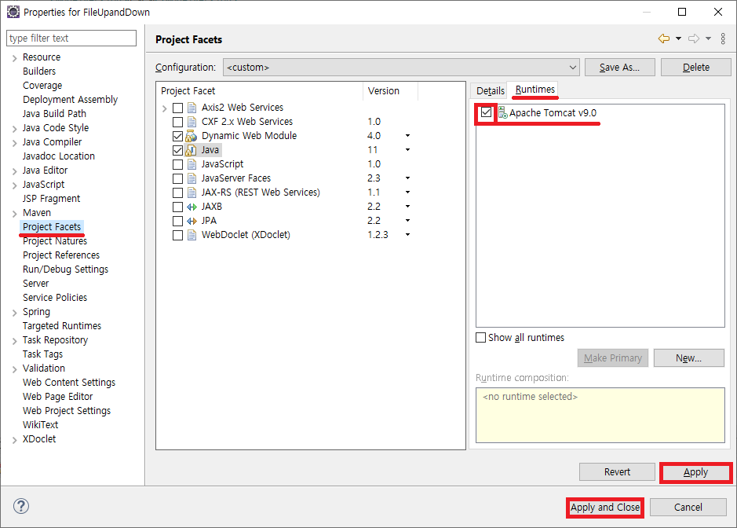

# Spring (Feat. SERVER & Multi)

본 학습은 servlet을 이해하고 COS 라이브러리를 통해 서버에 파일 업로드를 구현하고 다운로드 기능을 구현을 목적으로 합니다.

## 1. DB Setting

```
DROP TABLE FILETEST;

CREATE TABLE FILETEST (
	FILENAME VARCHAR(500), -- 중복되어 변경된 파일명
	FILEREALNAME VARCHAR(500), -- 사용자가 실제로 업로드한 파일명
	EXTENTION VARCHAR(50), -- 확장자
	FILESIZE BIGINT, -- 파일 크기
	DOWNCOUNT INT -- 다운로드 횟수
);

-- table comment
EXEC   SP_ADDEXTENDEDPROPERTY 'MS_DESCRIPTION', 'SERVER 파일업로드 TEST TABLE', 'USER', DBO, 'TABLE', FILETEST;

-- column comment
EXEC   SP_ADDEXTENDEDPROPERTY 'MS_DESCRIPTION', '중복되어 변경된 파일명', 'USER', DBO, 'TABLE', FILETEST, 'COLUMN', FILENAME;
EXEC   SP_ADDEXTENDEDPROPERTY 'MS_DESCRIPTION', '사용자가 실제로 업로드한 파일명', 'USER', DBO, 'TABLE', FILETEST, 'COLUMN', FILEREALNAME;
EXEC   SP_ADDEXTENDEDPROPERTY 'MS_DESCRIPTION', '확장자', 'USER', DBO, 'TABLE', FILETEST, 'COLUMN', EXTENTION;
EXEC   SP_ADDEXTENDEDPROPERTY 'MS_DESCRIPTION', '파일 크기', 'USER', DBO, 'TABLE', FILETEST, 'COLUMN', FILESIZE;
EXEC   SP_ADDEXTENDEDPROPERTY 'MS_DESCRIPTION', '다운로드 횟수', 'USER', DBO, 'TABLE', FILETEST, 'COLUMN', DOWNCOUNT;
```

---

## 2. Spring Tools Injection

  


---

## 3. CREATE MAVEN PROJECT WHIT SPRING

  
  


  
  
현재 로컬 workspace에 사용중인 java버전으로 변경합니다.  
본 교육에서는 자바11버전을 사용하기 때문에 11버전으로 pom.xml의 자바 버전을 번경합니다.

  
플러그인으로 가서 빌드하는 자바 버전을 변경합니다.  
위의 버전변경은 해당 pom.xml에서 사용하기 위한 자바버전을 변수로 등록해 놓은것이고  
실제로 플러그인 즉, 빌드될때 설정한 자바 버전으로 빌드되도록 ${변수명}을 입력하여 자바 버전을 변경합니다.  
여기서 변수명은 태그명이 됩니다.

  
pom.xml이 변경이 되었다면 Update Projct를 통해 현재 프로젝트와 동기화 할 수 있도록 해 줍니다.

  
  
  
  
  
  
  
  


---

## 4. WAS(Web Application Server) Setting Whit TOMCAT

WAS(Web Application Server) 다운로드  
[Apache Tomcat](https://tomcat.apache.org/)




해당 운영체제에 맞는 Tomcat을 다운로드 합니다.

  
  
  
  
  
  
  
  
  
  
  
  
  
context path 변경을 위해 Edit버튼을 누릅니다.

  
이전 교육을 잘 따라오셧다면 context path의 변경이 무엇을 의미 하는지 알고 계시리라고 생각됩니다.


