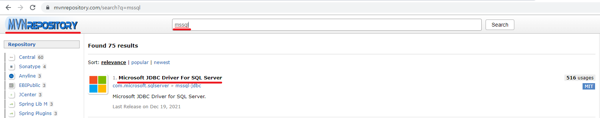
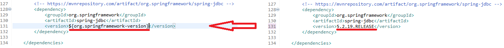

# Spring (Feat. SERVER & Multi)

본 학습은 servlet을 이해하고 COS 라이브러리를 통해 서버에 파일 업로드를 구현하고 다운로드 기능을 구현을 목적으로 합니다.

## 1. Encoding Filter Setting

  
?로 글자가 깨지는 것을 볼 수 있습니다.  
글자가 깨지는 것을 방지하기 위하여 Encoding Filter 설정을 합니다.

  
시작부터 에러가 나고 있습니다.  
당황하지 마시고 아래와 같이 java를 JAVA로 변경해 줍니다.


```
	<!-- spring의 내부적으로 utf-8 을 지원하지 않습니다. -->
	<!-- utf-8 설정을 하도록 합니다. -->
	<filter>
		<filter-name>encodingFilter</filter-name>
		<filter-class>org.springframework.web.filter.CharacterEncodingFilter</filter-class>
		<init-param>
			<param-name>encoding</param-name>
			<param-value>UTF-8</param-value>
		</init-param>
		<init-param>
			<param-name>forceEncoding</param-name>
			<param-value>true</param-value>
		</init-param>
	</filter>

	<filter-mapping>
		<filter-name>encodingFilter</filter-name>
		<url-pattern>/*</url-pattern>
	</filter-mapping>
```

해당 필터를 코드를 web.xml에 추가시켜 서버를 재가동 후 다시 접근해 보도록하겠습니다.

  
한글이 안깨지고 정상적으로 출력되는 모습을 볼 수 있습니다.

---

## 2. JDBC(MSSQL) DEPENDENCY 추가

[MavenRepository](https://mvnrepository.com/)

```
		<!-- https://mvnrepository.com/artifact/com.microsoft.sqlserver/mssql-jdbc -->
		<dependency>
		    <groupId>com.microsoft.sqlserver</groupId>
		    <artifactId>mssql-jdbc</artifactId>
		    <version>9.4.1.jre11</version>
		</dependency>
```

  
  
JDK버전에 맞는 라이브러리를 선택합니다.

  
✨ 이전교육과의 차이점은 라이브러리의 주입 방식입니다.  
이전 교육에서는 jar 파일을 다운받아 직접 프로젝트에 넣어 주었다면...  
Spring Maven Projct에서는 해당 코드를 복사하여 pom.xml에 추가 합니다.

  
복사한 라이브러리는 pom.xml에 dependencies 태그 안쪽에 넣어 줍니다.  
pom.xml이 바뀌었으므로 프로젝트 동기화및 라이브러리 다운을 위해 Maven Project를 업데이트 해 줍니다.

  
  
프로젝트 업데이트를 진행하면 위의 경로 즉, 사용자의 local에 해당 라이브러리를 다운 받습니다.

---

## 3. Spring JDBC DEPENDENCY 추가

[MavenRepository](https://mvnrepository.com/)

```
		<!-- https://mvnrepository.com/artifact/org.springframework/spring-jdbc -->
		<dependency>
		    <groupId>org.springframework</groupId>
		    <artifactId>spring-jdbc</artifactId>
		    <version>5.2.19.RELEASE</version>
		</dependency>
```

스프링에서 트랜잭션(commit, rollback...)을 원활히 관리하기 위하여 Spring JDBC라는 라이브러를 사용 하여 조금더 손쉽게 관리 할 수 있습니다.

  
  
해당 스프링 버전에 맞는 라이브러리를 사용해야 하기 때문에 pom.xml에서 현재 사용중인 버전을 확인 합니다.

  
버전을 확인하는 겸 스프링 버전을 5버전대로 올려서 진행하도록 하겠습니다.  
사진에 보시는 바와 같이 스프링버전또한 자바와 같이 변수화가 되어있으므로,  
버전 숫자만 바꿔 모두 적용 될 수 있도록합니다.

  
  
  
역시나 dependencies 태그 안에 넣어주시고 자주 바뀔 수 있는 버전 정보는 변수명으로 대체 할 수 있도록 합니다.


---

## 4. COS라이브러리 DEPENDENCY 추가

[MavenRepository](https://mvnrepository.com/)

```
        <!-- https://mvnrepository.com/artifact/servlets.com/cos -->
        <dependency>
            <groupId>servlets.com</groupId>
            <artifactId>cos</artifactId>
            <version>05Nov2002</version>
        </dependency>
```

  
  
  
  
다른 라이브러리들과 같이 pom.xml의 dependencies 태그 안에 넣어줄수 있도록 합니다.


