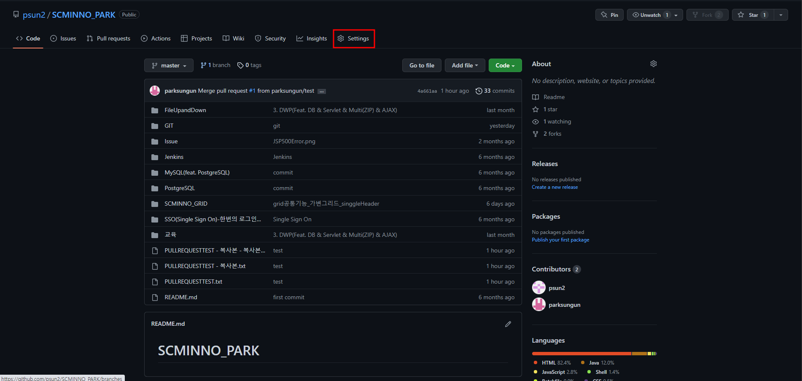
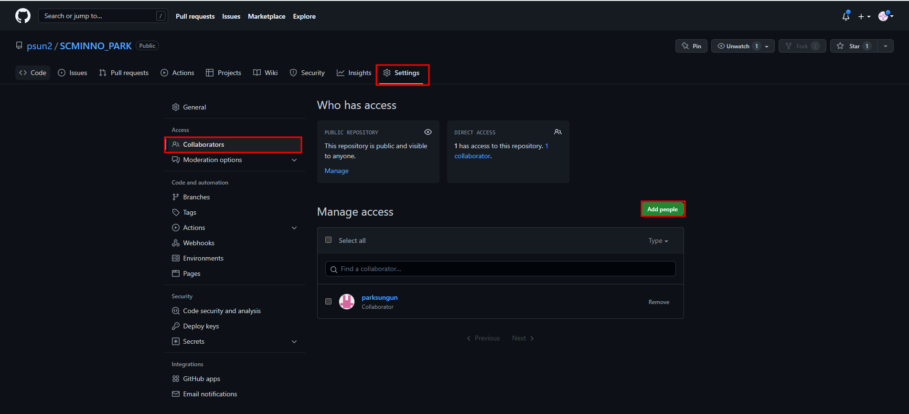
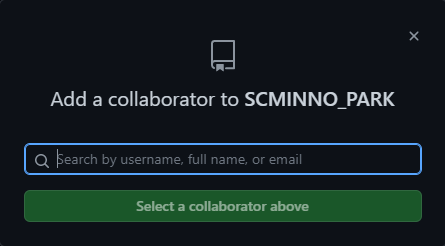
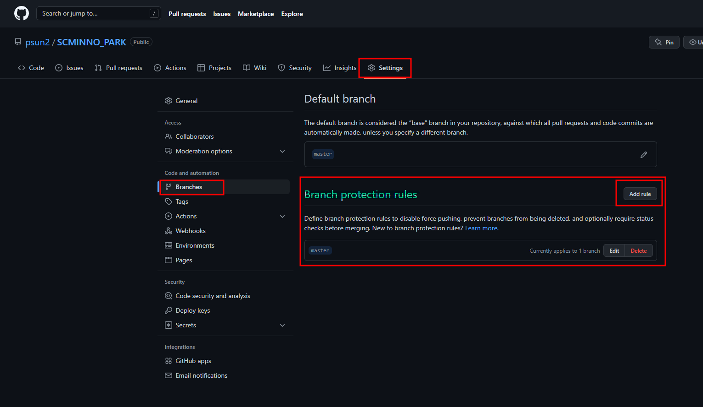
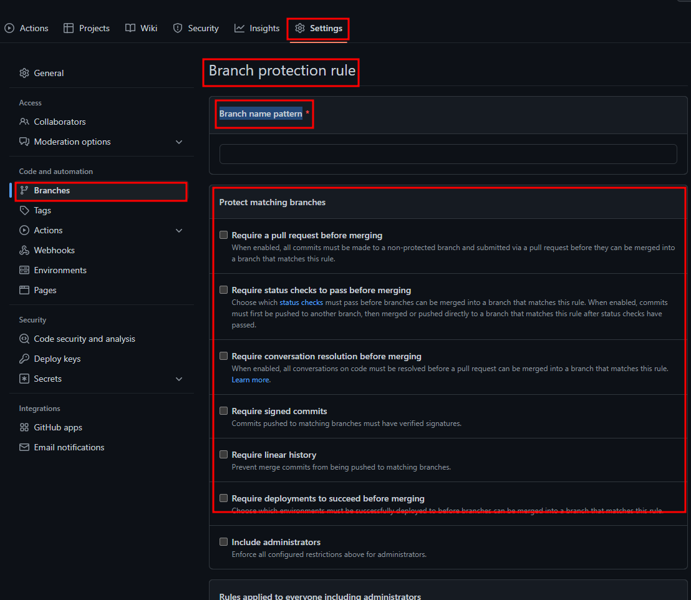
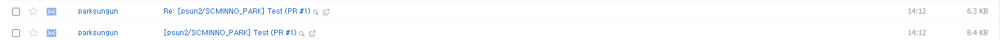
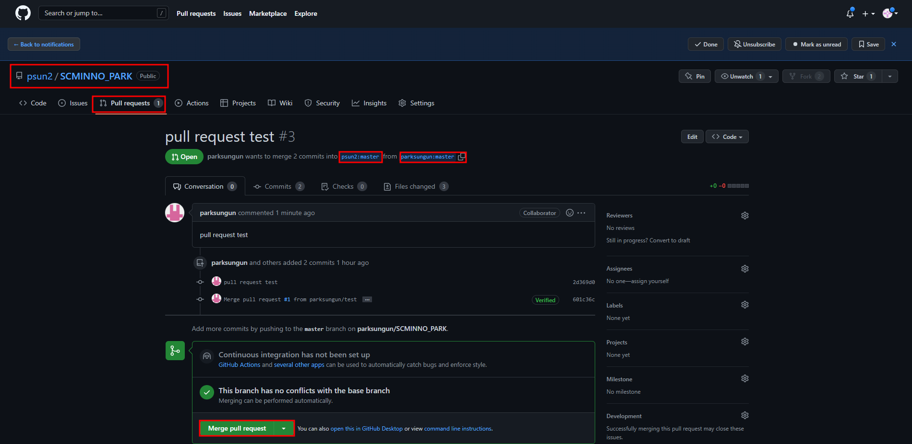

# `관리자`

본 학습은 CLI(Command Line InterFace)로 진행하였습니다.  
진행에 참고 부탁드립니다.

---

## `Repository 설정 및 Rule 설정`

관리자는 협업대상의 repository(원격저장소) 에 관한 설정을 합니다.  
(ex> 권한 및 collaborators 설정)



  
Add people 버튼을 눌러 해당프로젝트에 참여할 인원의 github의 ID및 Name을 검색하여 추가 합니다.



  
해당 레포지토리에 대한 권한을 설정 할 수 있습니다.

  
설정 디테일에 관한 부분은 구글링을 통하거나, 페이지 번역을 통해 설정을 완료 할 수 있습니다.

조금 중요한 부분이 Branch name pattern인데 Rule의 명칭을 정합니다.  
브랜치명으로 특정 브랜치를 정하거나, pattern으로 부합한 브랜치들을 설정 할 수 있습니다.

```
브랜치명: test
Branch name pattern: test
특정 test branch에대한 Rule 설정

Branch name pattern: test*
test 접두어를 가진 모든 branch에 대한 설정

Branch name pattern: test/*
test/ 접두어를 가진 모든 branch에 대한 설정
```

---

## `Merge`



관리자가 등록한 github emali로 merge 요청이 옵니다.

  
해당 코드가 이상이 없을시 Merge를 이용하여 코드를 병합 할 수 있도록 합니다.
