# `협업`

본 학습은 CLI(Command Line InterFace)로 진행하였습니다.  
진행에 참고 부탁드립니다.

---

## `Repository 설정 및 Rule 설정`

관리자는 협업대상의 repository(원격저장소) 에 관한 설정을 합니다.  
(ex> 권한 및 collaborators 설정)


  
Add people 버튼을 눌러 해당프로젝트에 참여할 인원의 github의 ID및 Name을 검색하여 추가 합니다.


  
해당 레포지토리에 대한 권한을 설정 할 수 있습니다.

  
설정 디테일에 관한 부분은 구글링을 통하거나, 페이지 번역을 통해 설정을 완료 할 수 있습니다.

조금 중요한 부분이 Branch name pattern인데 Rule의 명칭을 정합니다.  
브랜치명으로 특정 브랜치를 정하거나, pattern으로 부합한 브랜치들을 설정 할 수 있습니다.

```
브랜치명: test
Branch name pattern: test
특정 test branch에대한 Rule 설정

Branch name pattern: test*
test 접두어를 가진 모든 branch에 대한 설정

Branch name pattern: test/*
test/ 접두어를 가진 모든 branch에 대한 설정
```

---

## `Fork 및 Clone`

먼저 레포지토리의 관리자로부터 collaborator신청을 받으면 해당 github emali로 초대장이 날라 옵니다.

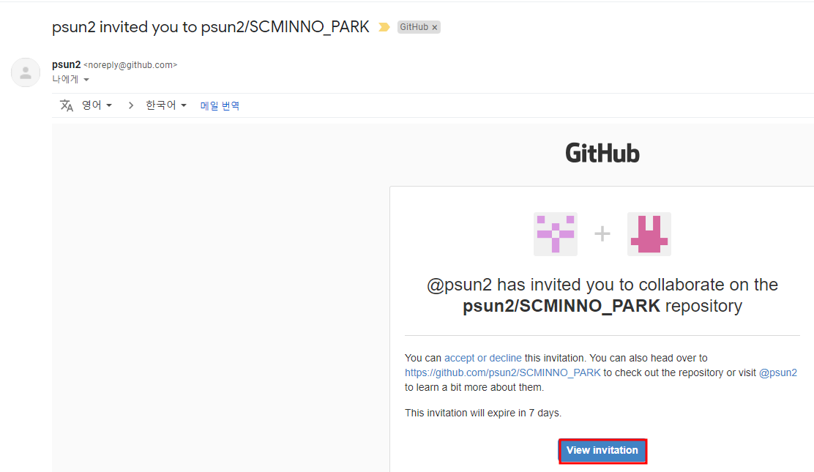

해당 버튼을 클릭하여 초대에 수락합니다.

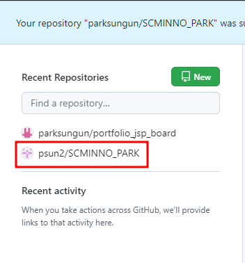  
초대에 응하게 되면 관리자의 name과 초대받은 repository가 repository목록에 나타나게 됩니다.

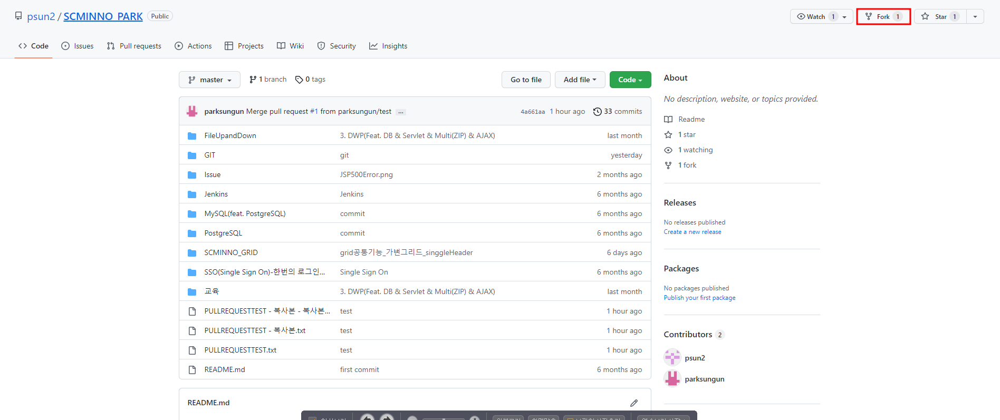  
우측상단에 Fork 버튼을 이용해 사용자(본인)의 Repository에 복제를 할 수 있도록 합니다.

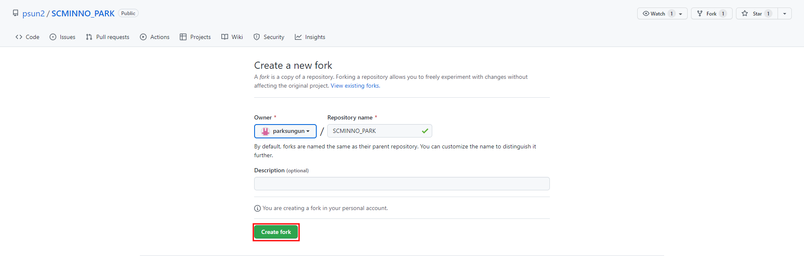

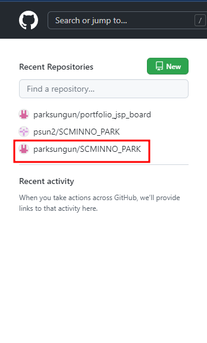  
fork가 성공적으로 이루어졌다면 repositoy 목록에 fork된 저장소가 나타납니다.

다음으론 fork된 저장소를 local로 clone을 하는 작업을 알아보도록 하겠습니다.

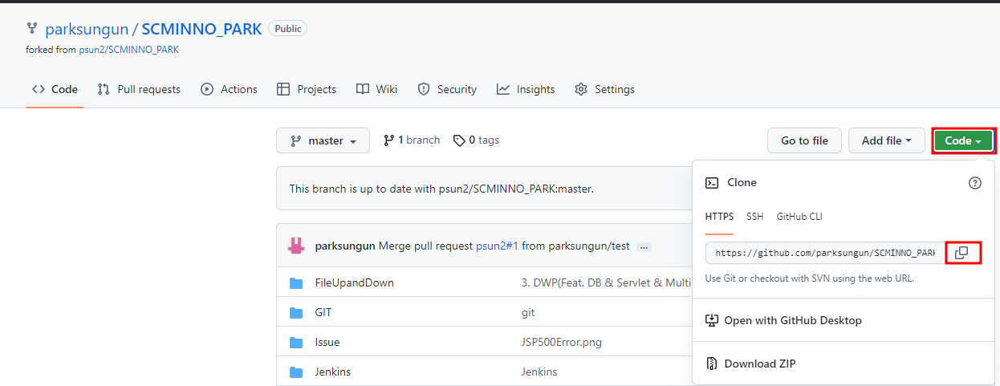

해당 저장소에서 CODE버튼을 이용하여 저장소의 주소를 복사 할 수 있도록 합니다.

  
원하시는 local root에 해당 clone 명령어와 함께 복사한 저장소 url 을 작성합니다.

```
git clone 복사된저장소URL
```

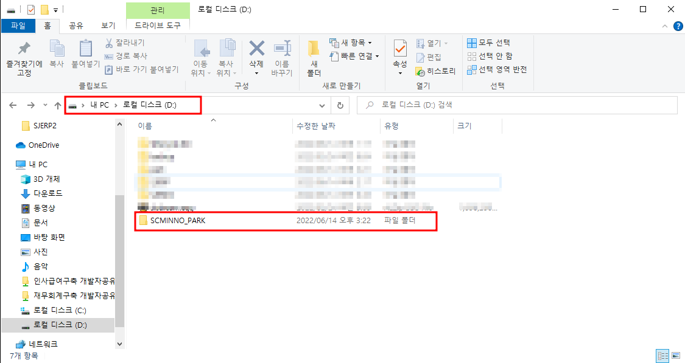  
local에 성공적으로 저장소가 복제 되었습니다.

---

## `자격증명 및 github 정보 수정`

> 코드수정과 add commit push 전 github의 설정이 현재 아이디와 일치하는지 확이하여 일치 시켜줄수 있도록 합니다.

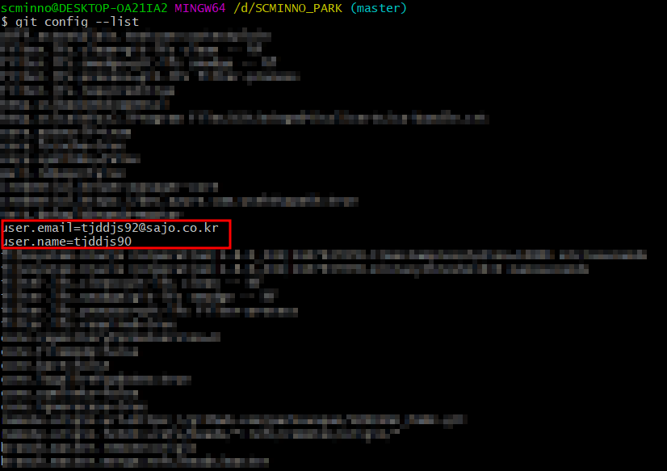

```
git config --list
```

> email과 name은 본 저장소의 git 명령어를 확인하여 변경 부탁드립니다.

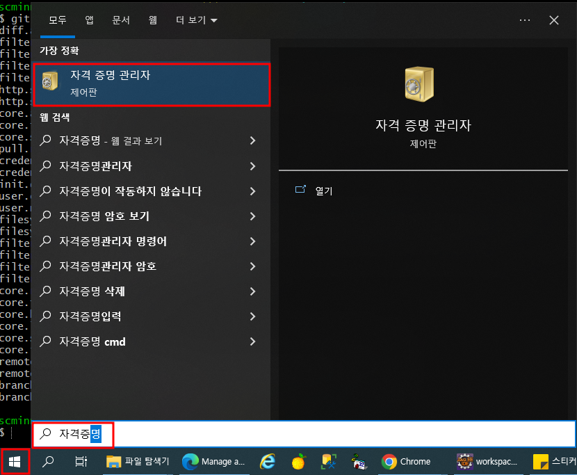  
Window사용자 이시라면 자격증명이 제대로 잡혀있는지 확인 부탁드립니다.

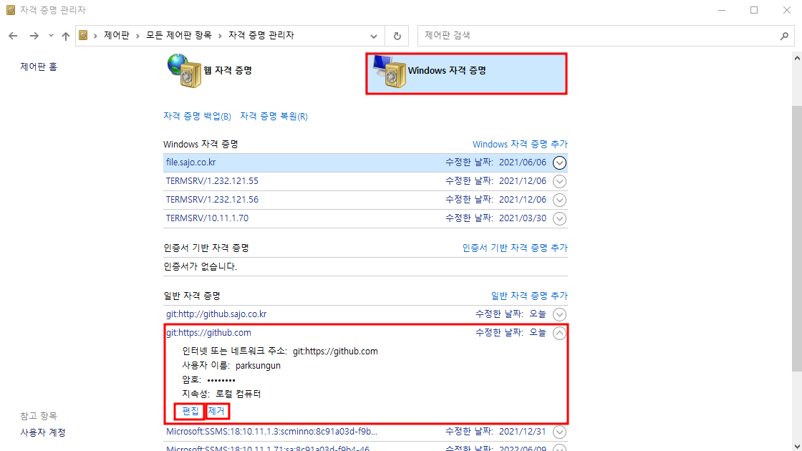  
편집을 이용하여 계정을 변경시켜주거나, 제거를 하여 현재 등록된 자격증명을 제거하여 새로운 자격증명을 등록하여 사용할 수 있습니다.

---

## `원본 저장소의 remote 설정`

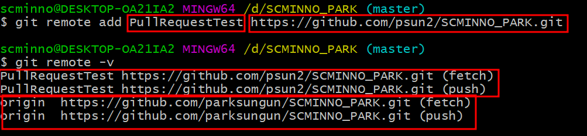

원본저장소를 가르키기 위한 remote설정을 합니다.

```
git remote add (remote 별명) (원본 저장소)
```

```
git remote -v
```

위 명령어를 사용하여 등록된 remote를 볼 수 있습니다.

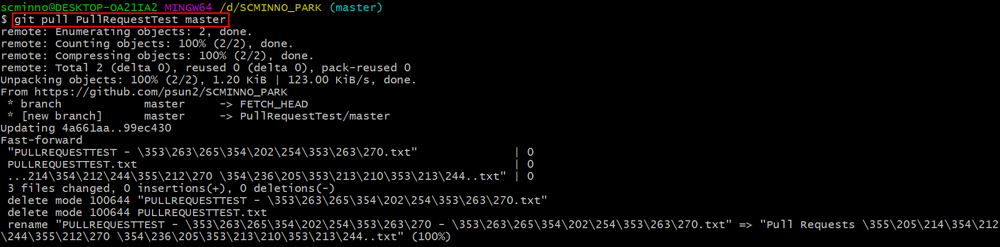

merge가 끝났다면... 보통 merge가 끝난 시점을 정확히 알 수 없어  
local에서 무엇인가 코드가 변동되고 push가 이루어지기 전 또는 다음 merge전에  
원본저장소의 pull을 요청하여 코드의 최신화가 이루어 질 수 있도록 합니다.

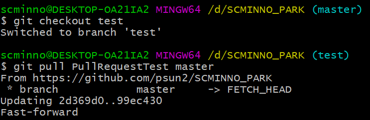

---

## `branch 생성 및 add commit push`

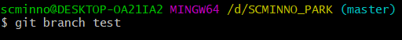

test라는 이름을 가지는 branch를 생성합니다.

```
git branch test
```

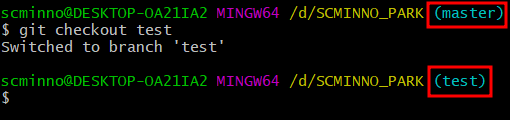  
위에서 만든 test브랜치로 변경합니다.

```
git checkout test
```

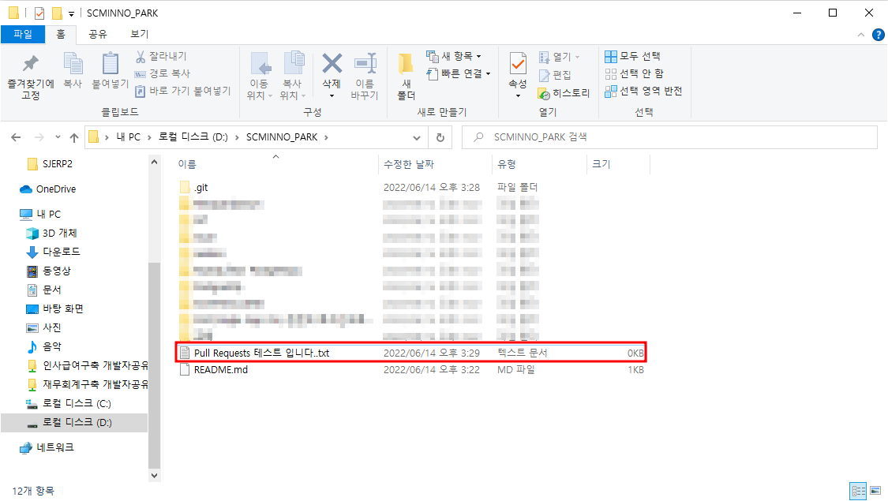  
add를 위한 test 파일을 하나 생성하여, Git이 변경목록을 추적할 수 있도록 하였습니다.

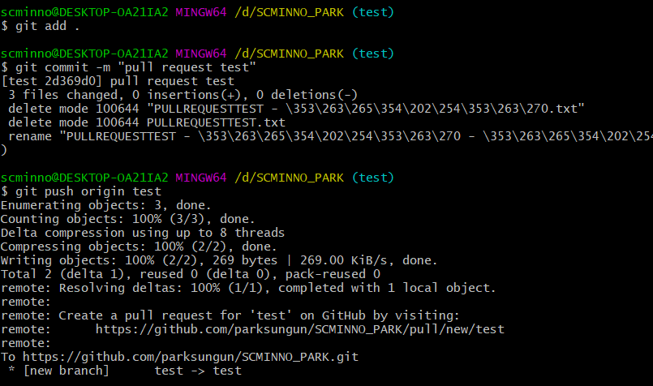  
Pull requests test를 위하여 새로운 파일을 fork된 저장소에 밀어 넣을 수 있도록 합니다.

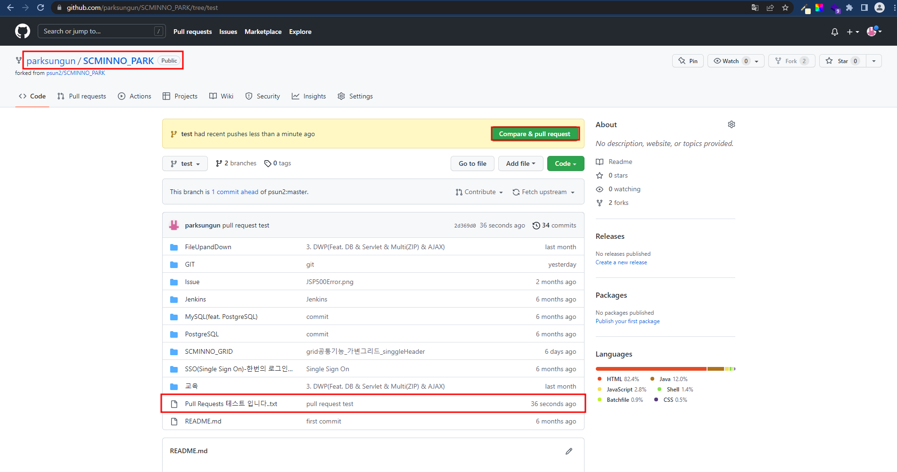  
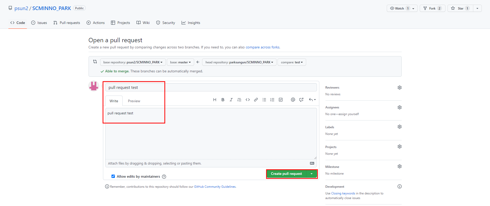

GitHub으로 들어와 Compare & pull requests를 통하여 변경된 파일을 원본 원격 저장소에서 확인, Merge 할 수 있도록 Create pull request 버튼으로 요청을 보냅니다.

---

## `Merge`

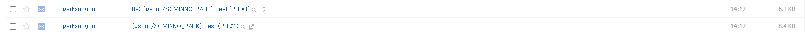

관리자가 등록한 github emali로 merge 요청이 옵니다.

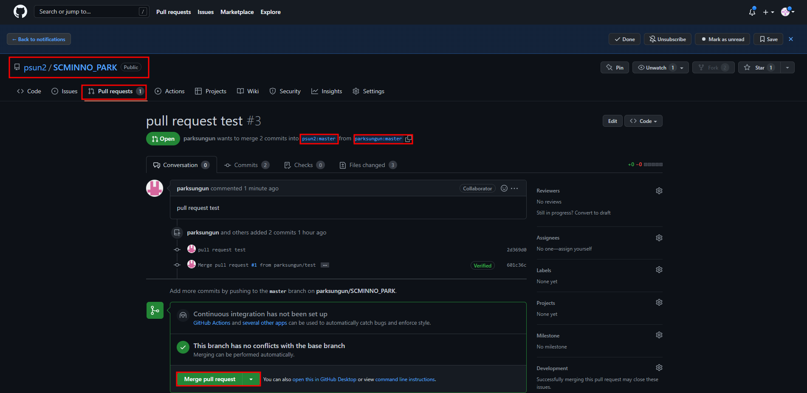  
해당 코드가 이상이 없을시 Merge를 이용하여 코드를 병합 할 수 있도록 합니다.
