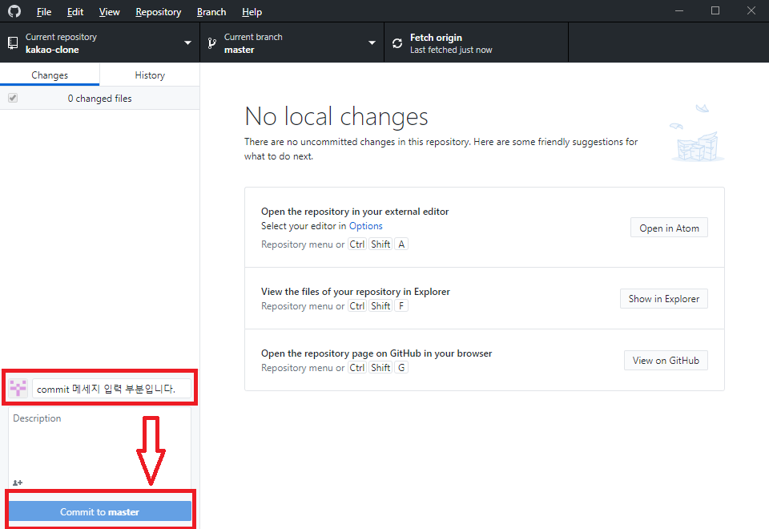

# `GitHubDesktop`

[참고](https://blog.naver.com/tjddjs90/221882030403)

[GitHub Desktop 다운로드 바로가기](https://desktop.github.com/)

## `회원가입 및 로그인`

아이디가 없으신 경우 : Create your free account.

무료 회원 : Sign in to GitHub.com

유료회원 : Sign in to GitHub Enterprise Server 

을 클릭후 진행 합니다.

---

## `repository 생성`

Name : repository 이름  
Description : repository 설명  
Local path : 내컴퓨터 와 github이 연결될 프로잭트 폴더를 선택합니다.  
Initialize this repository with a README : README.md file을 생성할 지 묻습니다.  

---

## `연동`

  
  

컴퓨터와 내 원격저장소를 연동합니다.  

---

## `commit`

  

commit => 즉, 변동되었으면, 무엇이 변동되었는지 message 를 삽입합니다.

---

## `push`

변동사항이 있는 내 자료들을 원격 저장소 즉 github에 밀어 넣어 줍니다.  
