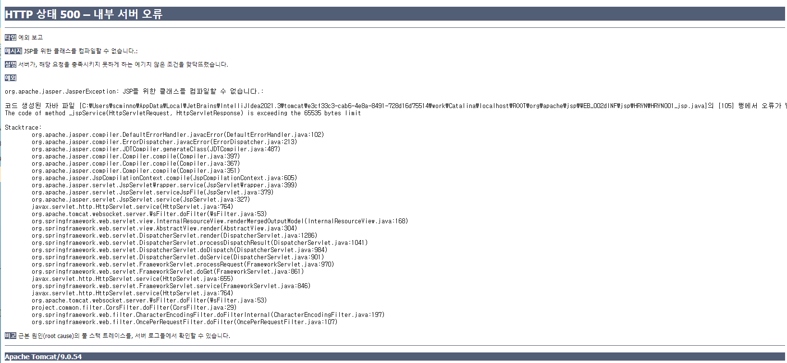

# `org.apache.jasper.JasperException: JSP를 위한 클래스를 컴파일할 수 없습니다.: `

## `발생상황`

- JSP파일 접근시 500에러가 나면서 Exception 발생 화면 페이 접근 불가.

---

## `발생 에러 내용`

```
타입 예외 보고

메시지 JSP를 위한 클래스를 컴파일할 수 없습니다.:

설명 서버가, 해당 요청을 충족시키지 못하게 하는 예기치 않은 조건을 맞닥뜨렸습니다.

예외

org.apache.jasper.JasperException: JSP를 위한 클래스를 컴파일할 수 없습니다.:

코드 생성된 자바 파일 [C:\Users\scminno\AppData\Local\JetBrains\IntelliJIdea2021.3\tomcat\e3cf33c3-cab6-4e8a-8491-728d16d75514\work\Catalina\localhost\ROOT\org\apache\jsp\WEB_002dINF\jsp\HRYN\HRYN001_jsp.java]의 [105] 행에서 오류가 발생했습니다.
The code of method _jspService(HttpServletRequest, HttpServletResponse) is exceeding the 65535 bytes limit

Stacktrace:
	org.apache.jasper.compiler.DefaultErrorHandler.javacError(DefaultErrorHandler.java:102)
	org.apache.jasper.compiler.ErrorDispatcher.javacError(ErrorDispatcher.java:213)
	org.apache.jasper.compiler.JDTCompiler.generateClass(JDTCompiler.java:487)
	org.apache.jasper.compiler.Compiler.compile(Compiler.java:397)
	org.apache.jasper.compiler.Compiler.compile(Compiler.java:367)
	org.apache.jasper.compiler.Compiler.compile(Compiler.java:351)
	org.apache.jasper.JspCompilationContext.compile(JspCompilationContext.java:605)
	org.apache.jasper.servlet.JspServletWrapper.service(JspServletWrapper.java:399)
	org.apache.jasper.servlet.JspServlet.serviceJspFile(JspServlet.java:379)
	org.apache.jasper.servlet.JspServlet.service(JspServlet.java:327)
	javax.servlet.http.HttpServlet.service(HttpServlet.java:764)
	org.apache.tomcat.websocket.server.WsFilter.doFilter(WsFilter.java:53)
	org.springframework.web.servlet.view.InternalResourceView.renderMergedOutputModel(InternalResourceView.java:168)
	org.springframework.web.servlet.view.AbstractView.render(AbstractView.java:304)
	org.springframework.web.servlet.DispatcherServlet.render(DispatcherServlet.java:1286)
	org.springframework.web.servlet.DispatcherServlet.processDispatchResult(DispatcherServlet.java:1041)
	org.springframework.web.servlet.DispatcherServlet.doDispatch(DispatcherServlet.java:984)
	org.springframework.web.servlet.DispatcherServlet.doService(DispatcherServlet.java:901)
	org.springframework.web.servlet.FrameworkServlet.processRequest(FrameworkServlet.java:970)
	org.springframework.web.servlet.FrameworkServlet.doGet(FrameworkServlet.java:861)
	javax.servlet.http.HttpServlet.service(HttpServlet.java:655)
	org.springframework.web.servlet.FrameworkServlet.service(FrameworkServlet.java:846)
	javax.servlet.http.HttpServlet.service(HttpServlet.java:764)
	org.apache.tomcat.websocket.server.WsFilter.doFilter(WsFilter.java:53)
	project.common.filter.CorsFilter.doFilter(CorsFilter.java:29)
	org.springframework.web.filter.CharacterEncodingFilter.doFilterInternal(CharacterEncodingFilter.java:197)
	org.springframework.web.filter.OncePerRequestFilter.doFilter(OncePerRequestFilter.java:107)
비고 근본 원인(root cause)의 풀 스택 트레이스를, 서버 로그들에서 확인할 수 있습니다.
```



---

## `발생이유`

JSP파일을 톰캣이 컴파일 하는 과정에서 JSP의 컴파일 용량 즉 byte과 초과되면서 나오는 Exception 입니다.

---

## `해결방법1`

web.xml에 컴파일 option 추가

```
	<servlet>
		<servlet-name>jsp</servlet-name>
		<servlet-class>org.apache.jasper.servlet.JspServlet</servlet-class>
		<init-param>
			<param-name>mappedfile</param-name>
			<param-value>false</param-value>
		</init-param>
	</servlet>
```

mappedfile의 default값은 true 입니다.

true와 false의 차이점은

```
<%@ page language="java" contentType="text/html; charset=UTF-8" pageEncoding="UTF-8"%>
<html>
    <head>
        <title>Insert title here</title>
    </head>
    <body>
    </body>
</html>
```

위 해당 JSP를 컴파일 할때 mappedfile가 true인 경우

```
out.write("\r\n");
out.write("<html>\r\n");
out.write("<head>\r\n");
out.write("<title>Insert title here</title>\r\n");
out.write("</head>\r\n");
out.write("<body>\r\n");
out.write("\r\n");
out.write("</body>\r\n");
out.write("</html>");
```

위와 같이 컴파일이 됩니다.  
컴파일하면서 enter의 byte의 공간을 차지 하게 됩니다.

mappedfile가 false인 경우

```
out.write("\r\n<html>\r\n<head>\r\n<title>Insert title  here</title>\r\n</head>\r\n<body>\r\n\r\n</body>\r\n</html>");
```

enter의 공간없이 이어서 컴파일 됨으로 byte수를 줄임으로써, 해당 에러를 해결 할 수 있습니다.

---

## `해결방법2`

JSP파일을 쪼개어 include하여 사용 할 수 있도록 합니다.
