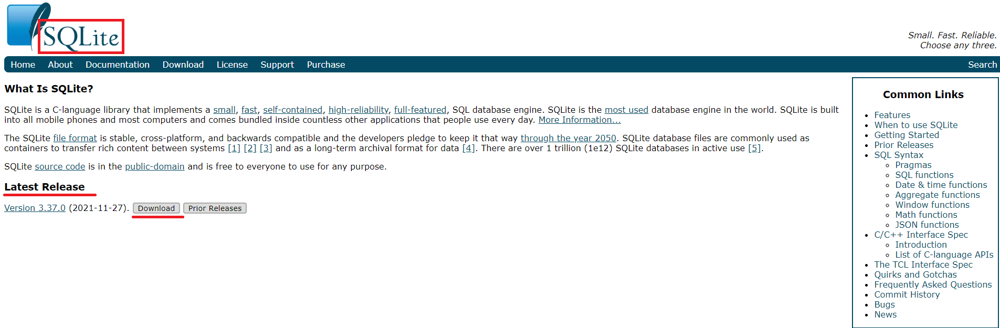
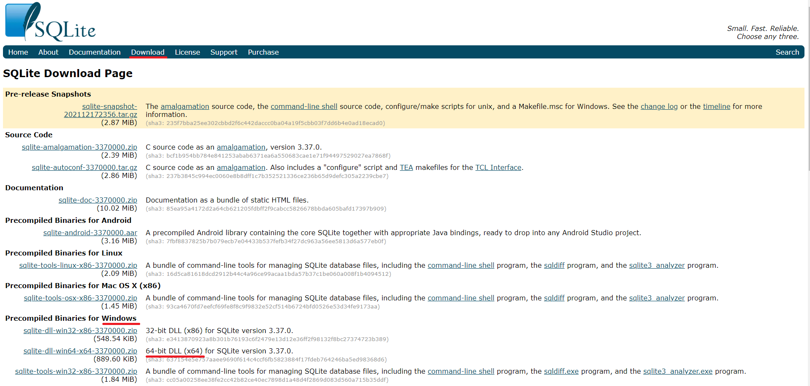
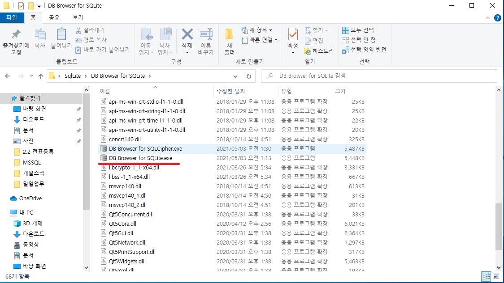
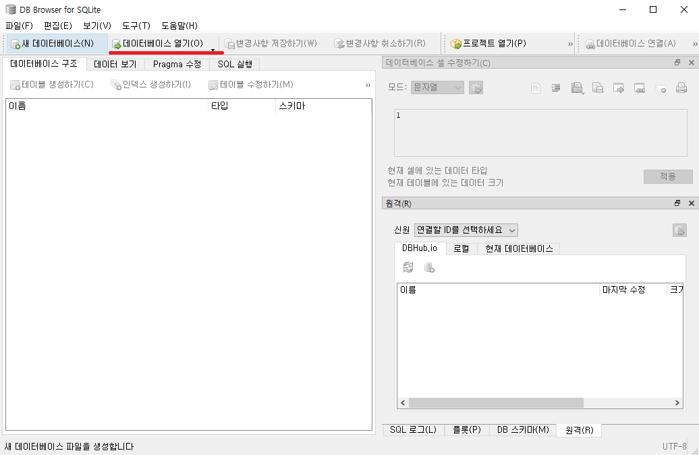
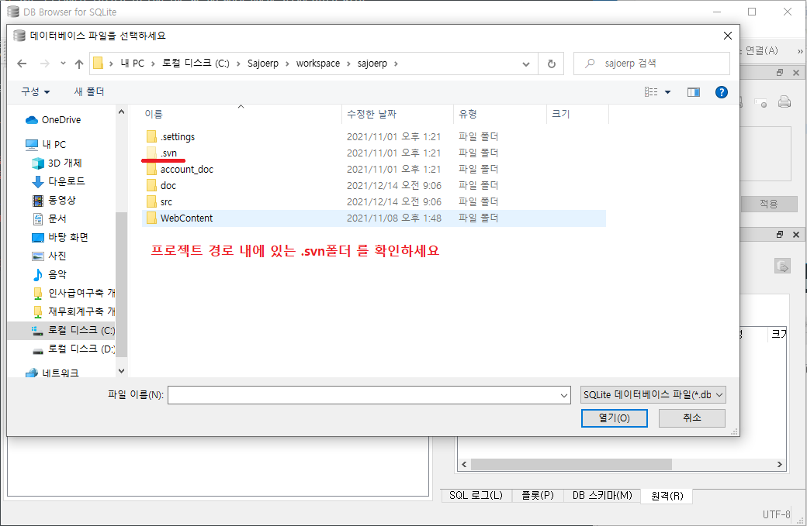
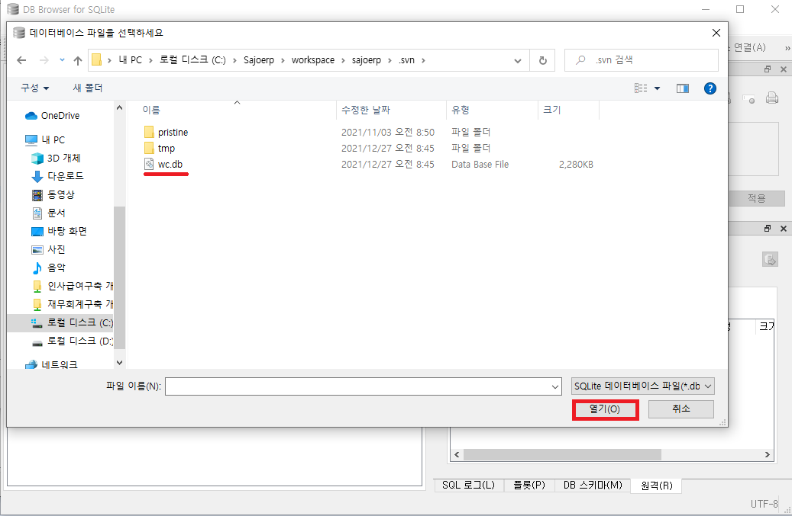
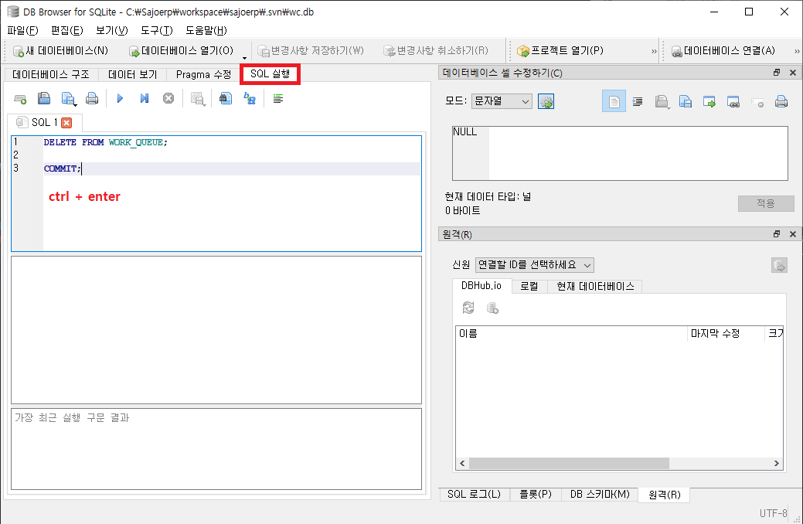
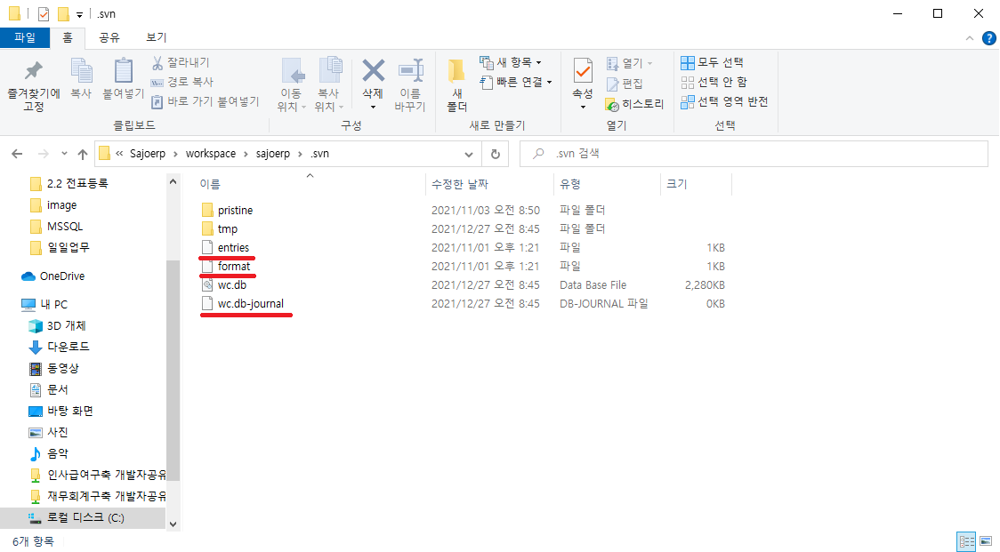
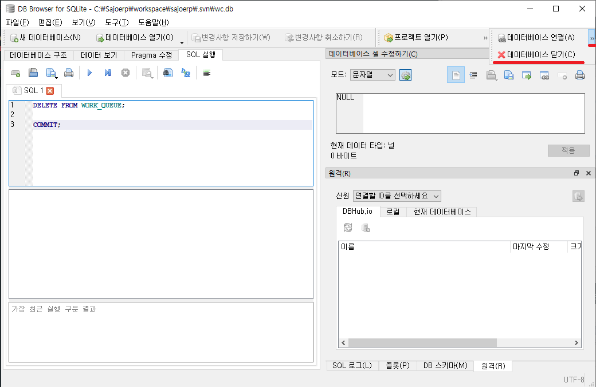

# `SVN Error`

## work queue error

> [svn 오류] svn: E155009: Failed to run the WC DB work queue associated with

SVN 명령을 수행하다 보면 "svn: E155009" 오류가 발생하는 경우가 있습니다.  
해당 경우는 WC work queue에 문제가 있을 경우에 발생합니다.  
해당 오류가 발생했을 때는 <b>svn cleanup 명령도 되지 않습니다.</b>

✨해결방법

[SQLite](https://www.sqlite.org/index.html)를 이용하여 work queue를 DELETE 합니다.

1. [SQLite 다운로드](https://www.sqlite.org/index.html)  
     
   

2. 압축을 풀어 DB Browser for SQLite.exe 를 실행합니다.  
   

3. project 내의 .svn폴더에 있는 데이터베이스에 연결해 줍니다.  
     
     
   

4. 에러난 Work Queue를 DELETE 합니다.

   ```
   DELETE FROM WORK_QUEUE;

   COMMIT;
   ```

   

5. 커밋전 주의사항!!!!
   SVN의 DB파일을 SQLite로 접근하면서 접근 파일들이 생성이 되었는데,  
    
   이 파일이 남은 상태로 svn의 commit을 진행하게 되면 현재 DB접근 중이므로, commit이 되지 않으니, <b>꼭!!!! 데이터베이스의 연결을 끊고 COMMIT 진행을 합니다.</b>
   
