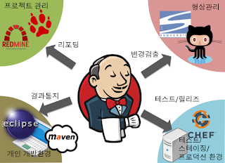

# `Jenkins란 무엇인가?`

[참조](https://ict-nroo.tistory.com/31)

## ✨what is jenkins

젠킨스는 소프트웨어 개발 시 지속적으로 통합 서비스를 제공하는 툴이다. CI(Continuous Integration) 툴이라고 표현한다.
(Continuous: 마디없는, 끊임없는 || Integration: 완성)  
다수의 개발자들이 하나의 프로그램을 개발할 때 버전 충돌을 방지하기 위해 각자 작업한 내용을 공유영역에 있는 저장소에 빈번히 업로드함으로써 지속적 통합이 가능하도록 해준다.  
원래 허드슨 프로젝트로 개발되었고, 허드슨의 개발은 2004년 여름 썬 마이크로시스템즈에서 시작되었다.  
그리고 2005년 2월 java.net에 처음 출시 되었다.

젠킨스와 같은 [CI툴](#ci)이 등장하기 전에는 일정시간마다 빌드를 실행하는 방식이 일반적이었다.  
특히 개발자들이 당일 작성한 소스들의 커밋이 모두 끝난 심야 시간대에 이러한 빌드가 타이머에 의해 집중적으로 진행되었는데, 이를 nightly-build라 한다.  
하지만, 젠킨스는 정기적인 빌드에 한발 나아가 서브버전, git 과 같은 버전관리 시스템과 연동하여 소스커밋을 감지하면 자동적으로 자동화 테스트가 포함된 빌드가 작동되도록 설정할 수 있다.

## ✨젠킨스가 주는 이점

개발중인 프로젝트에서 커밋은 매우 빈번히 일어나기 때문에 커밋 횟수만큼 빌드를 실행하는 것이 아니라 작업이 큐잉되어 자신이 실행될 차례를 기다리게 된다.  
코드의 변경과 함께 이뤄지는 이 같은 자동화된 빌드와 테스트 작업들은 다음과 같은 이점들을 가져다 준다.

- 프로젝트 표준 컴파일 환경에서의 컴파일 오류 검출
- 자동화 테스트 수행
- 정적 코드 분석에 의한 코딩 규약 준수여부 체크
- 프로파일링 툴을 이용한 소스 변경에 따른 성능 변화 감시
- 결합 테스트 환경에 대한 배포작업

이 외에도 젠킨스는 500여가지가 넘는 플러그인을 온라인으로 간단히 인스톨 할 수 있는 기능을 제공하고 있으며 파이썬과 같은 스크립트를 이용해 손쉽게 자신에게 필요한 기능을 추가 할 수도 있다.

## ✨각종 배치 작업의 간략화

프로젝트 기간 중에 개발자들은 순수한 개발 작업 외에도 DB셋업이나 환경설정, Deploy작업과 같은 단순 작업에 시간과 노력을 들이는 경우가 빈번하다.  
데이터베이스의 구축, 어플리케이션 서버로의 Deploy, 라이브러리 릴리즈와 같이 이전에 CLI로 실행되던 작업들이 젠킨스 덕분에 웹 인터페이스로 손쉽게 가능해졌다.

## ✨Build 자동화의 확립

빌드 툴의 경우 JAVA는 Maven과 Gradle이 자리잡고 있으며, 이미 빌드 관리 툴을 이용해 프로젝트를 진행하고 있다면 젠킨스를 사용하지 않을 이유가 하나도 없다.  
젠킨스와 연동하여 빌드 자동화를 통해 프로젝트 진행의 효율성을 높일 수 있다.

## ✨자동화 테스트

자동화 테스트는 젠킨스를 사용해야 하는 가장 큰 이유 중 하나이며,  
사실상 자동화 테스트가 포함되지 않는 빌드는 [CI](#ci)자체가 불가능 하다고 봐도 무방하다.  
젠킨스는 Subversion이나 Git과 같은 버전관리시스템과 연동하여 코드 변경을 감지하고 자동화 테스트를 수행하기 때문에 만약 개인이 미처 실시하지 못한 테스트가 있다 하여도 든든한 안전망이 되어준다.  
제대로 테스트를 거치지 않은 코드를 커밋하게 되면 화난 젠킨스를 만나게 된다.

## ✨코드 표준준수여부 검사

자동화 테스트와 마찬가지로 개인이 미처 실시하지 못한 코드 표준 준수 여부의 검사나 정적 분석을 통한 코드 품질 검사를 빌드 내부에서 수행함으로써 기술적 부채의 감소에도 크게 기여한다.

## ✨빌드 파이프라인 구성

2개 이상의 모듈로 구성되는 레이어드 아키텍처가 적용 된 프로젝트에는 그에 따른 빌드 파이프라인 구성이 필요하다.  
예를 들면, 도메인 -> 서비스 -> UI와 같이 각 레이어의 참조 관계에 따라 순차적으로 빌드를 진행하지 않으면 안된다.  
젠킨스에서는 이러한 빌드 [파이프라인](#pipeline) 구성을 간단히 할 수 있으며, 스크립트를 통해 매우 복잡한 제어까지도 가능하다.

---

## ci

[참조](https://helloworld-88.tistory.com/50)

> CI(Continuous Integration, 지속적인 통합)

CI란 팀의 구성원들이 작업한 내용을 정기적으로 통합하는 것을 의미한다.  
풀어서 이야기 하면 소프트 웨어가 거대해지고 복잡해지면서 팀 단위로 개발을 하게 되었고 분업과 협업이 필수가 되면서 하나의 프로젝트를 여러 명으로 구성된 한 팀이 작업을 하게 되고  
분업과 협업 과정에서 일을 나눠 각각 할당된 부분만 작업을 하게 되었다.  
그리고 팀멤버들은 자신이 담당해서 하고 있는 부분의 소스코드를 정기적으로 GIT, SVN 과 같은 <b>형상 관리 시스템</b>(SCM, Source Code Management)에 Submit 하는데  
이 각각의 팀멤버들로부터 Submit된 소스코드들을 정기적으로 통합하는 것을 CI라고 하고 이것을 시행해주는 프로그램을 <b>CI toll</b> 이라고 한다.

CI 시스템을 구축하지 않은 경우 개발자들이 각자 개발한 소스코드를 형상관리 서버에 커밋하면 별도의 품질관리를 거치지 않고, 대부분 개발이 끝난 막바지에 통합을 하여 테스트를 진행하게 된다.  
이럴경우, 개발 중 별도의 품질 관리를 수행하지 않았기 때문에 잘못된 소스코드를 형상관리 시스템에 반영하였을 경우 발생되는 문제가 개발 후반에 모두 장애로 발견된다.

반면 CI 시스템을 구축하게 되면 CI 서버는 형상관리 서버에 Commit된 소스코드를 주기적으로 [폴링](#polling)하여 컴파일, 단위테스트, 코드 인스펙션 등의 과정을 수행하며 신규 또는 수정된 소스가 결함이 있는지 여부를 지속적으로 검증한다.  
검증 결과는 이메일, RSS 등의 피드백 메커니즘을 통해 개발자에게 전달되고, 이를 통해 조기에 결함을 발견하여 해결 할 수 있는것이다.

🎈 CI 시스템 구축을 위한 핵심 구성요소

🎴 CI Sever  
빌드 프로세스를 관리하는 서버로 [Jenkins](#what-is-jenkins)가 여기에 속한다.  
ex > Jenkins, Travis, CI, etc

🎴 SCM(Source Code Management)  
소스코드 형상 관리 시스템으로 Git 이 여기에 속한다.  
소스코드의 개정과 백업 절차를 자동화하여 오류수정 과정을 돕는다.  
팀 프로젝트의 경우 각자 수정한 부분을 전체가 자동으로 동기화 할 수 있는 시스템이다.  
ex > Subversion, Git, etc

🎴 build tool  
컴파일, 테스트, 정적 분석 등을 실시해 동작 가능한 소프트웨어를 생성하는 도구로 Maven이 여기에 속한다.  
빌드는 형상 관리 시스템에 있는 소스코드를 가져와 컴파일 하여 실행 가능한 파일로 만드는 일련의 과정을 일컫는 말이다.  
ex > Maven, Gradle, Ant, make, etc

🎴 Test Tool  
작성된 테스트 코드에 따라 자동으로 테스트를 수행해주는 도구로 빌드 툴의 스크립트에서 실행되며 JUnit이 여기에 해당 한다.  
ex > JUnit, Mocha, etc

🎴 빌드 스크립트를 통한 CI 자동화 수행 절차

1. 소스코드를 바이너리 파일로 컴파일한다.
2. 바이너리 파일을 배포 형태로 패키징 한다.
3. 단위 테스트를 수행한다.
4. 정적 분석을 수행한다.
5. 분석 결과를 리포팅 한다.
6. 패키징한 파일을 테스트 서버에 배포한다.

---

## polling

[참조](<https://ko.wikipedia.org/wiki/%ED%8F%B4%EB%A7%81_(%EC%BB%B4%ED%93%A8%ED%84%B0_%EA%B3%BC%ED%95%99)>)

> 폴링(polling)이란

폴링(polling)이란 하나의 장치(또는 프로그램)가 충돌 회피 또는 동기화 처리 등을 목적으로 다른 장치(또는 프로그램)의 상태를 주기적으로 검사하여 일정한 조건을 만족할 때 송수신 등의 자료처리를 하는 방식을 말한다.  
이 방식은 버스, 멀티포인트 형태와 같이 여러 개의 장치가 동일 회선을 사용하는 상황에서 주로 발생된다.  
서버의 제어 장치(또는 프로그램)는 순차적으로 각 단말 장치(또는 프로그램)에 회선을 사용하기 원하는지를 물어본다.

---

## pipeline

[참조](<https://ko.wikipedia.org/wiki/%ED%8C%8C%EC%9D%B4%ED%94%84%EB%9D%BC%EC%9D%B8_(%EC%BB%B4%ED%93%A8%ED%8C%85)>)

> 파이프라인(pipeline) 이란?

컴퓨터 과학에서 파이프라인(pipeline)은 한 데이터 처리 단계의 출력이 다음 단계의 입력으로 이어지는 형태로 연결된 구조를 가르킨다.  
이렇게 연결된 데이터 처리 단계는 한 여러 단계가 서로 동시에, 또는 병렬적으로 수행될 수 있어 효율성의 향상을 꾀할 수 있다.  
각 단계 사이의 입출력을 증계하기 위해 버퍼가 사용될 수 있다.

대표적인 파이프라인 구조는 다음과 같은 것들이 있다.

- 명령어 파이프라인: 같은 CPU 회로 안에서 여러 명령어들이 단계적으로 수행되는 것을 가리킨다.  
  각 명령어는 다시 페치, 디코딩, 연산 등의 세부 주기로 나뉘어 각 파이프라인 단계에 의해 수행된다.
- 그래픽스 파이프라인: 대부분의 그래픽 카드는 그래픽 처리 과정을 3차원 사영, 윈도 클리핑, 셰이딩, 렌더링 등으로 나누어 각각의 하부 모듈에서
  병렬적으로 수행한다.
- 소프트웨어 파이프라인: 한 소프트웨어의 출력이 자동으로 다른 소프트웨어의 입력으로 연결될 경우 이를 소프트웨어 파이프라인 이라고 한다.  
  유닉스 계열 운영체제에서 사용되는 파이프가 대표적이다.
