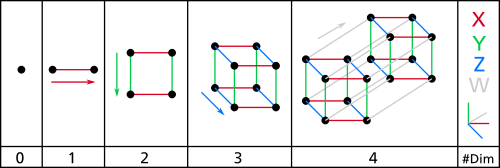
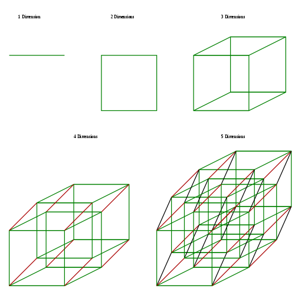

# `MySQL과 PostgreSQL`

  


## ddl dml dcl

> DDL, DML, DCL 이란?

[참조](https://brownbears.tistory.com/180)

<table>
    <thead>
        <tr>
            <th>명령어 종류</th>
            <th>명령어</th>
            <th>설명</th>
        </tr>
    </thead>
    <tbody>
        <tr>
            <td rowspan="4">데이터 조작어 (DML : Data Manipulation Language)</td>
            <td>SELECT</td>
            <td>데이터 베이스에 들어 있는 데이터를 조회 하거나 검색하기 위한 명령어를 말하는 것으로 RETRIEVE(검색하다)라고도 합니다.</td>
        </tr>
        <tr>
            <td>INSERT</td>
            <td rowspan="3">데이터베이스의 테이블에 들어 있는 데이터에 변형을 가하는 종류(데이터 삽입, 수정, 삭제)의 명령어를 말합니다.</td>
        </tr>
        <tr>
            <td>UPDATE</td>
        </tr>
        <tr>
            <td>DELETE</td>
        </tr>
        <tr>
            <td rowspan="5">
                데이터 정의어 (DDL: Data Definition Language)
            </td>
            <td>CREATE</td>
            <td rowspan="5">
                테이블과 같은 데이터 구조를 정의하는데 사용되는 명렁어들로 (생성, 변경, 삭제, 이름변경) 데이터 구조와 관련된 명렁어들을 말합니다.
            </td>
        </tr>
        <tr>
            <td>ALTER</td>
        </tr>
        <tr>
            <td>DROP</td>
        </tr>
        <tr>
            <td>RENAME</td>
        </tr>
        <tr>
            <td>TRUNCATE</td>
        </tr>
        <tr>
            <td rowspan="2">
                데이터 제어어 (DCL: Data Control Language)
            </td>
            <td>GRANT</td>
            <td rowspan="2">
                데이터베이스에 접근하고 객체들을 사용하도록 권한을 주고 회수하는 명령어를 뜻 합니다.
            </td>
        </tr>
        <tr>
            <td>REVOKE</td>
        </tr>
        <tr>
            <td rowspan="3">
                트랜잭션 제어어 (TCL: Transaction Control Language)
            </td>
            <td>COMMIT</td>
            <td rowspan="3">
                논리적인 작업의 단위를 묶어서 DML에 의해 조작된 결과를 작업단위(트랜잭션) 별로 제어하는 명령어를 말 합니다.
            </td>
        </tr>
        <tr>
            <td>ROLLBAK</td>
        </tr>
        <tr>
            <td>SAVEPOINT</td>
        </tr>
    </tbody>
</table>

---

## 혼동되기 쉬운 SQL 용어

> 혼동되기 쉬운 SQL 용어

[참조](https://reference-m1.tistory.com/94)

| 파일 시스템    | 데이터베이스 모델링   | 관계형 데이터베이스         |
| :------------- | :-------------------- | :-------------------------- |
| 파일(file)     | 엔티티(Entity)        | 테이블(Table)               |
| 레코드(Recode) | 튜플(Tuple)           | 행(Row)                     |
| 키(Key)        | 유일값(Identifier)    | 기본키(Primary Key), Unique |
| 필드(field)    | 어트리뷰트(Attribute) | 컬럼(Column)                |

---

## rdb

> RDB[Relational Data Base]

[참조](https://jwprogramming.tistory.com/52)

RDB: <b>Relational DatBbase</b> 란 관계형 데이터에 기초를 둔 데이터베이스 입니다.  
데이터 간의 상관관계에서의 개체간의 관계를 표현 한 것이라고 할 수 있습니다.

RDB는 데이터의 독립성이 높고, 고수준의 데이터 조작언어([DML](#ddl-dml-dcl) - Data Maniplulation Language)을 사용하여 결합, 제약, 투영 등의 관계 조작에 의해  
비약적으로 표현능력을 높일 수 있습니다.  
또한 이들의 관계 조작에 의해 자유롭게 구조를 변경 할 수 있다는 것이 RDB의 특징입니다.

---

## rdbms

> RDBMS[Relational Data Base Management System]

[참조](https://jwprogramming.tistory.com/52)

RDBMS는 관계형 데이터베이스를 생성하고 수정하고 관리할 수 있는 소프트웨어라고 정의할 수 있습니다.

(특징)

모든 데이터를 2차원으로 표현  
   


테이블은 [row(record, tuple)](#혼동되기-쉬운-SQL-용어)와 [column(field, item)](#혼동되기-쉬운-SQL-용어)으로 이루어진 기본 데이터 저장 단위

상호관령성을 가진 테이블(table)의 집합

데이터베이스의 설계도를 ER(Entity Relationship) 모델

ER모델에 따라, 데이터베이스가 만들어지며, 데이터베이스는 하나 이상의 테이블로 구성 됩니다.  
ER모델에서 [엔티티](#혼동되기-쉬운-SQL-용어)를 기반으로 테이블이 만들어 집니다.

여기서 DB인 데이터베이스는 일종의 데이터 저장소(Storage)라고 생각하면 됩니다.  
정보를 단순하고 규칙적인 모양새로 구성한 저장소인 셈 입니다.  
엑셀의 표처럼 테이블로 구성되어 있고 각 테이블은 [행(row)](#혼동되기-쉬운-SQL-용어)와 [컬럼(column)](#혼동되기-쉬운-SQL-용어)으로 구성 됩니다.  
각 행은 [레코드(recoed)](#혼동되기-쉬운-SQL-용어)라고 하고, 레코드들은 몇 조각의 정보로 이루어지는데 이때 조각이 컬럼이 됩니다.

MS(관리시스템)은 DB의 레코드들을 삽입(insert), 탐색(select), 수정(update), 삭제(delete)할 수 있도록 해주는 소프트웨어를 지칭합니다.  
즉, 데이터를 처리할 수 있는 기능을 의미하는데, 많은 DBMS가 이러한 일들은 SQL(Stuctured Query Language, 구조화된 질의 언어)를 지원 해줌으로서 가능해집니다.

<b>R(관계형)은 DBMS의 특정한 종류를 의미</b>하고, 여러 개의 테이블을 조합해 원하는 데이터를 찾아 올 수 있게 합니다.  
보통 테이블 한 개로 답을 얻을 수 없는 상황에서 이 관계성을 사용해 더 복잡한 요구를 실현할 수 있습니다.  
SQL또한 이것을 지원해주며, 관계형을 지원하기 위해 <b>트랜잭션</b>(Transaction) <b style="color: red;'">ACID</b>(Atomicity, Consistency, Isolation, Durability)등의 개념도 도입되었습니다.

---

## ordbms

> ORDBMS[Object Relational Data Base Management System]

[참조]

ORDBMS의 종류

- PostgresQL
- Oracle Corporation의 Oracle 데이터 베이스
- IBM의 Informix
- Microsoft의 SQL Server
- Pivotal Software의 Greenplum 데이터 베이스

이 밖에도 unisql이나 다른 ORDBMS가 더 존재합니다. 이러한 시스템 중 일부는 단순 RDBMS로 분류 될 수도 있습니다.  
ORDBMS속성의 수는 이러한 시스템마다 다르지만, 공급업체는 모두 ORDBMS라고 주장합니다.

ORDBMS는 SQL3라는 확장 된 형식의 SQL을 지원합니다.  
ORDBMS가 ADT를 지원해야하기 때문에 확장이 필요합니다.  
데이터가 행과 열이 있는 테이블 형식으로 저장되고, SQL이 쿼리 언어로 사용되며, 쿼리 결과도 테이블 또는 [튜플](#혼동되기-쉬운-SQL-용어) (행)이기 때문에 ORDBMS에는 관계형 모델이 있습니다.

- 비디오의 정보를 DB담으려고 할때 - 먼저 비디오를 ADT 객체로 저장하고 수행하려는 특수 조작을 캡처하는 메소드를 작성할 수 있습니다.
- 둘째, 목록과 같은 구조화 된 유형을 저장할 수 있기 때문에 비디오 정보와 함께 프로브의 위치 시퀀스를 단일 튜플에 저장할 수 있습니다.
- 이 레이아웃을 사용하면 시퀀스 및 비디오 정보가 모두 포함 된 쿼리에서 조인 할 필요가 없습니다.

끝으로 현재 RDB, ORDB를 구분하는 것 자체가 의미 없는 것 같습니다.  
태생이 RDB 제품들은 객체지향 기능을 수용했고,  
처음부터 ORDB로 포지셔닝 했던 제품의 사용자 분들도 대부분 RDB를 기반으로 설계 및 구현을 하고 있기 때문입니다.

---

## mysql

> MySQL

[참조](https://ko.strephonsays.com/mysql-and-postgresql-15369)

- MySQL은 오픈 소스 데이터베이스 관리 시스템입니다.
- MySQL은 [RDBM](#rdbms) 또는 [관계형 데이터베이스 관리 시스템](#rdbms)입니다.

---

## postgresql

> PostgreSQL

[참조](https://ko.strephonsays.com/mysql-and-postgresql-15369)
[참조](https://smoh.tistory.com/370)

- PostgreSQL [ORDBM](#ordbms) 또는 객체 관계형 데이터베이스 관리 시스템 입니다.

✨장점  
표준 SQL을 준수합니다.  
SQLite 또는 MySQL보다 PostgreSQL은 표준에 더 가깝게 구현하는 것을 목표로 하고 있습니다.

오픈소스 및 커뮤니티가 이끄는 데이터 베이스 입니다.  
완전한 오픈소스 프로젝트인 PostgreSQL의 소스코드는 대규모 헌신적인 커뮤니티에서 개발되었습니다.  
PostgreSQL 커뮤니티는 DBMS로 작업하는 방법을 설명하는 공식문서, 위치, 온라인포럼을 포함한 수많은 리소스를 유지 관리하고 기여합니다.

확장성이 뛰어 납니다.  
사용자는 카탈로그 기반 작업과 동적 로드 사용을 통해 PostSQL을 프로그래밍 방식으로 즉시 확장할 수 있습니다.  
공유 라이브러리와 같은 객체 코드 파일을 지정할 수 있고 PostgreSQL은 필요에 따라 이를 로드 합니다.

✨단점  
메모리 성능이 떨어집니다.  
모든 새로운 클라이언트 연결에 대해 PostgreSQL은 새로운 프로세스를 포크(fork)합니다.  
각각의 새로운 프로세스에는 약 10MB의 메모리가 할당되므로 많은 연결이 있는경우 메모리가 빠르게 증가합니다.  
따라서 읽기가 많은 간단한 작업의 경우 PostgreSQL은 일반적으로 MySQL과 같은 다른 RDBMS보다 성능이 떨어집니다.

인기도가 떨어집니다.  
최근 몇 년 동안 널리 사용되고 있지만 PostgreSQL은 역사적으로 보았을때 인기 측면에서 MySQL에 뒤쳐집니다.  
그 결과 PostgreSQL 데이터베이스를 관리하는데 도움이 되는 타사 도구가 여전히 적습니다.  
마찬가지로 MySQL은 경험이 있는 사람이 많은 것에 비해 PostgreSQL 데이터베이스 관리경험이 있는 사람이 많지 않습니다.

---

## mysql 과 postgresql 차이점

> MySQL 과 PostgreSQL 차이점

[참조](https://yahwang.github.io/posts/mysql-vs-postgres)

✨데이터베이스 구조  
 MySQL : database -> table  
 PostgresQL : database -> schema -> table  
 (schema란 ? 데이터베이스에서 자료의 구조, 자료의 표현방법, 자료 간의 관계를 형식 언어로 정의한 구조이다.

- 외부 스키마(External Schema): 프로그래머나 사용자의 입장에서 데이터베이스의 모습으로 조직의 일부분을 정의한것
- 개념 스키마(Conceptual Schema): 모든 응용 시스템과 사용자들이 필요로하는 데이터를 통합한 조직 전체의 데이터베이스 구조를 논리적으로 정의한것
- 내부 스키마(Internal Schema): 전체 데이터베이스의 물리적 저장 형태를 기술하는것)

<b>테이블의 집합이라는 의미로 MySQL에서는 DataBase</b>

<b>PostgreSQL에서는 Schema가 사용됩니다.</b>

✨ 테이블 생성시 증가하는 컬럼(시퀀스) 설정방법  
MySQL (AUTO_INCREMENT)

```
CREATE TABLE TEST (
    id INT NOT NULL AUTO_INCREMENT
)
```

PostgreSQL (SERIAL)

```
CREATE TABLE TEST (
    id SERIAL
)
```

✨PostgreSQL은 정수 / 정수를 정수로 계산한다

```
SELECT 10 / 3; -- 3

-- 해결방법
-- 둘 중 하나의 컬럼이라도 실수 형태로 casting 합니다.
SELECT CAST(10 AS FLOAT) / 3; -- 3.3333333333333335
SELECT 10.0 / 3; -- 3.3333333333333333
```

✨문자열을 숫자타입으로 변환하는 방법  
MySQL: MySQL은 정수(Integer)타입으로 변환 시 SIGNED 혹은 UNSIGNED타입을 요구합니다.  
실수 타입은 DECIMAL 타입으로 자리 수 설정까지 해야합니다.

```
-- INTEGER
SELECT CAST('777' AS UNSIGNED);
SELECT CAST('-777' AS SIGNED);

-- FLOAT(DOUBLE)
-- DECIMAL(M, D) M은 총 자리 수 D는 소수 점 자리수를 의미한다.
SELECT CAST('77.77' AS DECIMAL(4, 2));
```

PostgreSQL: MySQL의 DECIMAL 과 같은용도로 NUMERIC 타입이 있습니다.

```
-- INTEGER
SELECT CAST('777' AS INTEGER);
SELECT '-777'::INTEGER;

-- FLOAT(DOUBLE)
SELECT CAST('77.77' AS FLOAT);
SELECT CAST('77.77' AS DOUBLE PRECISION);
SELECT CAST('77.77' as NUMERIC(4, 2));
```

✨문자열 비교  
MySQL

```
SELECT 'HELLO' = 'hello'; -- true
```

PostgreSQL

```
SELECT 'HELLO' = 'hello'; -- false

SELECT 'HELLO' = 'HELLO'; -- true
```

✨공백 문자열 인식  
MySQL

```
SELECT 'HELLO' = 'hello     '; -- true
```

PostgerSQL

```
SELECT 'HELLO' = 'hello     '; -- false

SELECT 'HELLO' = 'HELLO     '; -- false
```

✨MySQL은 HAVING 절에 ALIAS를 허용한다.  
MySQL

```
SELECT EXTRACT(MONTH FROM DATE) AS MONTH, SUM(SALES) AS TOTAL_SUM
FROM SAMPLE
GROUP BY EXTRACT(MONTH FROM DATE)
HAVING MONTH > 2;
-- HAVING EXTRACT(MONTH FROM DATE) > 2; 은 오류 발생
```

PostgreSQL

```
SELECT EXTRACT(MONTH FROM DATE) AS MONTH, SUM(SALES) AS TOTAL_SUM
FROM SAMPLE
GROUP BY EXTRACT(MONTH FROM DATE)
HAVING EXTRACT(MONTH FROM DATE) > 2;
```
