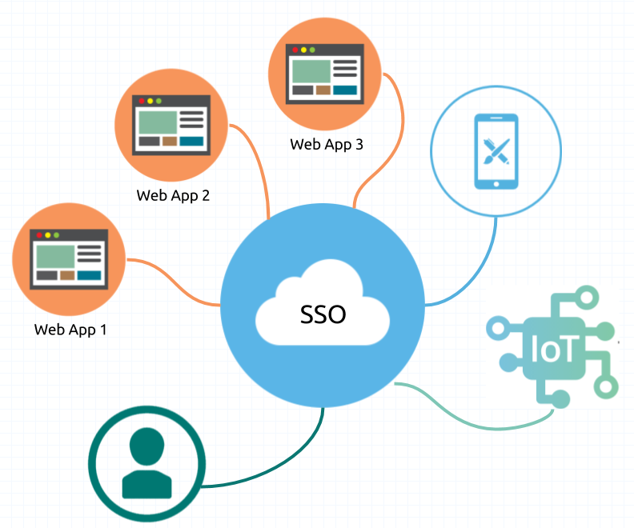
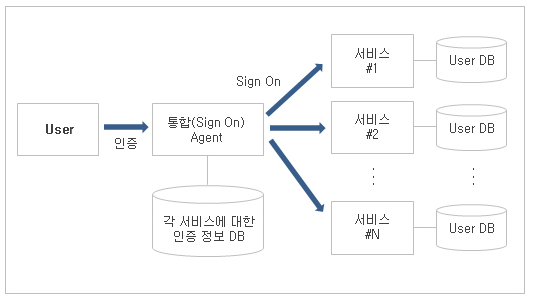
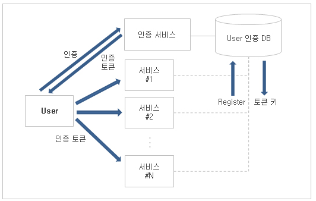

# `SSO(Single-Sign-On)`

[참조](https://toma0912.tistory.com/75)

## sso란 무엇인가

> SSO란 무었인가?

Single Sign On의 약자로 여러개의 사이트에서 한번의 로그인으로 다른 사이트들을 자동적으로 접속하여 이용하는 방법을 말합니다.  
일반적으로 서로다른 시스템 및 사이트에서 각각의 사용자 정보를 관리하게 되는데, 필요에 따라서 사용자 정보를 연동하여 사용해야 하는 경우도 생기게 됩니다.  
이 때, 하나의 사용자 정보를 기반으로 여러 시스템을 하나의 통합 인증을 사용하게 하는 것을 말합니다.  
즉 하나의 시스템에서 인증을 할 경우 타 시스템에서는 인증 정보가 있는지 확인하고 있으면, 로그인 처리를 하도록 하고, 없는 경우, 다시 통합 인증을 할 수 있도록 만드는 것을 의미합니다.  
아래의 도식화된 이미지를 참조하시면 됩니다.

즉, <b>하나의 아이디 및 패스워드를 통해 여러 시스템에 접근할 수 있는 통합 로그인(인증) 솔루션</b>이라고 생각하시면 됩니다.

---

## 등장배경

> 등장배경

최근 회사들이 그룹화 되거나 대형화 되어서 여러 사이트들을 통합 관리하는 경우 SSO를 사용합니다.  
이 때, 통합 인증 SSO를 사용하게 되면, 관리자는 보다 수월하게 관리 대상(사용자 및 고객)을 관리 할 수 있게 됩니다.

- 기술적 측면: 기업 내 다양한 정보 시스템의 구축에 따른 복잡성 증가, PKI, 생체 인식 등 다양한 인증 기술의 활성화
- 관리적 측면: 중앙 관리를 통한 업무 단순화 및 표준화 실현, 중앙 집중적인 사용자 관리를 통한 보안 기능 강화

---

## sso의 구성 요소

> SSO의 구성 요소

(1) 사용자 통합 로그인 (2) 인증 서버 (3) 통합 에이전트: 각 정보 시스템에 대한 정보 관리  
(4) LDAP(Lightweight Directory Access Protocol): 네트워크 상의 자원을 식별하고 인가된 사용자만 접근하도록 하는 네트워크 디렉토리

---

## sso의 기술 요소

> SSO의 기술 요소

- 인증: PKI(Public Key Infra Structure), 생체 인식, OTP(One Time Password)
- 관리: LDAP(Lightweight Directory Access Protocol), 쿠키(Cookie)
- 암호화 통신: SSL(Secure Socket Layer), IPSec(IP Security Protocol)

---

## sso의 구축유형

> SSO의 구축 유형

1. 인증 대행 모델(Delegation)  
   

   - 인증 방식을 변경하기 어려울 경우, 많이 사용
   - 시스템 접근 시, 통합 Agent가 인증 작업을 대행

2. 인증 정보 전달 모델(Propagation)  
   
   - 웹 기반 시스템에 주로 사용
   - 미리 인증된 토큰(Cookie 기능 이용)을 받아서 각 시스템 접근 시, 자동으로 전달

---

## cookie를 이용한 sso 구현시 cookie 보안 방법

> Cookie를 이용한 SSO 구현시, Cookie 보안 방법

- 데이터 기밀 유지(Data Confidentiality): 토큰은 주요 암호 알고리즘(AES, SEED)과 128bit 이상의 키로 암호화 되어야 합니다.
- 데이터 무결성(Data Integrity): 토큰은 MAC 등을 포함해 데이터 무결성을 보장해야 합니다.
- 사용자 주소 제한이나 유효 시간 제한 같은 보안 기술을 사용하여, 토큰을 네트워크에 노출시키지 않아야 합니다.
