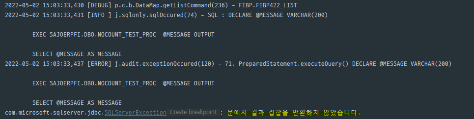

# `Java Console Error`

문에서 결과 집합을 반환하지 않았습니다.


---

## `프로시저 및 XML 내용`

PROCEDURE

```
CREATE PROCEDURE [dbo].[NOCOUNT_TEST_PROC]
-- ALTER PROCEDURE [dbo].[NOCOUNT_TEST_PROC]
	@MESSAGE VARCHAR(200) OUTPUT
AS
BEGIN
	DECLARE @TESTUSERID VARCHAR(10)
			, @CNT INT;

	SET @TESTUSERID = 'DEV'; -- 문에서 결과 집합을 반환하지 않았습니다.
	-- SET @TESTUSERID = '!@#!$!$#%@!$!'; -- 정상동작

	SELECT @CNT = COUNT(*)
	FROM SAJOERPCOM.DBO.MSTUSER
	WHERE USERID = @TESTUSERID

	IF @CNT > 0
		BEGIN
			SELECT *
			INTO #TEMP
			FROM SAJOERPCOM.DBO.MSTUSER
			WHERE USERID = @TESTUSERID

			DROP TABLE #TEMP
		END
	ELSE
        BEGIN
            SET @MESSAGE = '찾을 수 없습니다.'; -- 정상 동작
        END
END
```

Java MyBatic XML

```
	<select id="FIBP422_LIST" parameterType="hashmap" resultType="DataMap">
		DECLARE @MESSAGE VARCHAR(200)

		EXEC SAJOERPFI.DBO.NOCOUNT_TEST_PROC  @MESSAGE OUTPUT

		SELECT @MESSAGE AS MESSAGE
	</select>
```

---

## `원인`

위 문제의 원인은 select 태그로 되어있는 Mybatis에서 INSERT문 이후 어떤한 출력 결과물 또는 OUTPUT이 없는 상황 입니다.  
이로 인하여 "문에서 결과 집합을 반환하지 않았습니다." 라는 오류 메시지가 자바 콘솔에 찍히게 됩니다.

---

## `해결방법`

1.  PROCEDURE 작성 시

```
    ALTER PROCEDURE [dbo].[NOCOUNT_TEST_PROC]
        @MESSAGE VARCHAR(200) OUTPUT
    AS
    BEGIN
    SET NOCOUNT ON; -- set nocount on을 사용하여 에러 메시지에 대한 출력이 없도록 변경

    DECLARE @TESTUSERID VARCHAR(10)
    , @CNT INT;

        SET @TESTUSERID = 'DEV'; -- 문에서 결과 집합을 반환하지 않았습니다.
        -- SET @TESTUSERID = '!@#!$!$#%@!$!'; -- 정상동작

        SELECT @CNT = COUNT(*)
        FROM SAJOERPCOM.DBO.MSTUSER
        WHERE USERID = @TESTUSERID

        IF @CNT > 0
        	BEGIN
        		SELECT *
        		INTO #TEMP
        		FROM SAJOERPCOM.DBO.MSTUSER
        		WHERE USERID = @TESTUSERID

        		DROP TABLE #TEMP
        	END
	    ELSE
            BEGIN
                SET @MESSAGE = '찾을 수 없습니다.'; -- 정상 동작
            END
    END
```

2. XML 작성시

```
	<select id="FIBP422_LIST" parameterType="hashmap" resultType="DataMap">
        SET NOCOUNT ON; -- set nocount on을 사용하여 에러 메시지에 대한 출력이 없도록 변경

		DECLARE @MESSAGE VARCHAR(200)

		EXEC SAJOERPFI.DBO.NOCOUNT_TEST_PROC  @MESSAGE OUTPUT

		SELECT @MESSAGE AS MESSAGE
	</select>
```

위의 해결방법 중 편한 1개를 선택하여 SET NOCOUNT ON 구문을 넣어 주시면 됩니다.
